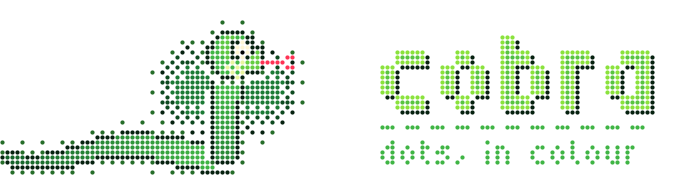
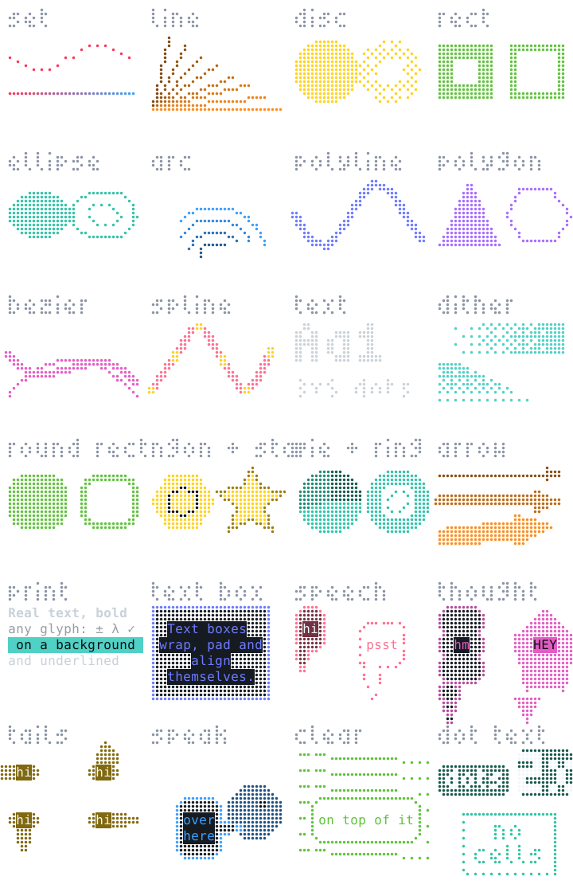
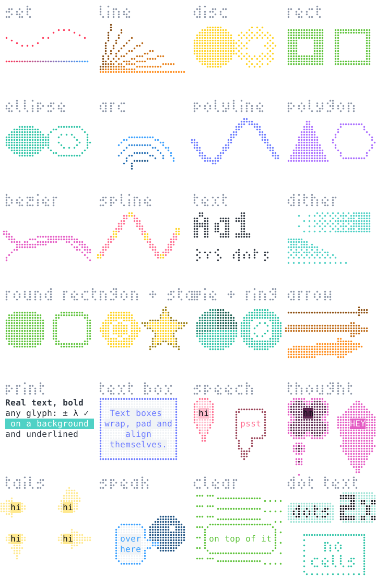
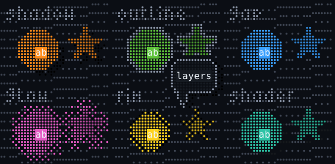
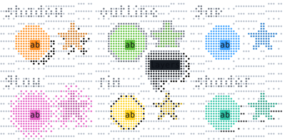

<p align="center"></p>

# cobra

[](https://github.com/MysteriousWolf/cobra/actions/workflows/ci.yml)
[](https://crates.io/crates/cobra)
[](https://docs.rs/cobra)

Draw with individually coloured dots in the terminal.

A braille character packs a 2×4 grid of dots into one cell: a cheap pixel grid, except
that a cell can only have one colour. cobra keeps the braille model, gives every dot its
own colour, and shows the result the best way the terminal can: as a small image aligned
to the character grid on kitty, WezTerm, Ghostty, iTerm2, foot, xterm and Windows
Terminal, and as real braille glyphs with one colour per cell everywhere else, tmux and
pipes included. Same code either way, nothing to configure.

```sh
cargo add cobra
```

```rust
use cobra::{Canvas, Renderer, Rgb, Terminal};

let mut renderer = Renderer::new(Terminal::detect());  // detect once, at start-up
let mut canvas = Canvas::new(20, 5);                   // 20×5 cells = 40×20 dots

for x in 0..canvas.width() {
    let t = x as f32 / canvas.width() as f32;
    canvas.set(x, 10, Rgb::hex(0xff0055).lerp(Rgb::hex(0x00ccff), t));
}
renderer.render(&canvas, &mut std::io::stdout())?;
```

`render` draws at the cursor, `render_at(col, row)` at a position, `encode` gives you the
bytes. Everything below is documented function by function, with a picture of what each
one draws, in the **[reference](docs/README.md)**.

## What is in the box

<p align="center">
  
  
</p>

**Shapes.** Rectangles, ellipses, arcs, polygons, rounded boxes, rings, pies, n-gons,
stars, arrows, Béziers and splines, filled or stroked, in `f32` dot coordinates with
anything off-canvas clipped. A [`Path`](docs/path.md) combines lines, curves, arcs and
smooth curves through points into one outline, with holes. Strokes take a
[`Pen`](docs/draw.md#pen): a width, optionally dashed.

```rust
canvas.fill_star(20.0, 10.0, 9.0, 4.0, 5, 0.0, Rgb::hex(0xf2cc60));
canvas.polyline(&[(2.0, 18.0), (38.0, 2.0)], Pen::new(2.0).dash(4.0, 2.0), Rgb::hex(0x58a6ff));
```

**Paints.** Every shape takes a [`Paint`](docs/draw.md#paint): a colour, a dither (ordered
or hashed), a hatch or checker [pattern](docs/draw.md#pattern), a linear or radial gradient,
a gradient from the shape's own edge inwards, cel bands lit from a direction, or a shader
given each dot's place in the shape and the surface normal there. `per_cell` makes any of
them decide once per cell so bands survive the text fallback; `anchor` pins a texture to its
shape; `Paint::erase` unsets dots instead.

```rust
canvas.disc(20.0, 10.0, 8.0, Paint::edge(Rgb::hex(0xffffff), Rgb::hex(0x3355ff), 3.0));
canvas.fill_rect(0.0, 0.0, 40.0, 4.0, Paint::pattern(Rgb::hex(0x56d364), Pattern::Diagonal(3)));
```

**Masks.** A [`Mask`](docs/mask.md) is a shape without a colour: drawn with the same
primitives, combined with other masks, moved with a [`Transform`](docs/transform.md), and
kept between frames. `stencil` paints through one, `clip` and `cut` keep or remove what it
covers, `clipped` draws inside it, and `effects` runs outlines, glows and rims around it.
`Canvas::with` draws everything in local coordinates through a transform.

```rust
let mut head = Mask::new(20, 5);
head.draw(|c| c.fill_ellipse(0.0, 0.0, 5.0, 4.0, Rgb::hex(0)));
head.transform(&Transform::at(20.0, 10.0).flip_x());
canvas.stencil(&head, Paint::cel(dark, (-1.0, -1.0), &[(-0.2, mid), (0.5, light)]).per_cell());
```

**Text.** [`Canvas::text`](docs/font.md) draws with a bitmap font (a 3×5 and a 5×9 monospace one are built in,
scalable per axis), so a label is dots like everything else. [`Canvas::print`](docs/text.md)
puts real characters on a text layer over the dots: copyable, any glyph the terminal has,
with bold, italic, underline and a background. [`Bubble`](docs/bubble.md) wraps text in a
box, a rounded box, an ellipse, a cloud or a burst, with a tail that `speak` aims at a
speaker while dodging the areas you want kept clear.

**Layers.** [`Layers`](docs/layer.md) stacks canvases and flattens them: what is in front
hides what is behind, and each layer can carry effects around its silhouette (a drop
shadow, an outline, a cleared gap, a glow, a shaded rim, a shader of your own). A matte
layer hides what is beneath it without painting anything. Layers can be offset from the
stack and wrap around it: scroll each by its own amount and the scene is a parallax.

<p align="center">
  
  
</p>

**Rigs.** A [`Rig`](docs/rig.md) is a figure as parts in a tree: each part a path about
its own joint, hung off a parent, posed by one transform, with named points that follow
the pose. `Rig::mix` tweens two poses of it; `Transform::skew`, `snapped`, `mix` and
`Path::mix` are the moves a dot grid affords. A rig rasterises once and keeps the parts
that did not move.

**Colours.** Dots take an RGB colour, a palette index or the terminal's default
foreground; palette colours follow the user's theme in every protocol, and the text
fallback quantises to however many colours the terminal has.

**Export.** `export::png` and `export::svg` write a canvas with the terminal's geometry,
which is how every picture here was made.

**ratatui.** With the `ratatui` feature, `cobra::ratatui::Braille` is a widget and
`overlay` sends the image after the frame; on kitty the widget writes placeholder cells
the diff never touches.

## Terminals

| Protocol | Terminals | Over the wire |
|---|---|---|
| Kitty  | kitty, WezTerm, Ghostty, Konsole ≥ 22.04 | zlib RGBA, chunked APC, one image id per canvas |
| iTerm2 | iTerm2, WezTerm, mintty, Konsole | PNG in OSC 1337 |
| Sixel  | foot, xterm, mlterm, Windows Terminal ≥ 1.22 | palettised DCS, transparent background |
| Text   | everything, screen, pipes | braille glyphs, one colour per cell |

`Terminal::detect()` runs once: the `COBRA_*` overrides, the usual environment
variables, then one escape-sequence round trip on `/dev/tty` for the rest. Frames are
transparent apart from the dots. Dot *positions* are exact; the dot *diameter* is a
style choice (`cargo run --example calibrate` matches it to your font, `COBRA_DOT` sets it).

| Variable | Effect |
|---|---|
| `COBRA_PROTOCOL` | `text`, `kitty`, `iterm2` or `sixel`; skips detection |
| `COBRA_CELL` | cell size in pixels, e.g. `9x18` |
| `COBRA_DOT` | dot diameter as a fraction of its slot, e.g. `0.8` |
| `COBRA_PALETTE` | `0` skips the colour-scheme queries |
| `COBRA_COLORS` | text colour depth: `mono`, `16`, `256` or `true` |

Inside tmux the outer terminal is recognised from its environment (Ghostty, kitty,
WezTerm, iTerm2), the cell size comes from tmux ≥ 3.2, and images are wrapped in tmux's
passthrough, which needs `set -g allow-passthrough on` in your `tmux.conf`; without it
they are dropped silently, and `COBRA_PROTOCOL=text` opts out. Each image is pinned to
the pane's cursor and clipped to the pane, since tmux would otherwise hand it to the
outer terminal wherever that terminal's cursor last was, hanging off the screen (which
crashes Ghostty). A terminal started from inside tmux inherits `TMUX` without being a
pane, so `TMUX` alone is not believed: tmux is asked over its socket whether the pane
owns the tty, and `TERM` (`tmux-*`, `screen-*`) decides only when tmux cannot be run.
GNU screen gets text.
Off unix there are no tty queries. A printed character takes its whole cell. Layers are
flattened to dots before anything is sent, so a soft shadow is a dithered one.
`Canvas::fallback` gives you the canvas as a plain terminal will show it, one colour per
cell at a chosen depth, to render on a graphical terminal while you design for both.

## Performance

A canvas is one `u32` per dot, allocated once; renderers and layer stacks reuse their
buffers, so steady-state rendering does not allocate. Rasterising is a table lookup per
pixel, the built-in zlib encoder knows the four match distances a dot matrix produces, and
one kitty image id per renderer replaces frames in place. A full-screen 80×24 plot costs
about a millisecond on kitty and 50 µs as text; `cargo bench` prints the table for your
machine. The only dependencies are optional: `libc` for detection, `ratatui` for the widget.

## Examples

```sh
cargo run --example gallery                 # every primitive, one per panel
cargo run --example layers                  # layers and their effects
cargo run --example shapes                  # a scene built from them
cargo run --example logo                    # the banner (add `theme`, `text`, `svg`, `png`)
cargo run --example calibrate               # match dot size to your font
cargo run --release --example snake         # animation, with timing
cargo run --release --features ratatui --example tui
cargo run --example docs                    # regenerate docs/
```

## Versioning

Releases are `YY.N.P`: the `N`th release of 20`YY`, patch `P`. That is a valid semver
triple, so a patch is a drop-in, a release within a year is a compatible upgrade, and a
new year is a new major; depending on `"26.1"` gets every release of 2026 from `26.1.0`.
Merging a version bump to main cuts the release (or run the **Release** workflow with a
`bump`); the release regenerates `docs/` before it tags.

## Contributing

```sh
cargo test --all-features
cargo clippy --all-features --all-targets -- -D warnings
cargo fmt --all
ci/version.fish check     # the version gate
ci/docs.fish check        # docs/ matches the source, and every public item has a picture
```

Integration tests decode frames back to pixels with their own PNG, zlib, sixel and kitty
readers, so a round trip is real evidence. The **Docs** workflow regenerates the reference
by hand and commits it to main when something changed.

## License

MIT or Apache-2.0, at your option.
