# `bubble`

[Index](README.md) · [canvas](canvas.md) · [draw](draw.md) · [path](path.md) · [layer](layer.md) · **bubble** · [font](font.md) · [text](text.md) · [color](color.md) · [render](render.md) · [term](term.md) · [export](export.md) · [ratatui](ratatui.md)

Text boxes and speech bubbles.

A [`Bubble`](bubble.md#bubble) is a body (rectangle, rounded box, ellipse, cloud or starburst) with
text in it and, optionally, a tail pointing at whoever is speaking. Without a tail
it is a text box; with one it is a chat bubble, and the tail can leave from any
side at any point along it.

```rust
use cobra::{Bubble, Canvas, Rgb};

let mut c = Canvas::new(40, 10);
Bubble::speech("Hello!")
    .fill(Rgb::hex(0x1b2430))
    .border(1.0, Rgb::hex(0x3aa0ff))
    .ink(Rgb::hex(0xc9d1d9))
    .draw(&mut c, 4.0, 4.0);
```

The text is [real text](text.md) by default, so it stays sharp and copyable;
[`Bubble::font`](bubble.md#bubblefont) switches it to dots in a bitmap [`Font`](font.md#font) when a bubble has to fit
somewhere too small for a character cell.

### Choosing a place

[`Bubble::speak`](bubble.md#bubblespeak) takes the mouth to point at and any number of keep-out
rectangles, tries the bubble on all four sides of the mouth, and draws the one that
stays on the canvas and clear of the zones, with the tail leaning over to reach the
mouth:

```rust
let face = Rect::new(40.0, 20.0, 24.0, 20.0);
let mouth = (52.0, 30.0);
Bubble::speech("Watch out!").fill(Rgb::hex(0x203040)).speak(&mut canvas, mouth, &[face]);
```

## Contents

- [`Side`](#side)
- [`Shape`](#shape)
- [`TailKind`](#tailkind)
- [`Tail`](#tail)
- [`Bubble`](#bubble)
- `Tail`: [`Tail::new`](bubble.md#tailnew), [`Tail::len`](bubble.md#taillen), [`Tail::width`](bubble.md#tailwidth)
- `Bubble`: [`Bubble::new`](bubble.md#bubblenew), [`Bubble::speech`](bubble.md#bubblespeech), [`Bubble::thought`](bubble.md#bubblethought), [`Bubble::shout`](bubble.md#bubbleshout), [`Bubble::whisper`](bubble.md#bubblewhisper), [`Bubble::shape`](bubble.md#bubbleshape), [`Bubble::tail`](bubble.md#bubbletail), [`Bubble::no_tail`](bubble.md#bubbleno_tail), [`Bubble::fill`](bubble.md#bubblefill), [`Bubble::border`](bubble.md#bubbleborder), [`Bubble::ink`](bubble.md#bubbleink), [`Bubble::font`](bubble.md#bubblefont), [`Bubble::pad`](bubble.md#bubblepad), [`Bubble::align`](bubble.md#bubblealign), [`Bubble::wrap`](bubble.md#bubblewrap), [`Bubble::clear_behind`](bubble.md#bubbleclear_behind), [`Bubble::size`](bubble.md#bubblesize), [`Bubble::bounds`](bubble.md#bubblebounds), [`Bubble::draw`](bubble.md#bubbledraw), [`Bubble::speak`](bubble.md#bubblespeak), [`Bubble::place`](bubble.md#bubbleplace)

## `Side`

```rust
pub enum Side
```

An edge of a bubble.

- `Top` — Above the body.
- `Right` — Right of the body.
- `Bottom` — Below the body.
- `Left` — Left of the body.

## `Shape`

```rust
pub enum Shape
```

The shape of a bubble's body.

- `Rect` — Plain box.
- `Round(f32)` — Box with corners rounded to a radius in dots.
- `Ellipse` — Ellipse through the body's box.
- `Cloud` — Scalloped outline of overlapping lobes: a thought bubble.
- `Burst` — Spiky starburst: a shout.

<picture>
  <source media="(prefers-color-scheme: dark)" srcset="img/shape.svg">
  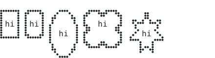
</picture>

```rust
let shapes = [Shape::Rect, Shape::Round(3.0), Shape::Ellipse, Shape::Cloud, Shape::Burst];
let mut x = 0.0;
for shape in shapes {
    let b = Bubble::new("hi").shape(shape).ink(t.ink).border(1.0, t.ink).no_tail();
    let r = b.draw(c, x, 4.0);
    x = r.right() + 2.0;
}
```

## `TailKind`

```rust
pub enum TailKind
```

What a tail looks like.

- `Point` — A straight triangle, the usual speech tail.
- `Curve` — A curved, tapering comic tail.
- `Bubbles` — Shrinking discs, the usual thought-bubble trail.
- `Line` — A single dot-wide line, for labels and callouts. `width` is ignored.

<picture>
  <source media="(prefers-color-scheme: dark)" srcset="img/tailkind.svg">
  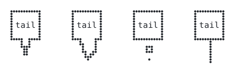
</picture>

```rust
let kinds = [TailKind::Point, TailKind::Curve, TailKind::Bubbles, TailKind::Line];
for (i, kind) in kinds.into_iter().enumerate() {
    let x = i as f32 * 24.0 + 4.0;
    let b = Bubble::new("tail").ink(t.ink).border(1.0, t.ink).tail(Tail::new(Side::Bottom, 0.5, kind).len(8.0));
    b.draw(c, x, 4.0);
}
```

## `Tail`

```rust
pub struct Tail
```

Where and how a bubble's tail leaves the body.

- `pub side: Side` — Which side it leaves from.
- `pub at: f32` — Where along that side, `0..=1` (left to right, top to bottom).
- `pub len: f32` — How far it reaches, in dots.
- `pub width: f32` — Width of its base, in dots.
- `pub kind: TailKind` — Its look.
- `pub tip: Option<Point>` — Where the point ends up. `None` puts it straight out from the base, which is what a hand-placed bubble wants; [`Bubble::speak`](bubble.md#bubblespeak) sets it to the mouth.

## `Bubble`

```rust
pub struct Bubble<'a>
```

A text box, or a chat bubble when it has a [`Tail`](bubble.md#tail). See the module docs.

## `Tail` methods

## `Tail::new`

```rust
pub fn new(side: Side, at: f32, kind: TailKind) -> Self
```

A tail of `kind` leaving `side` at `at` (`0..=1` along it).

## `Tail::len`

```rust
pub fn len(mut self, len: f32) -> Self
```

Sets how far the tail reaches, in dots.

## `Tail::width`

```rust
pub fn width(mut self, width: f32) -> Self
```

Sets the width of the tail's base, in dots.

## `Bubble` methods

## `Bubble::new`

```rust
pub fn new(text: &'a str) -> Self
```

A plain text box: a rectangle, no tail.

<picture>
  <source media="(prefers-color-scheme: dark)" srcset="img/bubble-new.svg">
  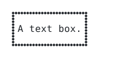
</picture>

```rust
Bubble::new("A text box.").ink(t.ink).border(1.0, t.ink).draw(c, 4.0, 4.0);
```

## `Bubble::speech`

```rust
pub fn speech(text: &'a str) -> Self
```

A rounded box with a triangular tail: an ordinary speech bubble.

<picture>
  <source media="(prefers-color-scheme: dark)" srcset="img/bubble-speech.svg">
  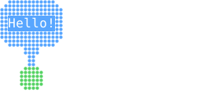
</picture>

```rust
c.disc(8.0, 20.0, 3.0, GREEN);
Bubble::speech("Hello!").ink(t.bg).fill(BLUE).speak(c, (8.0, 18.0), &[]);
```

## `Bubble::thought`

```rust
pub fn thought(text: &'a str) -> Self
```

A cloud with a trail of discs: a thought bubble.

<picture>
  <source media="(prefers-color-scheme: dark)" srcset="img/bubble-thought.svg">
  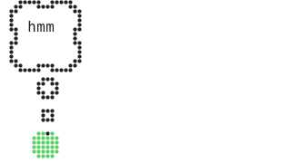
</picture>

```rust
c.disc(10.0, 24.0, 3.0, GREEN);
Bubble::thought("hmm").ink(t.ink).border(1.0, t.ink).speak(c, (10.0, 22.0), &[]);
```

## `Bubble::shout`

```rust
pub fn shout(text: &'a str) -> Self
```

A starburst with a straight tail: a shout.

<picture>
  <source media="(prefers-color-scheme: dark)" srcset="img/bubble-shout.svg">
  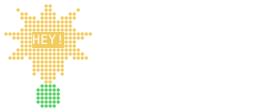
</picture>

```rust
c.disc(12.0, 24.0, 3.0, GREEN);
Bubble::shout("HEY!").ink(t.bg).fill(YELLOW).speak(c, (12.0, 22.0), &[]);
```

## `Bubble::whisper`

```rust
pub fn whisper(text: &'a str) -> Self
```

A rounded box with a curling comic tail: an aside.

<picture>
  <source media="(prefers-color-scheme: dark)" srcset="img/bubble-whisper.svg">
  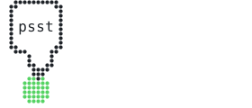
</picture>

```rust
c.disc(8.0, 20.0, 3.0, GREEN);
Bubble::whisper("psst").ink(t.ink).border(1.0, t.ink).speak(c, (8.0, 18.0), &[]);
```

## `Bubble::shape`

```rust
pub fn shape(mut self, shape: Shape) -> Self
```

Sets the body shape.

## `Bubble::tail`

```rust
pub fn tail(mut self, tail: Tail) -> Self
```

Attaches a tail.

## `Bubble::no_tail`

```rust
pub fn no_tail(mut self) -> Self
```

Removes the tail, leaving a text box.

## `Bubble::fill`

```rust
pub fn fill(mut self, paint: impl Into<Paint>) -> Self
```

Fills the body.

<picture>
  <source media="(prefers-color-scheme: dark)" srcset="img/bubble-fill.svg">
  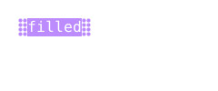
</picture>

```rust
Bubble::new("filled").ink(t.bg).fill(PURPLE).no_tail().draw(c, 4.0, 4.0);
```

## `Bubble::border`

```rust
pub fn border(mut self, width: f32, paint: impl Into<Paint>) -> Self
```

Outlines the body with a border `width` dots thick.

<picture>
  <source media="(prefers-color-scheme: dark)" srcset="img/bubble-border.svg">
  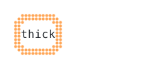
</picture>

```rust
Bubble::new("thick").ink(t.ink).border(2.0, ORANGE).shape(Shape::Round(4.0)).no_tail().draw(c, 4.0, 4.0);
```

## `Bubble::ink`

```rust
pub fn ink(mut self, ink: impl Into<TextStyle>) -> Self
```

Sets the text style. Its background defaults to the bubble's fill, since a
printed character replaces the dots in its cell.

## `Bubble::font`

```rust
pub fn font(mut self, font: &'a Font) -> Self
```

Draws the text as dots in `font` instead of as real characters. Use it when a
bubble is too small for a character cell, or in a drawing that is exported to
an image.

## `Bubble::pad`

```rust
pub fn pad(mut self, cols: i32, rows: i32) -> Self
```

Padding between the text and the body edge, in cells. Default `(1, 0)`, and at
least one row when the bubble has a border and prints real text: a character
hides the dots in its cell, and the top and bottom of the border are in it.

## `Bubble::align`

```rust
pub fn align(mut self, align: Align) -> Self
```

Aligns the lines inside the bubble.

<picture>
  <source media="(prefers-color-scheme: dark)" srcset="img/bubble-align.svg">
  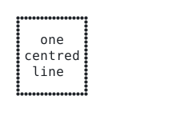
</picture>

```rust
let b = Bubble::new("one\ncentred\nline").align(Align::Center).ink(t.ink).border(1.0, t.ink);
b.no_tail().draw(c, 4.0, 4.0);
```

## `Bubble::wrap`

```rust
pub fn wrap(mut self, cols: i32) -> Self
```

Wraps the text to at most `cols` cells wide.

<picture>
  <source media="(prefers-color-scheme: dark)" srcset="img/bubble-wrap.svg">
  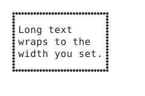
</picture>

```rust
let b = Bubble::new("Long text wraps to the width you set.").wrap(14).ink(t.ink).border(1.0, t.ink);
b.no_tail().draw(c, 4.0, 4.0);
```

## `Bubble::clear_behind`

```rust
pub fn clear_behind(mut self) -> Self
```

Unsets the dots under the body before drawing, so the bubble reads on top of a
busy background even when it is not filled.

<picture>
  <source media="(prefers-color-scheme: dark)" srcset="img/bubble-clear_behind.svg">
  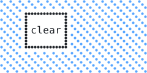
</picture>

```rust
c.fill_rect(0.0, 0.0, 48.0, 24.0, Paint::pattern(BLUE, Pattern::Diagonal(3)));
Bubble::new("clear").ink(t.ink).border(1.0, t.ink).clear_behind().no_tail().draw(c, 8.0, 4.0);
```

## `Bubble::size`

```rust
pub fn size(&self) -> (f32, f32)
```

Size of the body in dots, always a whole number of cells so the text inside
lands on the character grid.

## `Bubble::bounds`

```rust
pub fn bounds(&self, x: f32, y: f32) -> Rect
```

Everything the bubble would cover if drawn at `(x, y)`: the body and its tail.
Useful as a keep-out zone for the next bubble.

## `Bubble::draw`

```rust
pub fn draw(&self, canvas: &mut Canvas, x: f32, y: f32) -> Rect
```

Draws the bubble with the top-left of its body at dot `(x, y)`, snapped to the
cell grid, and returns the body's box. The tail may reach outside it.

## `Bubble::speak`

```rust
pub fn speak(&self, canvas: &mut Canvas, mouth: Point, keep_out: &[Rect]) -> Rect
```

Draws the bubble where it fits best: pointing its tail at `mouth`, inside the
canvas and off every rectangle in `keep_out`. Returns the body's box.

The four sides are tried in turn (above the mouth first, then beside it, then
below); each candidate is pushed back onto the canvas, and the one that covers
the least of the keep-out zones with the least tail lean wins.

<picture>
  <source media="(prefers-color-scheme: dark)" srcset="img/bubble-speak.svg">
  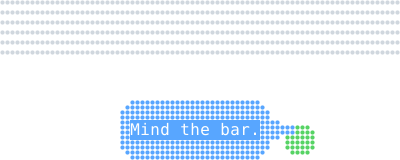
</picture>

```rust
let keep_out = cobra::Rect::new(0.0, 0.0, 80.0, 12.0);
c.fill_rect(0.0, 0.0, 80.0, 12.0, Paint::pattern(t.panel, Pattern::Rows(2)));
c.disc(60.0, 28.0, 3.0, GREEN);
Bubble::speech("Mind the bar.").ink(t.bg).fill(BLUE).speak(c, (60.0, 26.0), &[keep_out]);
```

## `Bubble::place`

```rust
pub fn place(&self, area: Rect, mouth: Point, keep_out: &[Rect]) -> (Self, Point)
```

The placement [`speak`](bubble.md#bubblespeak) would use: a copy of the bubble with its
tail aimed at `mouth`, and the top-left dot to draw it at.

[Index](README.md) · [canvas](canvas.md) · [draw](draw.md) · [path](path.md) · [layer](layer.md) · **bubble** · [font](font.md) · [text](text.md) · [color](color.md) · [render](render.md) · [term](term.md) · [export](export.md) · [ratatui](ratatui.md)

