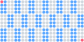
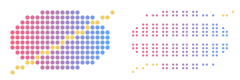
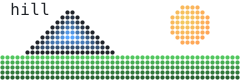
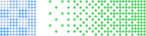
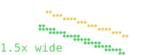
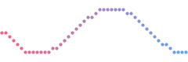
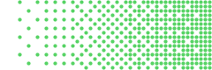
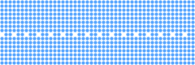
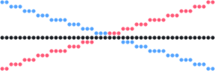
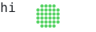

# `canvas`

[Index](README.md) · **canvas** · [draw](draw.md) · [path](path.md) · [mask](mask.md) · [transform](transform.md) · [rig](rig.md) · [layer](layer.md) · [bubble](bubble.md) · [font](font.md) · [text](text.md) · [color](color.md) · [render](render.md) · [term](term.md) · [export](export.md) · [ratatui](ratatui.md)

The dot grid.

## Contents

- [`DOTS_X`](#dots_x)
- [`DOTS_Y`](#dots_y)
- [`Cell`](#cell)
- [`Canvas`](#canvas)
- [`braille`](#braille)
- [`bayer`](#bayer)
- `Cell`: [`Cell::glyph`](canvas.md#cellglyph), [`Cell::dot`](canvas.md#celldot)
- `Canvas`: [`Canvas::new`](canvas.md#canvasnew), [`Canvas::with`](canvas.md#canvaswith), [`Canvas::transform`](canvas.md#canvastransform), [`Canvas::cols`](canvas.md#canvascols), [`Canvas::rows`](canvas.md#canvasrows), [`Canvas::width`](canvas.md#canvaswidth), [`Canvas::height`](canvas.md#canvasheight), [`Canvas::clear`](canvas.md#canvasclear), [`Canvas::set`](canvas.md#canvasset), [`Canvas::set_dithered`](canvas.md#canvasset_dithered), [`Canvas::unset`](canvas.md#canvasunset), [`Canvas::get`](canvas.md#canvasget), [`Canvas::line`](canvas.md#canvasline), [`Canvas::disc`](canvas.md#canvasdisc), [`Canvas::disc_dithered`](canvas.md#canvasdisc_dithered), [`Canvas::clear_disc`](canvas.md#canvasclear_disc), [`Canvas::cell`](canvas.md#canvascell), [`Canvas::cells`](canvas.md#canvascells), [`Canvas::fallback`](canvas.md#canvasfallback), [`Canvas::blit`](canvas.md#canvasblit), [`Canvas::to_text`](canvas.md#canvasto_text)

## `DOTS_X`

```rust
pub const DOTS_X: u16 = 2
```

Dots per cell horizontally.

<picture>
  <source media="(prefers-color-scheme: dark)" srcset="img/dots_x.svg">
  
</picture>

```rust
// A 12 × 3-cell canvas is 24 × 12 dots: every cell holds DOTS_X × DOTS_Y of them.
let (cw, ch) = (DOTS_X as i32, DOTS_Y as i32);
for row in 0..c.rows() as i32 {
    for col in 0..c.cols() as i32 {
        let shade = if (col + row) % 2 == 0 { BLUE } else { t.panel };
        c.fill_rect((col * cw) as f32, (row * ch) as f32, cw as f32, ch as f32, shade);
    }
}
c.set(0, 0, RED);                                // the first dot
c.set(c.width() - 1, c.height() - 1, RED);       // the last: (width - 1, height - 1)
```

## `DOTS_Y`

```rust
pub const DOTS_Y: u16 = 4
```

Dots per cell vertically.

<picture>
  <source media="(prefers-color-scheme: dark)" srcset="img/dots_x.svg">
  
</picture>

```rust
// A 12 × 3-cell canvas is 24 × 12 dots: every cell holds DOTS_X × DOTS_Y of them.
let (cw, ch) = (DOTS_X as i32, DOTS_Y as i32);
for row in 0..c.rows() as i32 {
    for col in 0..c.cols() as i32 {
        let shade = if (col + row) % 2 == 0 { BLUE } else { t.panel };
        c.fill_rect((col * cw) as f32, (row * ch) as f32, cw as f32, ch as f32, shade);
    }
}
c.set(0, 0, RED);                                // the first dot
c.set(c.width() - 1, c.height() - 1, RED);       // the last: (width - 1, height - 1)
```

## `Cell`

```rust
pub struct Cell
```

One terminal cell of a canvas: which of its eight dots are set, and the colour the
cell should take when it can only have one (text fallback).

- `pub bits: u8` — Braille dot bits (`U+2800 + bits` is the glyph).
- `pub color: Option<Color>` — The most frequent colour among the set dots, `None` when the cell is empty. On a canvas [flattened](layer.md#layersflatten) from layers only the dots of the topmost layer in the cell vote, so what is in front keeps its colour.

<picture>
  <source media="(prefers-color-scheme: dark)" srcset="img/cell.svg">
  
</picture>

```rust
// Left: the dots. Right: each cell as the text protocol sends it, the braille
// glyph of its dot pattern in the cell's one dominant colour.
c.fill_ellipse(12.0, 8.0, 10.0, 6.0, Paint::linear((2.0, 0.0), (22.0, 0.0), RED, BLUE));
c.line(2, 14, 22, 2, YELLOW);
for row in 0..c.rows() {
    for col in 0..12 {
        let cell = c.cell(col, row);
        if let Some(color) = cell.color {
            c.print(col as i32 + 12, row as i32, &cell.glyph().to_string(), color);
        }
    }
}
```

## `Canvas`

```rust
pub struct Canvas
```

A grid of individually coloured braille dots.

The canvas is sized in terminal cells; each cell holds a 2×4 block of dots, so a
`cols × rows` canvas has `2·cols × 4·rows` addressable dots with `(0, 0)` at the top
left. Coordinates are `i32` so callers can draw partially off-canvas shapes without
clamping; out-of-range dots are ignored.

Storage is one `u32` per dot (`0` = unset, otherwise a tagged [`Color`](color.md#color)), so a full
200×50-cell canvas is 320 KiB and never allocates after construction.

On top of the dots sits a [text layer](text.md): real characters, one per cell,
written with [`print`](text.md#canvasprint). It stays unallocated until something is
printed, and a cell that holds a character shows it instead of its dots.

Several canvases stacked, with occlusion and effects between them, are a
[`Layers`](layer.md#layers); flattening one gives back a plain canvas.

<picture>
  <source media="(prefers-color-scheme: dark)" srcset="img/canvas.svg">
  
</picture>

```rust
// Cells of dots, each dot its own colour: a scene, drawn with the shapes and
// paints below and a printed label.
c.fill_rect(0.0, 11.0, 48.0, 5.0, Paint::linear((0.0, 11.0), (0.0, 16.0), GREEN, GREEN.dim(0.4)));
c.disc(38.0, 5.0, 4.0, Paint::radial((37.0, 4.0), 5.0, YELLOW, ORANGE));
c.fill_polygon(&[(4.0, 11.0), (14.0, 2.0), (24.0, 11.0)], Paint::edge(t.ink, BLUE, 3.0));
c.print(1, 0, "hill", t.ink);
```

## `braille`

```rust
pub fn braille(bits: u8) -> char
```

Braille glyph for a dot bit pattern.

<picture>
  <source media="(prefers-color-scheme: dark)" srcset="img/cell.svg">
  
</picture>

```rust
// Left: the dots. Right: each cell as the text protocol sends it, the braille
// glyph of its dot pattern in the cell's one dominant colour.
c.fill_ellipse(12.0, 8.0, 10.0, 6.0, Paint::linear((2.0, 0.0), (22.0, 0.0), RED, BLUE));
c.line(2, 14, 22, 2, YELLOW);
for row in 0..c.rows() {
    for col in 0..12 {
        let cell = c.cell(col, row);
        if let Some(color) = cell.color {
            c.print(col as i32 + 12, row as i32, &cell.glyph().to_string(), color);
        }
    }
}
```

## `bayer`

```rust
pub fn bayer(x: i32, y: i32) -> f32
```

Ordered-dither threshold for dot `(x, y)`: a 4×4 Bayer matrix scaled to `0..1`
(sixteen evenly spaced levels). A dot is drawn when its coverage exceeds this.

<picture>
  <source media="(prefers-color-scheme: dark)" srcset="img/bayer.svg">
  
</picture>

```rust
// The 4 × 4 threshold matrix, each entry as a shade, and the ramp it dithers:
// a dot is drawn where the coverage beats its threshold.
for y in 0..4 {
    for x in 0..4 {
        c.fill_rect(x as f32 * 3.0, y as f32 * 3.0, 3.0, 3.0, t.panel.lerp(BLUE, bayer(x, y)));
    }
}
for y in 0..12 {
    for x in 14..48 {
        if (x - 14) as f32 / 34.0 > bayer(x, y) {
            c.set(x, y, GREEN);
        }
    }
}
```

## `Cell` methods

## `Cell::glyph`

```rust
pub fn glyph(&self) -> char
```

The braille glyph for this cell.

<picture>
  <source media="(prefers-color-scheme: dark)" srcset="img/cell.svg">
  
</picture>

```rust
// Left: the dots. Right: each cell as the text protocol sends it, the braille
// glyph of its dot pattern in the cell's one dominant colour.
c.fill_ellipse(12.0, 8.0, 10.0, 6.0, Paint::linear((2.0, 0.0), (22.0, 0.0), RED, BLUE));
c.line(2, 14, 22, 2, YELLOW);
for row in 0..c.rows() {
    for col in 0..12 {
        let cell = c.cell(col, row);
        if let Some(color) = cell.color {
            c.print(col as i32 + 12, row as i32, &cell.glyph().to_string(), color);
        }
    }
}
```

## `Cell::dot`

```rust
pub fn dot(&self, dx: u16, dy: u16) -> bool
```

Whether dot `(dx, dy)` of the cell (`dx` in `0..2`, `dy` in `0..4`) is set.

<picture>
  <source media="(prefers-color-scheme: dark)" srcset="img/cell-dot.svg">
  
</picture>

```rust
// A cell's dots read back one by one: the left half, redrawn on the right
// with every dot in its cell's colour, which is what a glyph can show.
c.disc(12.0, 8.0, 7.0, Paint::radial((9.0, 5.0), 9.0, YELLOW, RED));
for row in 0..c.rows() {
    for col in 0..12 {
        let cell = c.cell(col, row);
        for dy in 0..DOTS_Y {
            for dx in 0..DOTS_X {
                if cell.dot(dx, dy) {
                    c.set(((col + 12) * DOTS_X + dx) as i32, (row * DOTS_Y + dy) as i32, cell.color.unwrap());
                }
            }
        }
    }
}
```

## `Canvas` methods

## `Canvas::new`

```rust
pub fn new(cols: u16, rows: u16) -> Self
```

Creates an empty canvas of `cols × rows` cells.

<picture>
  <source media="(prefers-color-scheme: dark)" srcset="img/canvas-new.svg">
  
</picture>

```rust
// A sprite drawn once on a canvas of its own, copied wherever it is wanted.
let mut star = Canvas::new(4, 2);
star.fill_star(4.0, 4.0, 3.8, 1.6, 5, -PI / 2.0, YELLOW);
for (i, y) in [6, 2, 8, 1, 5].into_iter().enumerate() {
    c.blit(&star, 1 + i as i32 * 9, y);
}
```

## `Canvas::with`

```rust
pub fn with(&mut self, t: Transform, f: impl FnOnce(&mut Canvas))
```

Draws everything in `f` through `t`: the coordinates every primitive takes
are local, and `t` says where they land. Nested calls compose, inner first,
so a hand drawn inside an arm drawn inside a body moves with all three.
[`set`](canvas.md#canvasset) and [`unset`](canvas.md#canvasunset) map their dot through it too;
whole-cell operations ([`print`](text.md#canvasprint), [`span`](draw.md#canvasspan), the
mask operations) and reads ([`get`](canvas.md#canvasget)) are in canvas coordinates.

A translation or a flip is exact; under a rotation or a scale, boxes,
ellipses and rings are drawn as paths, and stroke widths scale with the
transform.

```rust
use cobra::{Canvas, Rgb, Transform};

let mut canvas = Canvas::new(20, 5);
let leg = |c: &mut Canvas| c.fill_rect(-1.0, 0.0, 2.0, 8.0, Rgb::hex(0xffa657));
for (x, angle) in [(10.0, -0.3), (14.0, 0.3)] {
    canvas.with(Transform::at(x, 8.0).rotate(angle), leg); // rotated, then placed
}
```

<picture>
  <source media="(prefers-color-scheme: dark)" srcset="img/canvas-with.svg">
  
</picture>

```rust
// A figure drawn about its own origin, facing either way.
let figure = |c: &mut Canvas| {
    c.fill_ellipse(0.0, 0.0, 5.0, 3.5, GREEN);      // body
    c.disc(5.0, -4.0, 2.2, GREEN);                  // head
    c.polyline(&[(7.0, -4.0), (10.0, -3.0)], 1.0, ORANGE); // beak
    c.polyline(&[(-1.0, 3.0), (-1.0, 7.0)], 1.0, ORANGE);  // leg
};
c.with(Transform::at(12.0, 8.0), figure);
c.with(Transform::at(36.0, 8.0).flip_x(), figure);
```

## `Canvas::transform`

```rust
pub fn transform(&self) -> Transform
```

The transform drawing currently lands through; the identity by default.

<picture>
  <source media="(prefers-color-scheme: dark)" srcset="img/canvas-transform.svg">
  
</picture>

```rust
c.with(Transform::at(6.0, 8.0).scale(1.5, 1.5), |c| {
    c.with(Transform::at(4.0, 0.0).rotate(0.3), |c| {
        // The composed transform, inner first: a one-dot stroke comes out
        // one and a half wide, which is its scale factor.
        let k = c.transform().scale_factor();
        c.polyline(&[(0.0, 0.0), (16.0, 0.0)], 1.0, GREEN);
        c.polyline(&[(0.0, -3.0), (16.0, -3.0)], 1.0 / k, YELLOW); // one dot, corrected
    });
});
c.print(0, 3, "1.5x wide", GREEN);
```

## `Canvas::cols`

```rust
pub fn cols(&self) -> u16
```

Width in cells.

<picture>
  <source media="(prefers-color-scheme: dark)" srcset="img/dots_x.svg">
  
</picture>

```rust
// A 12 × 3-cell canvas is 24 × 12 dots: every cell holds DOTS_X × DOTS_Y of them.
let (cw, ch) = (DOTS_X as i32, DOTS_Y as i32);
for row in 0..c.rows() as i32 {
    for col in 0..c.cols() as i32 {
        let shade = if (col + row) % 2 == 0 { BLUE } else { t.panel };
        c.fill_rect((col * cw) as f32, (row * ch) as f32, cw as f32, ch as f32, shade);
    }
}
c.set(0, 0, RED);                                // the first dot
c.set(c.width() - 1, c.height() - 1, RED);       // the last: (width - 1, height - 1)
```

## `Canvas::rows`

```rust
pub fn rows(&self) -> u16
```

Height in cells.

<picture>
  <source media="(prefers-color-scheme: dark)" srcset="img/dots_x.svg">
  
</picture>

```rust
// A 12 × 3-cell canvas is 24 × 12 dots: every cell holds DOTS_X × DOTS_Y of them.
let (cw, ch) = (DOTS_X as i32, DOTS_Y as i32);
for row in 0..c.rows() as i32 {
    for col in 0..c.cols() as i32 {
        let shade = if (col + row) % 2 == 0 { BLUE } else { t.panel };
        c.fill_rect((col * cw) as f32, (row * ch) as f32, cw as f32, ch as f32, shade);
    }
}
c.set(0, 0, RED);                                // the first dot
c.set(c.width() - 1, c.height() - 1, RED);       // the last: (width - 1, height - 1)
```

## `Canvas::width`

```rust
pub fn width(&self) -> i32
```

Width in dots (`2 · cols`).

<picture>
  <source media="(prefers-color-scheme: dark)" srcset="img/dots_x.svg">
  
</picture>

```rust
// A 12 × 3-cell canvas is 24 × 12 dots: every cell holds DOTS_X × DOTS_Y of them.
let (cw, ch) = (DOTS_X as i32, DOTS_Y as i32);
for row in 0..c.rows() as i32 {
    for col in 0..c.cols() as i32 {
        let shade = if (col + row) % 2 == 0 { BLUE } else { t.panel };
        c.fill_rect((col * cw) as f32, (row * ch) as f32, cw as f32, ch as f32, shade);
    }
}
c.set(0, 0, RED);                                // the first dot
c.set(c.width() - 1, c.height() - 1, RED);       // the last: (width - 1, height - 1)
```

## `Canvas::height`

```rust
pub fn height(&self) -> i32
```

Height in dots (`4 · rows`).

<picture>
  <source media="(prefers-color-scheme: dark)" srcset="img/dots_x.svg">
  
</picture>

```rust
// A 12 × 3-cell canvas is 24 × 12 dots: every cell holds DOTS_X × DOTS_Y of them.
let (cw, ch) = (DOTS_X as i32, DOTS_Y as i32);
for row in 0..c.rows() as i32 {
    for col in 0..c.cols() as i32 {
        let shade = if (col + row) % 2 == 0 { BLUE } else { t.panel };
        c.fill_rect((col * cw) as f32, (row * ch) as f32, cw as f32, ch as f32, shade);
    }
}
c.set(0, 0, RED);                                // the first dot
c.set(c.width() - 1, c.height() - 1, RED);       // the last: (width - 1, height - 1)
```

## `Canvas::clear`

```rust
pub fn clear(&mut self)
```

Unsets every dot and empties the text layer. Keeps the allocations.

<picture>
  <source media="(prefers-color-scheme: dark)" srcset="img/canvas-clear.svg">
  
</picture>

```rust
c.fill_rect(0.0, 0.0, 48.0, 16.0, RED);
c.print(1, 1, "gone", t.ink);
c.clear(); // dots and text, the allocation kept
c.disc(24.0, 8.0, 6.0, GREEN);
```

## `Canvas::set`

```rust
pub fn set(&mut self, x: i32, y: i32, color: impl Into<Color>)
```

Sets dot `(x, y)` to `color`. Out-of-range dots are ignored.

Accepts an [`Rgb`](color.md#rgb), a `0xRRGGBB` literal, an `(r, g, b)` tuple or a
[`Color`](color.md#color) (for palette colours).

<picture>
  <source media="(prefers-color-scheme: dark)" srcset="img/canvas-set.svg">
  
</picture>

```rust
for x in 0..c.width() {
    let y = 8.0 + 6.0 * (x as f32 / 6.0).sin();
    c.set(x, y as i32, RED.lerp(BLUE, x as f32 / c.width() as f32));
}
```

## `Canvas::set_dithered`

```rust
pub fn set_dithered(&mut self, x: i32, y: i32, color: impl Into<Color>, coverage: f32)
```

Sets dot `(x, y)` to `color` with probability `coverage` (`0..=1`) using an
ordered 4×4 Bayer pattern, which is what dithering means on a dot matrix:
dots are on or off, so partial coverage is spread evenly across the area.
Dots that the pattern skips are left unchanged.

<picture>
  <source media="(prefers-color-scheme: dark)" srcset="img/canvas-set_dithered.svg">
  
</picture>

```rust
for y in 0..c.height() {
    for x in 0..c.width() {
        c.set_dithered(x, y, GREEN, x as f32 / c.width() as f32);
    }
}
```

## `Canvas::unset`

```rust
pub fn unset(&mut self, x: i32, y: i32)
```

Unsets dot `(x, y)`; like [`set`](canvas.md#canvasset), under the current transform.

<picture>
  <source media="(prefers-color-scheme: dark)" srcset="img/canvas-unset.svg">
  
</picture>

```rust
c.fill_rect(0.0, 0.0, 48.0, 16.0, BLUE);
for x in (0..48).step_by(3) {
    c.unset(x, 8);
}
```

## `Canvas::get`

```rust
pub fn get(&self, x: i32, y: i32) -> Option<Color>
```

The colour of dot `(x, y)`, `None` if unset or out of range. Reads are in
canvas coordinates: the transform of [`with`](canvas.md#canvaswith) is not applied.

<picture>
  <source media="(prefers-color-scheme: dark)" srcset="img/canvas-get.svg">
  
</picture>

```rust
// The left half read back dot by dot and mirrored on the right, upside down.
c.fill_pie(12.0, 8.0, 10.0, 7.0, -0.8 * PI, 0.3 * PI, ORANGE);
c.disc(6.0, 4.0, 2.5, BLUE);
for y in 0..16 {
    for x in 0..24 {
        if let Some(color) = c.get(x, y) {
            c.set(47 - x, 15 - y, color);
        }
    }
}
```

## `Canvas::line`

```rust
pub fn line(&mut self, x0: i32, y0: i32, x1: i32, y1: i32, color: impl Into<Color>)
```

Draws a one-dot-wide line with Bresenham's algorithm.

<picture>
  <source media="(prefers-color-scheme: dark)" srcset="img/canvas-line.svg">
  
</picture>

```rust
c.line(0, 15, 47, 0, RED);
c.line(0, 0, 47, 15, BLUE);
c.line(0, 8, 47, 8, t.ink);
```

## `Canvas::disc`

```rust
pub fn disc(&mut self, cx: f32, cy: f32, r: f32, paint: impl Into<Paint>)
```

Fills a disc of radius `r` (in dots) centred on `(cx, cy)`.

<picture>
  <source media="(prefers-color-scheme: dark)" srcset="img/canvas-disc.svg">
  
</picture>

```rust
c.disc(8.0, 8.0, 7.0, YELLOW);
c.disc(24.0, 8.0, 5.0, CYAN);
c.disc(40.0, 8.0, 3.0, RED);
```

## `Canvas::disc_dithered`

```rust
pub fn disc_dithered(&mut self, cx: f32, cy: f32, r: f32, color: impl Into<Color>, coverage: f32)
```

Fills a disc like [`disc`](canvas.md#canvasdisc) but only `coverage` (`0..=1`) of its
dots, in an ordered pattern; see [`set_dithered`](canvas.md#canvasset_dithered).

<picture>
  <source media="(prefers-color-scheme: dark)" srcset="img/canvas-disc_dithered.svg">
  
</picture>

```rust
c.disc_dithered(8.0, 8.0, 7.0, YELLOW, 0.25);
c.disc_dithered(24.0, 8.0, 7.0, YELLOW, 0.5);
c.disc_dithered(40.0, 8.0, 7.0, YELLOW, 0.75);
```

## `Canvas::clear_disc`

```rust
pub fn clear_disc(&mut self, cx: f32, cy: f32, r: f32)
```

Unsets every dot inside a disc of radius `r` centred on `(cx, cy)`; a cleared
ring around a shape separates it from what is behind it on any background.

<picture>
  <source media="(prefers-color-scheme: dark)" srcset="img/canvas-clear_disc.svg">
  
</picture>

```rust
c.fill_rect(0.0, 0.0, 48.0, 16.0, Paint::dithered(BLUE, 0.5));
c.clear_disc(24.0, 8.0, 7.0);
c.disc(24.0, 8.0, 5.0, RED);
```

## `Canvas::cell`

```rust
pub fn cell(&self, col: u16, row: u16) -> Cell
```

Cell `(col, row)` as a glyph plus its dominant colour.

<picture>
  <source media="(prefers-color-scheme: dark)" srcset="img/cell.svg">
  
</picture>

```rust
// Left: the dots. Right: each cell as the text protocol sends it, the braille
// glyph of its dot pattern in the cell's one dominant colour.
c.fill_ellipse(12.0, 8.0, 10.0, 6.0, Paint::linear((2.0, 0.0), (22.0, 0.0), RED, BLUE));
c.line(2, 14, 22, 2, YELLOW);
for row in 0..c.rows() {
    for col in 0..12 {
        let cell = c.cell(col, row);
        if let Some(color) = cell.color {
            c.print(col as i32 + 12, row as i32, &cell.glyph().to_string(), color);
        }
    }
}
```

## `Canvas::cells`

```rust
pub fn cells(&self) -> impl Iterator<Item = Cell> + '_
```

Iterates over all cells, row-major.

<picture>
  <source media="(prefers-color-scheme: dark)" srcset="img/cell.svg">
  
</picture>

```rust
// Left: the dots. Right: each cell as the text protocol sends it, the braille
// glyph of its dot pattern in the cell's one dominant colour.
c.fill_ellipse(12.0, 8.0, 10.0, 6.0, Paint::linear((2.0, 0.0), (22.0, 0.0), RED, BLUE));
c.line(2, 14, 22, 2, YELLOW);
for row in 0..c.rows() {
    for col in 0..12 {
        let cell = c.cell(col, row);
        if let Some(color) = cell.color {
            c.print(col as i32 + 12, row as i32, &cell.glyph().to_string(), color);
        }
    }
}
```

## `Canvas::fallback`

```rust
pub fn fallback(&self, depth: Depth, palette: &Palette) -> Canvas
```

The canvas as the text protocol shows it on a terminal of `depth`: every dot
first quantised to the colours the terminal has, then every set dot of a cell
in the cell's one dominant colour, since a glyph can only have one. Printed
characters are kept, their styles quantised the same way. Render this on a
graphical terminal to see what users of plain ones will get, or compare it
with the original to judge a colour scheme.

```rust
use cobra::{Canvas, Color, Depth, Palette, Rgb};

let mut canvas = Canvas::new(2, 1);
canvas.set(0, 0, Rgb::hex(0xff0000));
canvas.set(1, 0, Rgb::hex(0x0000ff));
canvas.set(0, 1, Rgb::hex(0x0000ff));
let text = canvas.fallback(Depth::Ansi16, &Palette::default());
assert_eq!(text.get(0, 0), Some(Color::Indexed(4)), "blue outvoted red, and became ANSI blue");
```

<picture>
  <source media="(prefers-color-scheme: dark)" srcset="img/canvas-fallback.svg">
  
</picture>

```rust
// What a plain terminal makes of the left half: a cell's dots keep their
// pattern and take its one dominant colour, quantised to 256 colours here.
c.disc(12.0, 8.0, 7.0, Paint::linear((5.0, 1.0), (19.0, 15.0), CYAN, PURPLE));
c.polyline(&[(2.0, 14.0), (22.0, 2.0)], 1.0, YELLOW);
c.blit(&c.clone().fallback(Depth::Ansi256, &Palette::default()), 24, 0);
```

## `Canvas::blit`

```rust
pub fn blit(&mut self, src: &Canvas, x: i32, y: i32)
```

Copies `src` onto this canvas with its top-left dot at `(x, y)`: every set dot
of `src`, and every printed character, which lands in the cell containing
its top-left dot. Unset dots of `src` leave what is here alone, so a sprite
drawn once is placed anywhere at the cost of copying it. Not transformed by
[`with`](canvas.md#canvaswith); dots that land off the canvas are dropped.

<picture>
  <source media="(prefers-color-scheme: dark)" srcset="img/canvas-new.svg">
  
</picture>

```rust
// A sprite drawn once on a canvas of its own, copied wherever it is wanted.
let mut star = Canvas::new(4, 2);
star.fill_star(4.0, 4.0, 3.8, 1.6, 5, -PI / 2.0, YELLOW);
for (i, y) in [6, 2, 8, 1, 5].into_iter().enumerate() {
    c.blit(&star, 1 + i as i32 * 9, y);
}
```

## `Canvas::to_text`

```rust
pub fn to_text(&self) -> String
```

Plain text, one line per row, no colour: braille glyphs for the dots, and the
real character wherever one was [printed](text.md#canvasprint). This is what a user gets
when they copy the canvas out of a terminal running the text fallback.

<picture>
  <source media="(prefers-color-scheme: dark)" srcset="img/canvas-to_text.svg">
  
</picture>

```rust
c.disc(12.0, 4.0, 3.5, GREEN);
c.print(0, 0, "hi", t.ink);
```

[Index](README.md) · **canvas** · [draw](draw.md) · [path](path.md) · [mask](mask.md) · [transform](transform.md) · [rig](rig.md) · [layer](layer.md) · [bubble](bubble.md) · [font](font.md) · [text](text.md) · [color](color.md) · [render](render.md) · [term](term.md) · [export](export.md) · [ratatui](ratatui.md)

