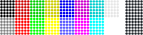
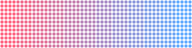
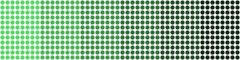

# `color`

[Index](README.md) · [canvas](canvas.md) · [draw](draw.md) · [path](path.md) · [layer](layer.md) · [bubble](bubble.md) · [font](font.md) · [text](text.md) · **color** · [render](render.md) · [term](term.md) · [export](export.md) · [ratatui](ratatui.md)

Colour types: truecolor [`Rgb`](color.md#rgb), the terminal-palette aware [`Color`](color.md#color), and the
[`Palette`](color.md#palette) that maps one onto the other.

## Contents

- [`Rgb`](#rgb)
- [`Color`](#color)
- [`Depth`](#depth)
- [`Palette`](#palette)
- `Rgb`: [`Rgb::new`](color.md#rgbnew), [`Rgb::hex`](color.md#rgbhex), [`Rgb::lerp`](color.md#rgblerp), [`Rgb::dim`](color.md#rgbdim), [`Rgb::luminance`](color.md#rgbluminance), [`Rgb::contrast`](color.md#rgbcontrast)
- `Color`: [`Color::resolve`](color.md#colorresolve), [`Color::quantize`](color.md#colorquantize)
- `Depth`: [`Depth::parse`](color.md#depthparse), [`Depth::from_env`](color.md#depthfrom_env)
- `Palette`: [`Palette::is_light`](color.md#paletteis_light), [`Palette::nearest_ansi`](color.md#palettenearest_ansi)

## `Rgb`

```rust
pub struct Rgb
```

An opaque 24-bit RGB colour.

- `pub r: u8` — Red.
- `pub g: u8` — Green.
- `pub b: u8` — Blue.

## `Color`

```rust
pub enum Color
```

A dot colour: either an explicit [`Rgb`](color.md#rgb) or a reference into the terminal's own
palette, so a canvas can follow the user's colour scheme.

In the text fallback, palette colours are emitted as ordinary SGR indices
(`38;5;n`, or the default foreground) and the terminal applies its theme. In the
image protocols they are resolved through the [`Palette`](color.md#palette) that
[`Terminal::detect`](term.md#terminaldetect) reads from the terminal (`OSC 4`,
`OSC 10`), which costs one table lookup per dot and nothing on the wire.

- `Rgb(Rgb)` — An explicit 24-bit colour.
- `Indexed(u8)` — One of the terminal's 256 palette entries (`0..=15` are the themed ANSI colours).
- `Foreground` — The terminal's default foreground colour.

<picture>
  <source media="(prefers-color-scheme: dark)" srcset="img/color.svg">
  
</picture>

```rust
// Palette colours follow the terminal's theme; the file shows the default palette.
for i in 0..8u8 {
    c.fill_rect(i as f32 * 5.0, 0.0, 5.0, 6.0, Color::Indexed(i));
    c.fill_rect(i as f32 * 5.0, 6.0, 5.0, 6.0, Color::Indexed(i + 8));
}
c.fill_rect(42.0, 0.0, 6.0, 12.0, Color::Foreground);
```

## `Depth`

```rust
pub enum Depth
```

How many colours the terminal can show in text: what the braille fallback
quantises [`Color::Rgb`](color.md#color) dots to.

Image protocols always get full RGB; the depth only matters for
[`Protocol::Text`](term.md#protocol) and the ratatui widget.

- `Mono` — No colour: every dot is drawn in the default foreground.
- `Ansi16` — The 16 ANSI colours (`SGR 30–37`, `90–97`), matched against the terminal's real palette when it was queried.
- `Ansi256` — The xterm 256-colour palette: a 6×6×6 cube and a 24-step grey ramp.
- `TrueColor` — 24-bit `SGR 38;2;r;g;b`.

## `Palette`

```rust
pub struct Palette
```

The terminal's colour scheme: 256 palette entries plus default foreground and
background. Used to turn [`Color::Indexed`](color.md#color) and [`Color::Foreground`](color.md#color) dots into
pixels for the image protocols.

`Palette::default` is the xterm palette. [`Terminal::detect`](term.md#terminaldetect)
replaces entries `0..=15`, the foreground and the background with what the terminal
reports; the 6×6×6 cube and the grey ramp are the same on every terminal.

- `pub colors: [Rgb; 256]` — Entries `0..=255`.
- `pub foreground: Rgb` — Default foreground.
- `pub background: Rgb` — Default background.

## `Rgb` methods

## `Rgb::new`

```rust
pub const fn new(r: u8, g: u8, b: u8) -> Self
```

Creates a colour from its channels.

## `Rgb::hex`

```rust
pub const fn hex(rgb: u32) -> Self
```

Creates a colour from a `0xRRGGBB` literal.

## `Rgb::lerp`

```rust
pub fn lerp(self, other: Rgb, t: f32) -> Rgb
```

Linear blend towards `other`; `t` is clamped to `0..=1`.

<picture>
  <source media="(prefers-color-scheme: dark)" srcset="img/rgb-lerp.svg">
  
</picture>

```rust
for i in 0..12 {
    c.fill_rect(i as f32 * 4.0, 0.0, 4.0, 12.0, RED.lerp(BLUE, i as f32 / 11.0));
}
```

## `Rgb::dim`

```rust
pub fn dim(self, f: f32) -> Rgb
```

Scales every channel by `f` (clamped to `0..=1`); `0.5` halves the brightness.

<picture>
  <source media="(prefers-color-scheme: dark)" srcset="img/rgb-dim.svg">
  
</picture>

```rust
for i in 0..6 {
    c.fill_rect(i as f32 * 8.0, 0.0, 8.0, 12.0, GREEN.dim(1.0 - i as f32 / 6.0));
}
```

## `Rgb::luminance`

```rust
pub fn luminance(self) -> f32
```

Relative luminance in `0..=1` (sRGB, WCAG weights), for contrast checks.

## `Rgb::contrast`

```rust
pub fn contrast(self, other: Rgb) -> f32
```

WCAG contrast ratio between two colours, `1..=21`.

## `Color` methods

## `Color::resolve`

```rust
pub fn resolve(self, palette: &Palette) -> Rgb
```

Resolves the colour to RGB through `palette`.

## `Color::quantize`

```rust
pub fn quantize(self, depth: Depth, palette: &Palette) -> Color
```

The closest colour the terminal can show at `depth`; a no-op at
[`Depth::TrueColor`](color.md#depth). Palette indices are kept where the depth has them and
resolved through `palette` where it does not.

## `Depth` methods

## `Depth::parse`

```rust
pub fn parse(s: &str) -> Option<Self>
```

Parses `mono` / `16` / `256` / `true` (also `truecolor`, `24bit`, `ansi`).

## `Depth::from_env`

```rust
pub fn from_env() -> Self
```

Guesses the depth from the environment, without touching the tty.

`NO_COLOR` wins, then `COLORTERM`, then well-known terminal programs, then
`TERM`. An unknown but non-empty `TERM` is assumed to be 256-colour capable,
which every terminal of the last two decades is; `dumb`, `vt*` and `ansi`
are not.

## `Palette` methods

## `Palette::is_light`

```rust
pub fn is_light(&self) -> bool
```

`true` when the background is light, i.e. the terminal runs a light theme.

## `Palette::nearest_ansi`

```rust
pub fn nearest_ansi(&self, c: Rgb) -> u8
```

Index of the ANSI colour (`0..=15`) closest to `c` in this palette.

[Index](README.md) · [canvas](canvas.md) · [draw](draw.md) · [path](path.md) · [layer](layer.md) · [bubble](bubble.md) · [font](font.md) · [text](text.md) · **color** · [render](render.md) · [term](term.md) · [export](export.md) · [ratatui](ratatui.md)

