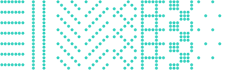
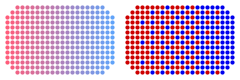
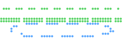
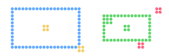
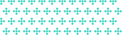
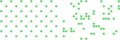
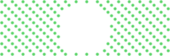
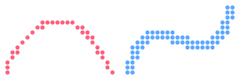
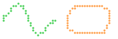

# `draw`

[Index](README.md) · [canvas](canvas.md) · **draw** · [path](path.md) · [mask](mask.md) · [transform](transform.md) · [rig](rig.md) · [layer](layer.md) · [bubble](bubble.md) · [font](font.md) · [text](text.md) · [color](color.md) · [render](render.md) · [term](term.md) · [export](export.md) · [ratatui](ratatui.md)

Vector primitives: rectangles, polygons, ellipses, arcs, Bézier curves, splines
and [`Path`](path.md#path)s, filled or stroked, drawn straight into the dot buffer.

Everything here reduces to horizontal spans ([`Canvas::span`](draw.md#canvasspan)): a fill is one
clipped `slice::fill` per dot row rather than a bounds check per dot, and a stroke
is a chain of Bresenham lines (width ≤ 1) or convex quads plus round joins. Curves
are flattened on the fly, one segment at a time, so nothing here allocates
(except [`Canvas::fill_polygon`](draw.md#canvasfill_polygon) on a polygon with more than 128 vertices, paths,
and the shape-relative paints described under [`Paint`](draw.md#paint)).

Coordinates are in dots, `f32`, with dot `(x, y)` covering the unit square from
`(x, y)` to `(x + 1, y + 1)`. A fill includes every dot whose centre is inside the
shape, so `fill_rect(2.0, 3.0, 4.0, 2.0)` is exactly dots `2..6 × 3..5`.

Every method takes a [`Paint`](draw.md#paint) (a colour, a dither, a pattern, a gradient, a
shader, or [`Paint::erase`](draw.md#painterase)) and every stroke takes a [`Pen`](draw.md#pen) (a width, or a width
with a dash pattern; a bare `f32` is a solid pen).

## Contents

- [`Pattern`](#pattern)
- [`Shader`](#shader)
- [`Probe`](#probe)
- [`Paint`](#paint)
- [`Pen`](#pen)
- [`Point`](#point)
- [`Rect`](#rect)
- `Pattern`: [`Pattern::on`](draw.md#patternon)
- `Probe`: [`Probe::mix`](draw.md#probemix), [`Probe::lit`](draw.md#probelit)
- `Paint`: [`Paint::new`](draw.md#paintnew), [`Paint::dithered`](draw.md#paintdithered), [`Paint::erase`](draw.md#painterase), [`Paint::pattern`](draw.md#paintpattern), [`Paint::linear`](draw.md#paintlinear), [`Paint::radial`](draw.md#paintradial), [`Paint::edge`](draw.md#paintedge), [`Paint::cel`](draw.md#paintcel), [`Paint::shader`](draw.md#paintshader), [`Paint::dither`](draw.md#paintdither), [`Paint::hashed`](draw.md#painthashed), [`Paint::per_cell`](draw.md#paintper_cell), [`Paint::soften`](draw.md#paintsoften), [`Paint::anchor`](draw.md#paintanchor), [`Paint::color`](draw.md#paintcolor), [`Paint::coverage`](draw.md#paintcoverage)
- `Pen`: [`Pen::new`](draw.md#pennew), [`Pen::dash`](draw.md#pendash), [`Pen::dotted`](draw.md#pendotted), [`Pen::phase`](draw.md#penphase)
- `Rect`: [`Rect::new`](draw.md#rectnew), [`Rect::around`](draw.md#rectaround), [`Rect::right`](draw.md#rectright), [`Rect::bottom`](draw.md#rectbottom), [`Rect::center`](draw.md#rectcenter), [`Rect::contains`](draw.md#rectcontains), [`Rect::inset`](draw.md#rectinset), [`Rect::offset`](draw.md#rectoffset), [`Rect::overlap`](draw.md#rectoverlap)
- `Canvas`: [`Canvas::span`](draw.md#canvasspan), [`Canvas::stencil`](draw.md#canvasstencil), [`Canvas::stencil_in`](draw.md#canvasstencil_in), [`Canvas::clip`](draw.md#canvasclip), [`Canvas::cut`](draw.md#canvascut), [`Canvas::clipped`](draw.md#canvasclipped), [`Canvas::fill_rect`](draw.md#canvasfill_rect), [`Canvas::rect`](draw.md#canvasrect), [`Canvas::fill_ellipse`](draw.md#canvasfill_ellipse), [`Canvas::ellipse`](draw.md#canvasellipse), [`Canvas::arc`](draw.md#canvasarc), [`Canvas::polyline`](draw.md#canvaspolyline), [`Canvas::polygon`](draw.md#canvaspolygon), [`Canvas::fill_polygon`](draw.md#canvasfill_polygon), [`Canvas::fill_path`](draw.md#canvasfill_path), [`Canvas::stroke_path`](draw.md#canvasstroke_path), [`Canvas::bezier`](draw.md#canvasbezier), [`Canvas::spline`](draw.md#canvasspline), [`Canvas::fill_round_rect`](draw.md#canvasfill_round_rect), [`Canvas::round_rect`](draw.md#canvasround_rect), [`Canvas::ring`](draw.md#canvasring), [`Canvas::fill_pie`](draw.md#canvasfill_pie), [`Canvas::fill_ngon`](draw.md#canvasfill_ngon), [`Canvas::ngon`](draw.md#canvasngon), [`Canvas::fill_star`](draw.md#canvasfill_star), [`Canvas::star`](draw.md#canvasstar), [`Canvas::arrow`](draw.md#canvasarrow)

## `Pattern`

```rust
pub enum Pattern
```

A repeating dot pattern for [`Paint::pattern`](draw.md#paintpattern), with its period in dots. Patterns
are anchored at the canvas origin unless the paint is [anchored](draw.md#paintanchor)
elsewhere.

- `Rows(u8)` — Horizontal lines, one dot thick, every `n` dots.
- `Columns(u8)` — Vertical lines, one dot thick, every `n` dots.
- `Diagonal(u8)` — Lines running down-right (`\`), every `n` dots.
- `Antidiagonal(u8)` — Lines running up-right (`/`), every `n` dots.
- `Cross(u8)` — Both diagonals: cross-hatching.
- `Grid(u8)` — Rows and columns: a grid.
- `Checker(u8)` — A checkerboard of `n × n` squares.
- `Dots(u8)` — One dot every `n` dots, each row staggered by half a period.

<picture>
  <source media="(prefers-color-scheme: dark)" srcset="img/pattern.svg">
  
</picture>

```rust
let all = [
    Pattern::Rows(3), Pattern::Columns(3), Pattern::Diagonal(4), Pattern::Antidiagonal(4),
    Pattern::Cross(6), Pattern::Grid(4), Pattern::Checker(3), Pattern::Dots(4),
];
for (i, p) in all.into_iter().enumerate() {
    c.fill_rect(i as f32 * 8.0 + 0.5, 0.0, 7.0, 20.0, Paint::pattern(CYAN, p));
}
```

## `Shader`

```rust
pub type Shader = fn(&Probe) -> Option<Paint>
```

A shader for [`Paint::shader`](draw.md#paintshader): the paint for one dot, or `None` to leave it.

<picture>
  <source media="(prefers-color-scheme: dark)" srcset="img/shader.svg">
  
</picture>

```rust
// A shader is a plain function. `mix` blends `a` towards `b` for RGB colours
// and dithers between them for palette colours, which cannot blend.
fn across(p: &Probe) -> Option<Paint> {
    Some(p.mix(p.u))
}
c.fill_round_rect(1.0, 1.0, 22.0, 14.0, 4.0, Paint::shader(RED, BLUE, across));
c.fill_round_rect(25.0, 1.0, 22.0, 14.0, 4.0, Paint::shader(Color::Indexed(1), Color::Indexed(4), across));
```

## `Probe`

```rust
pub struct Probe
```

One dot as a [`Paint::shader`](draw.md#paintshader) sees it: where it is, and where in the shape.

The shape-relative fields (`u`, `v`, `dist`, `normal`) come from the shape the
paint is filling: its bounding box and its distance field. With
[`Paint::per_cell`](draw.md#paintper_cell) they are those of one dot per cell, so what a shader decides
is decided per cell.

- `pub x: i32` — The dot, relative to the paint's [anchor](draw.md#paintanchor).
- `pub y: i32` — The dot, relative to the paint's [anchor](draw.md#paintanchor).
- `pub u: f32` — Where the dot sits across the shape's bounding box, `0..1` left to right.
- `pub v: f32` — Where the dot sits down the shape's bounding box, `0..1` top to bottom.
- `pub dist: f32` — Signed distance in dots to the shape's edge: `-1` on the edge, more negative deeper inside. (A paint only ever fills the inside, so it is never positive.)
- `pub normal: (f32, f32)` — The unit normal of the shape's surface at this dot, pointing outwards: the direction to the nearest edge, which for a rounded shape is the direction it faces. `(0, 0)` on a ridge equidistant from two edges. Dot it with a light direction and the shape is lit.
- `pub a: Color` — The paint's first colour.
- `pub b: Color` — The paint's second colour.

<picture>
  <source media="(prefers-color-scheme: dark)" srcset="img/probe.svg">
  
</picture>

```rust
// What a shader is told about a dot: where it sits across the shape (`u`,
// `v`), how deep inside it is (`dist`), and which way the surface faces there.
c.fill_round_rect(1.0, 1.0, 14.0, 14.0, 4.0, Paint::shader(RED, BLUE, |p| Some(p.mix(p.v))));
c.fill_round_rect(17.0, 1.0, 14.0, 14.0, 4.0, Paint::shader(YELLOW, PURPLE, |p| Some(p.mix(-p.dist / 6.0))));
c.fill_round_rect(33.0, 1.0, 14.0, 14.0, 4.0, Paint::shader(GREEN, CYAN, |p| Some(p.mix((p.normal.0 + 1.0) / 2.0))));
```

## `Paint`

```rust
pub struct Paint
```

What a shape is drawn with.

The simplest paint is a colour ([`Paint::new`](draw.md#paintnew), or any colour converted with
`into()`), and [`Paint::erase`](draw.md#painterase) unsets dots instead. On top of that:

* [`dithered`](draw.md#paintdithered) draws a fraction of the dots in an ordered pattern
  ([`hashed`](draw.md#painthashed) spreads them without the pattern);
* [`pattern`](draw.md#paintpattern) draws hatching, grids, checkers or dots;
* [`linear`](draw.md#paintlinear) and [`radial`](draw.md#paintradial) blend between two colours
  across the canvas;
* [`edge`](draw.md#paintedge) blends from the edge of the shape inwards;
* [`cel`](draw.md#paintcel) lights the shape from a direction in flat bands;
* [`shader`](draw.md#paintshader) is a function of your own, given the dot's position,
  where it lies in the shape and which way the shape faces there.

Dithers, patterns and gradients are laid out in canvas coordinates, so a shape
drawn in the same paint at another position shows another slice of the texture.
[`anchor`](draw.md#paintanchor) moves the paint's origin to a point of the shape, so the
texture moves with it.

Edge, cel and shader paints are *shape-relative*: the shape is first rasterised
into a scratch mask (one kept per thread, so it costs an allocation once), its
distance field is computed, and the paint is then evaluated per dot with its
position in the shape's bounding box, its distance to the edge and the surface
normal there. [`per_cell`](draw.md#paintper_cell) evaluates once per cell instead, so
that whatever the paint decides lands on cell boundaries and survives the text
fallback, where a cell has one colour.

```rust
use cobra::{Canvas, Paint, Pattern, Rgb};

let (red, blue) = (Rgb::hex(0xff3355), Rgb::hex(0x3355ff));
let mut canvas = Canvas::new(20, 5);
canvas.fill_rect(0.0, 0.0, 20.0, 20.0, Paint::linear((0.0, 0.0), (20.0, 0.0), red, blue));
canvas.disc(30.0, 10.0, 8.0, Paint::edge(blue, red, 3.0));
canvas.fill_rect(0.0, 0.0, 40.0, 4.0, Paint::pattern(red, Pattern::Diagonal(3)).anchor(0, 0));
```

<picture>
  <source media="(prefers-color-scheme: dark)" srcset="img/paint.svg">
  
</picture>

```rust
// One shape in six paints: a colour, a dither, a pattern, a gradient, an
// edge gradient and cel bands.
let paints = [
    Paint::new(BLUE),
    Paint::dithered(BLUE, 0.4),
    Paint::pattern(BLUE, Pattern::Diagonal(3)),
    Paint::linear((0.0, 0.0), (0.0, 16.0), BLUE, GREEN),
    Paint::edge(t.ink, BLUE, 2.5),
    Paint::cel(BLUE.dim(0.4), (-1.0, -1.0), &[(-0.2, BLUE), (0.5, CYAN)]),
];
for (i, paint) in paints.into_iter().enumerate() {
    c.fill_round_rect(i as f32 * 8.0 + 0.5, 1.0, 7.0, 14.0, 2.5, paint);
}
```

## `Pen`

```rust
pub struct Pen
```

How a stroke is drawn: its width, and optionally a dash pattern.

Every stroking method takes `impl Into<Pen>`, and a bare `f32` is a solid pen of
that width, so `canvas.polyline(&pts, 2.0, paint)` and
`canvas.polyline(&pts, Pen::new(2.0).dash(4.0, 2.0), paint)` both work.

- `pub width: f32` — Width in dots. Up to `1.0` the stroke is a one-dot Bresenham line; wider ones are quads with round joins and caps.
- `pub dash: Option<(f32, f32)>` — Dash pattern as `(on, off)` lengths in dots, `None` for a solid stroke.
- `pub phase: f32` — Where in the dash pattern the stroke starts, in dots; animate it for a marching-ants effect.

<picture>
  <source media="(prefers-color-scheme: dark)" srcset="img/pen.svg">
  
</picture>

```rust
for (y, width) in [(1.0, 1.0), (4.0, 2.0), (8.0, 3.0), (13.0, 5.0)] {
    c.polyline(&[(2.0, y), (46.0, y)], Pen::new(width), BLUE);
}
```

**`dash`**

<picture>
  <source media="(prefers-color-scheme: dark)" srcset="img/pen-dash.svg">
  
</picture>

```rust
c.polyline(&[(1.0, 3.0), (47.0, 3.0)], Pen::new(1.0).dash(3.0, 2.0), GREEN);
c.polyline(&[(1.0, 8.0), (47.0, 8.0)], Pen::new(2.0).dash(6.0, 3.0), GREEN);
c.ellipse(24.0, 12.0, 20.0, 3.0, Pen::new(1.0).dash(4.0, 4.0), BLUE);
```

**`phase`**

<picture>
  <source media="(prefers-color-scheme: dark)" srcset="img/pen-phase.svg">
  
</picture>

```rust
for i in 0..4 {
    let y = 2.0 + i as f32 * 4.0;
    c.polyline(&[(1.0, y), (47.0, y)], Pen::new(1.0).dash(4.0, 4.0).phase(i as f32 * 2.0), YELLOW);
}
```

## `Point`

```rust
pub type Point = (f32, f32)
```

A point in dot coordinates.

<picture>
  <source media="(prefers-color-scheme: dark)" srcset="img/point.svg">
  
</picture>

```rust
// Dot coordinates as `f32`: dot `(x, y)` spans `x..x+1`, so its centre is
// `(x + 0.5, y + 0.5)`.
let pts: [Point; 4] = [(4.0, 12.0), (16.0, 3.0), (30.0, 13.0), (44.0, 4.0)];
c.polyline(&pts, 1.0, t.panel);
for p in pts {
    c.disc(p.0, p.1, 1.5, RED);
}
```

## `Rect`

```rust
pub struct Rect
```

An axis-aligned box in dot coordinates: what a [`Bubble`](bubble.md#bubble) occupies
and what a keep-out zone is.

- `pub x: f32` — Left edge.
- `pub y: f32` — Top edge.
- `pub w: f32` — Width in dots.
- `pub h: f32` — Height in dots.

<picture>
  <source media="(prefers-color-scheme: dark)" srcset="img/rect.svg">
  
</picture>

```rust
let r = Rect::new(3.0, 2.0, 20.0, 12.0);
c.rect(r.x, r.y, r.w, r.h, 1.0, BLUE);
let (cx, cy) = r.center();
c.disc(cx, cy, 1.5, YELLOW);
c.disc(r.right(), r.bottom(), 1.5, YELLOW);
let a = Rect::around((36.0, 8.0), 14.0, 8.0); // by its centre
c.rect(a.x, a.y, a.w, a.h, 1.0, GREEN);
for p in [(31.0, 6.0), (36.0, 8.0), (45.0, 3.0), (40.0, 13.0)] {
    c.disc(p.0, p.1, 1.2, if a.contains(p) { GREEN } else { RED });
}
```

## `Pattern` methods

## `Pattern::on`

```rust
pub fn on(self, x: i32, y: i32) -> bool
```

Whether the pattern has a dot at `(x, y)`.

<picture>
  <source media="(prefers-color-scheme: dark)" srcset="img/pattern-on.svg">
  
</picture>

```rust
// The pattern as a predicate, for when a paint is not what is wanted.
for y in 0..16 {
    for x in 0..48 {
        if Pattern::Dots(4).on(x, y) {
            c.disc(x as f32 + 0.5, y as f32 + 0.5, 1.2, CYAN);
        }
    }
}
```

## `Probe` methods

## `Probe::mix`

```rust
pub fn mix(&self, t: f32) -> Paint
```

Solid `a` blended towards `b` by `t` (`0..=1`): a true blend for RGB colours,
an ordered dither between the two for palette colours.

<picture>
  <source media="(prefers-color-scheme: dark)" srcset="img/shader.svg">
  
</picture>

```rust
// A shader is a plain function. `mix` blends `a` towards `b` for RGB colours
// and dithers between them for palette colours, which cannot blend.
fn across(p: &Probe) -> Option<Paint> {
    Some(p.mix(p.u))
}
c.fill_round_rect(1.0, 1.0, 22.0, 14.0, 4.0, Paint::shader(RED, BLUE, across));
c.fill_round_rect(25.0, 1.0, 22.0, 14.0, 4.0, Paint::shader(Color::Indexed(1), Color::Indexed(4), across));
```

## `Probe::lit`

```rust
pub fn lit(&self, light: Point) -> f32
```

How much the surface faces `light`, a direction towards the light: `1`
facing it, `0` side on, `-1` facing away. This is `normal · light` with
`light` normalised, the number every kind of shading starts from.

<picture>
  <source media="(prefers-color-scheme: dark)" srcset="img/probe-lit.svg">
  
</picture>

```rust
// Smooth shading from the normal: `lit` is -1..1, mixed into a colour.
let lit = Paint::shader(CYAN.dim(0.3), CYAN, |p| Some(p.mix((p.lit((-1.0, -1.0)) + 1.0) / 2.0)));
c.disc(9.0, 8.0, 7.5, lit);
c.fill_round_rect(20.0, 1.0, 26.0, 14.0, 5.0, lit);
```

## `Paint` methods

## `Paint::new`

```rust
pub fn new(color: impl Into<Color>) -> Self
```

Solid `color`.

<picture>
  <source media="(prefers-color-scheme: dark)" srcset="img/paint-new.svg">
  
</picture>

```rust
c.disc(12.0, 8.0, 7.0, Paint::new(RED));
c.disc(36.0, 8.0, 7.0, Paint::new(Color::Foreground)); // the terminal's own
```

## `Paint::dithered`

```rust
pub fn dithered(color: impl Into<Color>, coverage: f32) -> Self
```

`color` on `coverage` (`0..=1`) of the dots, in the ordered Bayer pattern of
[`Canvas::set_dithered`](canvas.md#canvasset_dithered).

<picture>
  <source media="(prefers-color-scheme: dark)" srcset="img/paint-dithered.svg">
  
</picture>

```rust
for (i, coverage) in [0.15, 0.35, 0.6, 0.85].into_iter().enumerate() {
    c.fill_rect(i as f32 * 12.0, 0.0, 12.0, 16.0, Paint::dithered(BLUE, coverage));
}
```

## `Paint::erase`

```rust
pub const fn erase() -> Self
```

Unsets dots instead of colouring them.

<picture>
  <source media="(prefers-color-scheme: dark)" srcset="img/paint-erase.svg">
  
</picture>

```rust
c.fill_rect(0.0, 0.0, 48.0, 16.0, PURPLE);
c.text(4, 3, "GONE", &Font::tiny().scale(2), Paint::erase());
```

## `Paint::pattern`

```rust
pub fn pattern(color: impl Into<Color>, pattern: Pattern) -> Self
```

`color` on the dots of `pattern`.

<picture>
  <source media="(prefers-color-scheme: dark)" srcset="img/paint-pattern.svg">
  
</picture>

```rust
c.fill_rect(0.0, 0.0, 15.0, 16.0, Paint::pattern(GREEN, Pattern::Diagonal(4)));
c.fill_rect(16.0, 0.0, 15.0, 16.0, Paint::pattern(GREEN, Pattern::Checker(2)));
c.disc(40.0, 8.0, 7.5, Paint::pattern(GREEN, Pattern::Dots(3)));
```

## `Paint::linear`

```rust
pub fn linear(from: Point, to: Point, a: impl Into<Color>, b: impl Into<Color>) -> Self
```

A gradient from `a` at `from` to `b` at `to`, constant beyond either end and
along lines perpendicular to the axis between them.

<picture>
  <source media="(prefers-color-scheme: dark)" srcset="img/paint-linear.svg">
  
</picture>

```rust
c.fill_rect(0.0, 0.0, 23.0, 16.0, Paint::linear((0.0, 0.0), (23.0, 0.0), RED, YELLOW));
c.disc(36.0, 8.0, 7.5, Paint::linear((30.0, 2.0), (42.0, 14.0), BLUE, GREEN));
```

## `Paint::radial`

```rust
pub fn radial(center: Point, r: f32, a: impl Into<Color>, b: impl Into<Color>) -> Self
```

A gradient from `a` at `center` to `b` at radius `r`, and `b` beyond.

<picture>
  <source media="(prefers-color-scheme: dark)" srcset="img/paint-radial.svg">
  
</picture>

```rust
c.fill_rect(0.0, 0.0, 23.0, 16.0, Paint::radial((11.5, 8.0), 12.0, YELLOW, RED));
c.disc(36.0, 8.0, 7.5, Paint::radial((33.0, 5.0), 10.0, t.ink, BLUE));
```

## `Paint::edge`

```rust
pub fn edge(a: impl Into<Color>, b: impl Into<Color>, depth: f32) -> Self
```

A gradient from `a` on the edge of whatever shape it fills to `b` `depth` dots
inside it, and `b` further in: shading that follows the shape. Shape-relative;
see the type docs.

<picture>
  <source media="(prefers-color-scheme: dark)" srcset="img/paint-edge.svg">
  
</picture>

```rust
c.fill_star(9.0, 8.0, 8.0, 3.5, 5, -PI / 2.0, Paint::edge(YELLOW, RED, 3.0));
c.fill_round_rect(20.0, 1.0, 26.0, 14.0, 5.0, Paint::edge(t.ink, BLUE, 4.0));
```

## `Paint::cel`

```rust
pub fn cel<P: Into<Paint> + Copy>(base: impl Into<Color>, light: Point, bands: &[(f32, P)]) -> Self
```

Cel shading: `base` where the shape faces away from `light` (a direction
towards the light, such as `(-1.0, -1.0)` for light from the upper left), and
each of `bands` where the surface faces it at least as much as the band's
threshold, `-1..=1` as [`Probe::lit`](draw.md#probelit) gives it. A band's paint lends its
colour, coverage and pattern, so a band can be a flat ink, a dither or a
hatch. Up to four bands, in any order. Shape-relative; see the [type
docs](Self), and [`per_cell`](draw.md#paintper_cell) for bands that survive the text
fallback, [`soften`](draw.md#paintsoften) for band edges that dissolve instead of
stepping.

```rust
use cobra::{Canvas, Paint, Rgb};

let (dark, mid, light) = (Rgb::hex(0x7a3e00), Rgb::hex(0xff8c1a), Rgb::hex(0xffe08a));
let ball = Paint::cel(dark, (-1.0, -1.0), &[(-0.2, mid), (0.5, light)]).per_cell();
let mut canvas = Canvas::new(10, 5);
canvas.disc(10.0, 10.0, 9.0, ball);
```

<picture>
  <source media="(prefers-color-scheme: dark)" srcset="img/paint-cel.svg">
  
</picture>

```rust
// Three tones by how much the surface faces the light, from the upper left.
let ball = Paint::cel(Rgb::hex(0x7a3e00), (-1.0, -1.0), &[(-0.2, ORANGE), (0.5, YELLOW)]);
c.disc(9.0, 8.0, 7.5, ball);
c.fill_round_rect(20.0, 1.0, 26.0, 14.0, 6.0, ball);
```

## `Paint::shader`

```rust
pub fn shader(a: impl Into<Color>, b: impl Into<Color>, f: Shader) -> Self
```

A paint computed per dot by `f`, given a [`Probe`](draw.md#probe) carrying the dot's
position, its place in the shape, the surface normal there and the two
colours `a` and `b`. `f` returns the paint for the dot (its colour, coverage
and pattern are used) or `None` to leave the dot as it is. Shape-relative;
see the type docs.

```rust
use cobra::{Canvas, Paint, Rgb};

// Horizontal bands of the two colours, four dots tall.
let bands = Paint::shader(Rgb::hex(0xffffff), Rgb::hex(0x808080), |p| Some(p.mix((p.y / 4 % 2) as f32)));
// Lit from the top left, smoothly: the surface normal against the light.
let lit = Paint::shader(Rgb::hex(0x203040), Rgb::hex(0x80c0ff), |p| Some(p.mix(p.lit((-1.0, -1.0)))));
let mut canvas = Canvas::new(10, 5);
canvas.disc(10.0, 10.0, 8.0, lit);
canvas.fill_rect(0.0, 0.0, 20.0, 4.0, bands);
```

<picture>
  <source media="(prefers-color-scheme: dark)" srcset="img/paint-shader.svg">
  
</picture>

```rust
// Lit from the top left, using the dot's place in the shape.
let lit = Paint::shader(BLUE, t.ink, |p| Some(p.mix(1.0 - (p.u + p.v) / 2.0)));
c.disc(9.0, 8.0, 7.5, lit);
// Rings, from the distance to the edge.
let rings = Paint::shader(GREEN, YELLOW, |p| Some(p.mix(((-p.dist / 2.0) % 2.0 < 1.0) as i32 as f32)));
c.fill_rect(20.0, 0.0, 28.0, 16.0, rings);
```

## `Paint::dither`

```rust
pub fn dither(mut self, coverage: f32) -> Self
```

Draws only `coverage` (`0..=1`) of the dots this paint would, in the ordered
pattern of [`Canvas::set_dithered`](canvas.md#canvasset_dithered).

<picture>
  <source media="(prefers-color-scheme: dark)" srcset="img/paint-dither.svg">
  
</picture>

```rust
let grad = Paint::linear((0.0, 0.0), (48.0, 0.0), PURPLE, CYAN);
c.fill_rect(0.0, 0.0, 48.0, 7.0, grad);
c.fill_rect(0.0, 9.0, 48.0, 7.0, grad.dither(0.5));
```

## `Paint::hashed`

```rust
pub fn hashed(mut self) -> Self
```

Spreads the paint's coverage by a hash of each dot's position instead of the
Bayer lattice: the same share of dots, with no visible grid. Ordered dither
is right for a gradient, where the eye wants regularity; this is right for a
texture, where it reads regularity as a material.

<picture>
  <source media="(prefers-color-scheme: dark)" srcset="img/paint-hashed.svg">
  
</picture>

```rust
// The same coverage: ordered on the left reads as a lattice, hashed on the
// right reads as grain.
c.fill_rect(0.0, 0.0, 23.0, 16.0, Paint::dithered(GREEN, 0.15));
c.fill_rect(25.0, 0.0, 23.0, 16.0, Paint::dithered(GREEN, 0.15).hashed());
```

## `Paint::per_cell`

```rust
pub fn per_cell(mut self) -> Self
```

Evaluates the paint once per cell, at the covered dot nearest the cell's
centre, and gives every dot of the cell the answer: gradients, cel bands and
shaders then change colour only on cell boundaries, so a band is never
thinner than the one colour a cell has in the text fallback. The coverage
dither stays per dot.

<picture>
  <source media="(prefers-color-scheme: dark)" srcset="img/paint-per_cell.svg">
  
</picture>

```rust
// Left: bands wherever the normal says. Right: the same, decided once per
// cell, so every band is at least a cell and survives the text fallback.
let ball = Paint::cel(BLUE.dim(0.4), (-1.0, -1.0), &[(-0.2, BLUE), (0.5, t.ink)]);
c.disc(10.0, 8.0, 7.5, ball);
c.disc(36.0, 8.0, 7.5, ball.per_cell());
```

## `Paint::soften`

```rust
pub fn soften(mut self, width: f32) -> Self
```

For a [`cel`](draw.md#paintcel) paint: within `width` (in units of [`Probe::lit`](draw.md#probelit),
so about `0.1`–`0.3`) of a band's threshold, dither between the two bands
instead of stepping, so the terminator dissolves over a few dots. Ignored by
other paints.

<picture>
  <source media="(prefers-color-scheme: dark)" srcset="img/paint-soften.svg">
  
</picture>

```rust
// A hard terminator, and one that dissolves into a dither over the band edge.
let ball = Paint::cel(PURPLE.dim(0.4), (-1.0, -0.5), &[(0.1, PURPLE)]);
c.disc(10.0, 8.0, 7.5, ball);
c.disc(36.0, 8.0, 7.5, ball.soften(0.35));
```

## `Paint::anchor`

```rust
pub fn anchor(mut self, x: i32, y: i32) -> Self
```

Moves the paint's origin to dot `(x, y)`: the dither, the pattern and the
gradient geometry are evaluated relative to it, so a texture drawn at a
shape's own corner follows the shape when it moves.

<picture>
  <source media="(prefers-color-scheme: dark)" srcset="img/paint-anchor.svg">
  
</picture>

```rust
// The same hatch, anchored at each box's corner: it lines up with the box.
for i in 0..4 {
    let x = 1.0 + i as f32 * 12.0;
    c.fill_rect(x, 2.0, 10.0, 12.0, Paint::pattern(ORANGE, Pattern::Grid(4)).anchor(x as i32, 2));
}
```

## `Paint::color`

```rust
pub fn color(&self) -> Option<Color>
```

The colour, `None` for [`erase`](draw.md#painterase). For a gradient or a shader, the
first of its two colours; for a cel paint, its base.

<picture>
  <source media="(prefers-color-scheme: dark)" srcset="img/paint-color.svg">
  
</picture>

```rust
// What a paint says about itself: the dithered swatch, then its colour solid
// and its coverage as a number.
let paint = Paint::dithered(GREEN, 0.35);
c.fill_rect(1.0, 1.0, 20.0, 14.0, paint);
c.fill_rect(24.0, 1.0, 6.0, 14.0, paint.color().unwrap());
c.text(33, 5, &format!("{:.0}%", paint.coverage() * 100.0), Font::tiny(), t.ink);
```

## `Paint::coverage`

```rust
pub fn coverage(&self) -> f32
```

Dither coverage, `1.0` when solid.

<picture>
  <source media="(prefers-color-scheme: dark)" srcset="img/paint-color.svg">
  
</picture>

```rust
// What a paint says about itself: the dithered swatch, then its colour solid
// and its coverage as a number.
let paint = Paint::dithered(GREEN, 0.35);
c.fill_rect(1.0, 1.0, 20.0, 14.0, paint);
c.fill_rect(24.0, 1.0, 6.0, 14.0, paint.color().unwrap());
c.text(33, 5, &format!("{:.0}%", paint.coverage() * 100.0), Font::tiny(), t.ink);
```

## `Pen` methods

## `Pen::new`

```rust
pub const fn new(width: f32) -> Self
```

A solid pen `width` dots wide.

<picture>
  <source media="(prefers-color-scheme: dark)" srcset="img/pen.svg">
  
</picture>

```rust
for (y, width) in [(1.0, 1.0), (4.0, 2.0), (8.0, 3.0), (13.0, 5.0)] {
    c.polyline(&[(2.0, y), (46.0, y)], Pen::new(width), BLUE);
}
```

## `Pen::dash`

```rust
pub const fn dash(mut self, on: f32, off: f32) -> Self
```

Dashes `on` dots long with `off` dots between them. Each dash has the pen's
round caps, so a dash shorter than the width is a dot.

<picture>
  <source media="(prefers-color-scheme: dark)" srcset="img/pen-dash.svg">
  
</picture>

```rust
c.polyline(&[(1.0, 3.0), (47.0, 3.0)], Pen::new(1.0).dash(3.0, 2.0), GREEN);
c.polyline(&[(1.0, 8.0), (47.0, 8.0)], Pen::new(2.0).dash(6.0, 3.0), GREEN);
c.ellipse(24.0, 12.0, 20.0, 3.0, Pen::new(1.0).dash(4.0, 4.0), BLUE);
```

## `Pen::dotted`

```rust
pub const fn dotted(self) -> Self
```

A dotted pen: dashes as long as the pen is wide, spaced the same again.

<picture>
  <source media="(prefers-color-scheme: dark)" srcset="img/pen-dotted.svg">
  
</picture>

```rust
c.polyline(&[(1.0, 4.0), (47.0, 4.0)], Pen::new(1.0).dotted(), CYAN);
c.polyline(&[(2.0, 11.0), (46.0, 11.0)], Pen::new(3.0).dotted(), CYAN);
```

## `Pen::phase`

```rust
pub const fn phase(mut self, phase: f32) -> Self
```

Starts the dash pattern `phase` dots in.

<picture>
  <source media="(prefers-color-scheme: dark)" srcset="img/pen-phase.svg">
  
</picture>

```rust
for i in 0..4 {
    let y = 2.0 + i as f32 * 4.0;
    c.polyline(&[(1.0, y), (47.0, y)], Pen::new(1.0).dash(4.0, 4.0).phase(i as f32 * 2.0), YELLOW);
}
```

## `Rect` methods

## `Rect::new`

```rust
pub const fn new(x: f32, y: f32, w: f32, h: f32) -> Self
```

A box from its corner and size.

<picture>
  <source media="(prefers-color-scheme: dark)" srcset="img/rect.svg">
  
</picture>

```rust
let r = Rect::new(3.0, 2.0, 20.0, 12.0);
c.rect(r.x, r.y, r.w, r.h, 1.0, BLUE);
let (cx, cy) = r.center();
c.disc(cx, cy, 1.5, YELLOW);
c.disc(r.right(), r.bottom(), 1.5, YELLOW);
let a = Rect::around((36.0, 8.0), 14.0, 8.0); // by its centre
c.rect(a.x, a.y, a.w, a.h, 1.0, GREEN);
for p in [(31.0, 6.0), (36.0, 8.0), (45.0, 3.0), (40.0, 13.0)] {
    c.disc(p.0, p.1, 1.2, if a.contains(p) { GREEN } else { RED });
}
```

## `Rect::around`

```rust
pub fn around(center: Point, w: f32, h: f32) -> Self
```

A box around `center`.

<picture>
  <source media="(prefers-color-scheme: dark)" srcset="img/rect.svg">
  
</picture>

```rust
let r = Rect::new(3.0, 2.0, 20.0, 12.0);
c.rect(r.x, r.y, r.w, r.h, 1.0, BLUE);
let (cx, cy) = r.center();
c.disc(cx, cy, 1.5, YELLOW);
c.disc(r.right(), r.bottom(), 1.5, YELLOW);
let a = Rect::around((36.0, 8.0), 14.0, 8.0); // by its centre
c.rect(a.x, a.y, a.w, a.h, 1.0, GREEN);
for p in [(31.0, 6.0), (36.0, 8.0), (45.0, 3.0), (40.0, 13.0)] {
    c.disc(p.0, p.1, 1.2, if a.contains(p) { GREEN } else { RED });
}
```

## `Rect::right`

```rust
pub fn right(&self) -> f32
```

Right edge (`x + w`).

<picture>
  <source media="(prefers-color-scheme: dark)" srcset="img/rect.svg">
  
</picture>

```rust
let r = Rect::new(3.0, 2.0, 20.0, 12.0);
c.rect(r.x, r.y, r.w, r.h, 1.0, BLUE);
let (cx, cy) = r.center();
c.disc(cx, cy, 1.5, YELLOW);
c.disc(r.right(), r.bottom(), 1.5, YELLOW);
let a = Rect::around((36.0, 8.0), 14.0, 8.0); // by its centre
c.rect(a.x, a.y, a.w, a.h, 1.0, GREEN);
for p in [(31.0, 6.0), (36.0, 8.0), (45.0, 3.0), (40.0, 13.0)] {
    c.disc(p.0, p.1, 1.2, if a.contains(p) { GREEN } else { RED });
}
```

## `Rect::bottom`

```rust
pub fn bottom(&self) -> f32
```

Bottom edge (`y + h`).

<picture>
  <source media="(prefers-color-scheme: dark)" srcset="img/rect.svg">
  
</picture>

```rust
let r = Rect::new(3.0, 2.0, 20.0, 12.0);
c.rect(r.x, r.y, r.w, r.h, 1.0, BLUE);
let (cx, cy) = r.center();
c.disc(cx, cy, 1.5, YELLOW);
c.disc(r.right(), r.bottom(), 1.5, YELLOW);
let a = Rect::around((36.0, 8.0), 14.0, 8.0); // by its centre
c.rect(a.x, a.y, a.w, a.h, 1.0, GREEN);
for p in [(31.0, 6.0), (36.0, 8.0), (45.0, 3.0), (40.0, 13.0)] {
    c.disc(p.0, p.1, 1.2, if a.contains(p) { GREEN } else { RED });
}
```

## `Rect::center`

```rust
pub fn center(&self) -> Point
```

Centre point.

<picture>
  <source media="(prefers-color-scheme: dark)" srcset="img/rect.svg">
  
</picture>

```rust
let r = Rect::new(3.0, 2.0, 20.0, 12.0);
c.rect(r.x, r.y, r.w, r.h, 1.0, BLUE);
let (cx, cy) = r.center();
c.disc(cx, cy, 1.5, YELLOW);
c.disc(r.right(), r.bottom(), 1.5, YELLOW);
let a = Rect::around((36.0, 8.0), 14.0, 8.0); // by its centre
c.rect(a.x, a.y, a.w, a.h, 1.0, GREEN);
for p in [(31.0, 6.0), (36.0, 8.0), (45.0, 3.0), (40.0, 13.0)] {
    c.disc(p.0, p.1, 1.2, if a.contains(p) { GREEN } else { RED });
}
```

## `Rect::contains`

```rust
pub fn contains(&self, p: Point) -> bool
```

Whether `p` is inside.

<picture>
  <source media="(prefers-color-scheme: dark)" srcset="img/rect.svg">
  
</picture>

```rust
let r = Rect::new(3.0, 2.0, 20.0, 12.0);
c.rect(r.x, r.y, r.w, r.h, 1.0, BLUE);
let (cx, cy) = r.center();
c.disc(cx, cy, 1.5, YELLOW);
c.disc(r.right(), r.bottom(), 1.5, YELLOW);
let a = Rect::around((36.0, 8.0), 14.0, 8.0); // by its centre
c.rect(a.x, a.y, a.w, a.h, 1.0, GREEN);
for p in [(31.0, 6.0), (36.0, 8.0), (45.0, 3.0), (40.0, 13.0)] {
    c.disc(p.0, p.1, 1.2, if a.contains(p) { GREEN } else { RED });
}
```

## `Rect::inset`

```rust
pub fn inset(&self, d: f32) -> Rect
```

A copy shrunk by `d` on every side (grown when `d` is negative).

<picture>
  <source media="(prefers-color-scheme: dark)" srcset="img/rect-inset.svg">
  
</picture>

```rust
let a = Rect::new(2.0, 1.0, 20.0, 12.0);
let b = a.offset(14.0, 3.0); // moved
c.fill_rect(a.x, a.y, a.w, a.h, Paint::dithered(BLUE, 0.5));
c.fill_rect(b.x, b.y, b.w, b.h, Paint::dithered(RED, 0.5));
let i = a.inset(3.0); // shrunk on every side
c.rect(i.x, i.y, i.w, i.h, 1.0, t.ink);
c.text(38, 1, &format!("{}", a.overlap(&b) as i32), Font::tiny(), t.ink); // the area they share
```

## `Rect::offset`

```rust
pub fn offset(&self, dx: f32, dy: f32) -> Rect
```

A copy moved by `(dx, dy)`.

<picture>
  <source media="(prefers-color-scheme: dark)" srcset="img/rect-inset.svg">
  
</picture>

```rust
let a = Rect::new(2.0, 1.0, 20.0, 12.0);
let b = a.offset(14.0, 3.0); // moved
c.fill_rect(a.x, a.y, a.w, a.h, Paint::dithered(BLUE, 0.5));
c.fill_rect(b.x, b.y, b.w, b.h, Paint::dithered(RED, 0.5));
let i = a.inset(3.0); // shrunk on every side
c.rect(i.x, i.y, i.w, i.h, 1.0, t.ink);
c.text(38, 1, &format!("{}", a.overlap(&b) as i32), Font::tiny(), t.ink); // the area they share
```

## `Rect::overlap`

```rust
pub fn overlap(&self, other: &Rect) -> f32
```

Area the two boxes share, `0.0` when they do not touch.

<picture>
  <source media="(prefers-color-scheme: dark)" srcset="img/rect-inset.svg">
  
</picture>

```rust
let a = Rect::new(2.0, 1.0, 20.0, 12.0);
let b = a.offset(14.0, 3.0); // moved
c.fill_rect(a.x, a.y, a.w, a.h, Paint::dithered(BLUE, 0.5));
c.fill_rect(b.x, b.y, b.w, b.h, Paint::dithered(RED, 0.5));
let i = a.inset(3.0); // shrunk on every side
c.rect(i.x, i.y, i.w, i.h, 1.0, t.ink);
c.text(38, 1, &format!("{}", a.overlap(&b) as i32), Font::tiny(), t.ink); // the area they share
```

## `Canvas` methods

## `Canvas::span`

```rust
pub fn span(&mut self, y: i32, x0: i32, x1: i32, paint: Paint)
```

Paints dots `x0..x1` of row `y`, clipped to the canvas. This is the primitive
every fill and stroke ends up in. It is not transformed by [`with`](canvas.md#canvaswith).

<picture>
  <source media="(prefers-color-scheme: dark)" srcset="img/canvas-span.svg">
  
</picture>

```rust
for y in 0..16 {
    c.span(y, 24 - y, 24 + y, Paint::new(PURPLE));
}
```

## `Canvas::stencil`

```rust
pub fn stencil(&mut self, mask: &impl Silhouette, paint: impl Into<Paint>)
```

Paints every dot that `mask` covers: a [`Mask`](mask.md#mask), or a canvas of
the same size (its set dots and printed cells). This is how a shape-relative
[`Paint`](draw.md#paint) is applied, and it works for any paint: the mask is the shape,
whatever drew it. [`stencil_in`](draw.md#canvasstencil_in) limits it to a box.

<picture>
  <source media="(prefers-color-scheme: dark)" srcset="img/canvas-stencil.svg">
  
</picture>

```rust
let mut mask = Canvas::new(24, 4);
mask.text(1, 1, "MASK", &Font::tiny().scale_xy(3, 3), t.ink);
c.stencil(&mask, Paint::linear((0.0, 0.0), (48.0, 0.0), RED, BLUE));
```

## `Canvas::stencil_in`

```rust
pub fn stencil_in(&mut self, mask: &impl Silhouette, area: Rect, paint: impl Into<Paint>)
```

[`stencil`](draw.md#canvasstencil) within `area` only. The dots of `mask` outside it
are neither painted nor looked at. The area is also the frame a
shape-relative paint works in: a gradient runs across it, and an edge paint
measures to its border as to the mask's own. It covers the dots
[`fill_rect`](draw.md#canvasfill_rect) would with the same box.

```rust
use cobra::{Canvas, Paint, Rect, Rgb};

let mut mask = Canvas::new(20, 5);
mask.disc(10.0, 10.0, 6.0, Rgb::hex(0xffffff));
let mut canvas = Canvas::new(20, 5);
canvas.stencil_in(&mask, Rect::new(4.0, 4.0, 12.0, 12.0), Paint::edge(Rgb::hex(0x3aa0ff), Rgb::hex(0x0b2a4a), 3.0));
```

<picture>
  <source media="(prefers-color-scheme: dark)" srcset="img/canvas-stencil_in.svg">
  
</picture>

```rust
let mut mask = Canvas::new(24, 4);
mask.fill_rect(0.0, 0.0, 48.0, 16.0, t.ink);
// Only the box is painted, and it is the gradient's frame: the mask's
// extent is never looked at.
c.stencil_in(&mask, Rect::new(4.0, 2.0, 40.0, 12.0), Paint::edge(BLUE, t.panel, 4.0));
```

## `Canvas::clip`

```rust
pub fn clip(&mut self, mask: &impl Silhouette)
```

Keeps only the dots that `mask` covers: clips the canvas to a shape.

<picture>
  <source media="(prefers-color-scheme: dark)" srcset="img/canvas-clip.svg">
  
</picture>

```rust
c.fill_rect(0.0, 0.0, 48.0, 16.0, Paint::pattern(GREEN, Pattern::Diagonal(3)));
let mut mask = Canvas::new(24, 4);
mask.disc(24.0, 8.0, 7.5, t.ink);
c.clip(&mask);
```

## `Canvas::cut`

```rust
pub fn cut(&mut self, mask: &impl Silhouette)
```

Unsets every dot that `mask` covers: cuts a shape out of the canvas.

<picture>
  <source media="(prefers-color-scheme: dark)" srcset="img/canvas-cut.svg">
  
</picture>

```rust
c.fill_rect(0.0, 0.0, 48.0, 16.0, Paint::pattern(GREEN, Pattern::Diagonal(3)));
let mut mask = Canvas::new(24, 4);
mask.disc(24.0, 8.0, 7.5, t.ink);
c.cut(&mask);
```

## `Canvas::clipped`

```rust
pub fn clipped(&mut self, mask: &impl Silhouette, f: impl FnOnce(&mut Canvas))
```

Draws everything in `f`, then keeps only what landed inside `mask`: a line
clipped to a body, a texture that stops at a silhouette. `f` draws on a
scratch canvas under the current transform, with any primitive and any paint;
what it erases there does not erase here.

```rust
use cobra::{Canvas, Mask, Rgb};

let mut body = Mask::new(20, 5);
body.draw(|c| c.fill_ellipse(20.0, 10.0, 14.0, 8.0, Rgb::hex(0)));
let mut canvas = Canvas::new(20, 5);
canvas.stencil(&body, Rgb::hex(0xffa657));
// A crease that cannot escape the body however the points move.
canvas.clipped(&body, |c| c.spline(&[(2.0, 4.0), (20.0, 14.0), (38.0, 6.0)], false, 1.0, Rgb::hex(0x7a3e00)));
```

<picture>
  <source media="(prefers-color-scheme: dark)" srcset="img/canvas-clipped.svg">
  
</picture>

```rust
let mut body = Mask::new(24, 4);
body.draw(|c| c.fill_ellipse(24.0, 8.0, 18.0, 7.0, t.ink));
c.stencil(&body, ORANGE);
// Creases that stay inside the body wherever the points go.
c.clipped(&body, |c| {
    c.spline(&[(0.0, 2.0), (16.0, 12.0), (30.0, 3.0), (48.0, 14.0)], false, 1.5, Rgb::hex(0x7a3e00));
    c.polyline(&[(20.0, -4.0), (28.0, 20.0)], 1.0, Rgb::hex(0x7a3e00));
});
```

## `Canvas::fill_rect`

```rust
pub fn fill_rect(&mut self, x: f32, y: f32, w: f32, h: f32, paint: impl Into<Paint>)
```

Fills the axis-aligned box from `(x, y)` of size `w × h`.

<picture>
  <source media="(prefers-color-scheme: dark)" srcset="img/canvas-fill_rect.svg">
  
</picture>

```rust
c.fill_rect(2.0, 2.0, 20.0, 12.0, BLUE);
c.fill_rect(26.0, 4.0, 20.0, 8.0, Paint::dithered(BLUE, 0.5));
```

## `Canvas::rect`

```rust
pub fn rect(&mut self, x: f32, y: f32, w: f32, h: f32, width: f32, paint: impl Into<Paint>)
```

Outlines the box from `(x, y)` of size `w × h` with a border `width` dots
thick, drawn inside the box so it covers the same dots as
[`fill_rect`](draw.md#canvasfill_rect) would.

<picture>
  <source media="(prefers-color-scheme: dark)" srcset="img/canvas-rect.svg">
  
</picture>

```rust
c.rect(2.0, 2.0, 20.0, 12.0, 1.0, GREEN);
c.rect(26.0, 2.0, 20.0, 12.0, 3.0, GREEN);
```

## `Canvas::fill_ellipse`

```rust
pub fn fill_ellipse(&mut self, cx: f32, cy: f32, rx: f32, ry: f32, paint: impl Into<Paint>)
```

Fills the ellipse centred on `(cx, cy)` with radii `rx`, `ry`.

<picture>
  <source media="(prefers-color-scheme: dark)" srcset="img/canvas-fill_ellipse.svg">
  
</picture>

```rust
c.fill_ellipse(12.0, 8.0, 10.0, 6.0, ORANGE);
c.fill_ellipse(36.0, 8.0, 4.0, 7.0, CYAN);
```

## `Canvas::ellipse`

```rust
pub fn ellipse(&mut self, cx: f32, cy: f32, rx: f32, ry: f32, pen: impl Into<Pen>, paint: impl Into<Paint>)
```

Strokes the ellipse centred on `(cx, cy)` with radii `rx`, `ry`.

<picture>
  <source media="(prefers-color-scheme: dark)" srcset="img/canvas-ellipse.svg">
  
</picture>

```rust
c.ellipse(12.0, 8.0, 10.0, 6.0, 1.0, ORANGE);
c.ellipse(36.0, 8.0, 10.0, 6.0, 2.5, CYAN);
```

## `Canvas::arc`

```rust
pub fn arc(&mut self, cx: f32, cy: f32, rx: f32, ry: f32, a0: f32, a1: f32, pen: impl Into<Pen>, paint: impl Into<Paint>)
```

Strokes the elliptical arc from angle `a0` to `a1` (radians, clockwise on
screen since `y` grows downwards).

<picture>
  <source media="(prefers-color-scheme: dark)" srcset="img/canvas-arc.svg">
  
</picture>

```rust
c.arc(12.0, 9.0, 9.0, 7.0, PI, TAU, 1.0, RED);
c.arc(36.0, 8.0, 7.0, 7.0, 0.0, 1.5 * PI, 2.0, BLUE);
```

## `Canvas::polyline`

```rust
pub fn polyline(&mut self, pts: &[Point], pen: impl Into<Pen>, paint: impl Into<Paint>)
```

Strokes straight segments through `pts`.

<picture>
  <source media="(prefers-color-scheme: dark)" srcset="img/canvas-polyline.svg">
  
</picture>

```rust
c.polyline(&[(1.0, 14.0), (10.0, 2.0), (18.0, 12.0), (24.0, 4.0)], 1.0, GREEN);
c.polyline(&[(28.0, 14.0), (36.0, 3.0), (46.0, 13.0)], 3.0, PURPLE);
```

## `Canvas::polygon`

```rust
pub fn polygon(&mut self, pts: &[Point], pen: impl Into<Pen>, paint: impl Into<Paint>)
```

Strokes the closed outline through `pts`.

<picture>
  <source media="(prefers-color-scheme: dark)" srcset="img/canvas-polygon.svg">
  
</picture>

```rust
c.polygon(&[(2.0, 14.0), (12.0, 1.0), (22.0, 14.0)], 1.0, YELLOW);
c.polygon(&[(27.0, 4.0), (45.0, 2.0), (43.0, 13.0), (30.0, 12.0)], 2.0, CYAN);
```

## `Canvas::fill_polygon`

```rust
pub fn fill_polygon(&mut self, pts: &[Point], paint: impl Into<Paint>)
```

Fills the polygon with vertices `pts` (any shape, even-odd rule).

<picture>
  <source media="(prefers-color-scheme: dark)" srcset="img/canvas-fill_polygon.svg">
  
</picture>

```rust
c.fill_polygon(&[(2.0, 14.0), (12.0, 1.0), (22.0, 14.0)], YELLOW);
// Even-odd: a self-crossing outline leaves its crossing empty.
c.fill_polygon(&[(26.0, 1.0), (46.0, 14.0), (46.0, 1.0), (26.0, 14.0)], CYAN);
```

## `Canvas::fill_path`

```rust
pub fn fill_path(&mut self, path: &Path, paint: impl Into<Paint>)
```

Fills a [`Path`](path.md#path): every subpath is closed and the even-odd rule decides what
is inside, so a subpath drawn inside another is a hole.

<picture>
  <source media="(prefers-color-scheme: dark)" srcset="img/canvas-fill_path.svg">
  
</picture>

```rust
let mut p = Path::new();
p.move_to((2.0, 14.0)).quad_to((12.0, -8.0), (22.0, 14.0)).close();
p.ellipse(12.0, 9.0, 3.0, 2.5); // inside the first subpath: a hole
p.rect(28.0, 2.0, 16.0, 12.0).rect(32.0, 5.0, 8.0, 6.0);
c.fill_path(&p, ORANGE);
```

## `Canvas::stroke_path`

```rust
pub fn stroke_path(&mut self, path: &Path, pen: impl Into<Pen>, paint: impl Into<Paint>)
```

Strokes a [`Path`](path.md#path): each subpath as a polyline, closed where the path closed it.

<picture>
  <source media="(prefers-color-scheme: dark)" srcset="img/canvas-stroke_path.svg">
  
</picture>

```rust
let mut p = Path::new();
p.move_to((2.0, 14.0)).quad_to((12.0, -8.0), (22.0, 14.0)).close();
p.move_to((26.0, 12.0)).curve_through(&[(32.0, 3.0), (38.0, 13.0), (46.0, 3.0)]);
c.stroke_path(&p, Pen::new(1.0).dash(4.0, 2.0), CYAN);
```

## `Canvas::bezier`

```rust
pub fn bezier(&mut self, ctrl: &[Point], pen: impl Into<Pen>, paint: impl Into<Paint>)
```

Strokes a Bézier curve with control points `ctrl` (three for quadratic, four
for cubic, up to sixteen).

<picture>
  <source media="(prefers-color-scheme: dark)" srcset="img/canvas-bezier.svg">
  
</picture>

```rust
c.bezier(&[(1.0, 14.0), (12.0, -6.0), (22.0, 14.0)], 1.0, RED);
c.bezier(&[(26.0, 14.0), (30.0, -4.0), (42.0, 20.0), (46.0, 2.0)], 2.0, BLUE);
```

## `Canvas::spline`

```rust
pub fn spline(&mut self, pts: &[Point], closed: bool, pen: impl Into<Pen>, paint: impl Into<Paint>)
```

Strokes a smooth curve through every point of `pts` (Catmull–Rom), open or
closed into a loop.

<picture>
  <source media="(prefers-color-scheme: dark)" srcset="img/canvas-spline.svg">
  
</picture>

```rust
c.spline(&[(1.0, 8.0), (8.0, 2.0), (15.0, 14.0), (22.0, 8.0)], false, 1.0, GREEN);
c.spline(&[(30.0, 3.0), (44.0, 4.0), (42.0, 13.0), (28.0, 12.0)], true, 1.0, ORANGE);
```

## `Canvas::fill_round_rect`

```rust
pub fn fill_round_rect(&mut self, x: f32, y: f32, w: f32, h: f32, r: f32, paint: impl Into<Paint>)
```

Fills the box from `(x, y)` of size `w × h` with corners rounded to radius `r`.

<picture>
  <source media="(prefers-color-scheme: dark)" srcset="img/canvas-fill_round_rect.svg">
  
</picture>

```rust
c.fill_round_rect(1.0, 1.0, 22.0, 14.0, 4.0, PURPLE);
c.fill_round_rect(26.0, 1.0, 20.0, 14.0, 7.0, CYAN);
```

## `Canvas::round_rect`

```rust
pub fn round_rect(&mut self, x: f32, y: f32, w: f32, h: f32, r: f32, width: f32, paint: impl Into<Paint>)
```

Outlines a rounded box with a border `width` dots thick, drawn inside it.

<picture>
  <source media="(prefers-color-scheme: dark)" srcset="img/canvas-round_rect.svg">
  
</picture>

```rust
c.round_rect(1.0, 1.0, 22.0, 14.0, 4.0, 1.0, PURPLE);
c.round_rect(26.0, 1.0, 20.0, 14.0, 7.0, 3.0, CYAN);
```

## `Canvas::ring`

```rust
pub fn ring(&mut self, cx: f32, cy: f32, outer: f32, inner: f32, paint: impl Into<Paint>)
```

Fills the ring between radii `inner` and `outer`, centred on `(cx, cy)`.

<picture>
  <source media="(prefers-color-scheme: dark)" srcset="img/canvas-ring.svg">
  
</picture>

```rust
c.ring(8.0, 8.0, 7.5, 5.0, YELLOW);
c.ring(24.0, 8.0, 7.5, 2.0, GREEN);
c.ring(40.0, 8.0, 7.5, 0.0, BLUE);
```

## `Canvas::fill_pie`

```rust
pub fn fill_pie(&mut self, cx: f32, cy: f32, rx: f32, ry: f32, a0: f32, a1: f32, paint: impl Into<Paint>)
```

Fills the pie slice of the ellipse `(cx, cy, rx, ry)` from angle `a0` to `a1`
(radians, clockwise on screen).

<picture>
  <source media="(prefers-color-scheme: dark)" srcset="img/canvas-fill_pie.svg">
  
</picture>

```rust
c.fill_pie(12.0, 8.0, 7.5, 7.5, 0.0, 0.3 * TAU, RED);
c.fill_pie(12.0, 8.0, 7.5, 7.5, 0.3 * TAU, 0.75 * TAU, BLUE);
c.fill_pie(12.0, 8.0, 7.5, 7.5, 0.75 * TAU, TAU, YELLOW);
c.fill_pie(36.0, 8.0, 10.0, 6.0, -0.4 * PI, 0.4 * PI, GREEN);
```

## `Canvas::fill_ngon`

```rust
pub fn fill_ngon(&mut self, cx: f32, cy: f32, r: f32, sides: u32, rot: f32, paint: impl Into<Paint>)
```

Fills the regular `sides`-gon inscribed in radius `r` around `(cx, cy)`,
rotated by `rot` radians (`0` puts a vertex to the right).

<picture>
  <source media="(prefers-color-scheme: dark)" srcset="img/canvas-fill_ngon.svg">
  
</picture>

```rust
c.fill_ngon(8.0, 8.0, 7.5, 3, -PI / 2.0, RED);
c.fill_ngon(24.0, 8.0, 7.5, 5, -PI / 2.0, ORANGE);
c.fill_ngon(40.0, 8.0, 7.5, 6, 0.0, YELLOW);
```

## `Canvas::ngon`

```rust
pub fn ngon(&mut self, cx: f32, cy: f32, r: f32, sides: u32, rot: f32, pen: impl Into<Pen>, paint: impl Into<Paint>)
```

Strokes the outline of [`fill_ngon`](draw.md#canvasfill_ngon).

<picture>
  <source media="(prefers-color-scheme: dark)" srcset="img/canvas-ngon.svg">
  
</picture>

```rust
c.ngon(8.0, 8.0, 7.5, 3, -PI / 2.0, 1.0, RED);
c.ngon(24.0, 8.0, 7.5, 5, -PI / 2.0, 1.0, ORANGE);
c.ngon(40.0, 8.0, 7.5, 8, 0.0, 2.0, YELLOW);
```

## `Canvas::fill_star`

```rust
pub fn fill_star(&mut self, cx: f32, cy: f32, outer: f32, inner: f32, points: u32, rot: f32, paint: impl Into<Paint>)
```

Fills a star with `points` spikes reaching `outer`, its notches at `inner`.

<picture>
  <source media="(prefers-color-scheme: dark)" srcset="img/canvas-fill_star.svg">
  
</picture>

```rust
c.fill_star(8.0, 8.0, 7.5, 3.0, 5, -PI / 2.0, YELLOW);
c.fill_star(24.0, 8.0, 7.5, 5.0, 8, 0.0, CYAN);
c.fill_star(40.0, 8.0, 7.5, 1.5, 4, 0.0, PURPLE);
```

## `Canvas::star`

```rust
pub fn star(&mut self, cx: f32, cy: f32, outer: f32, inner: f32, points: u32, rot: f32, pen: impl Into<Pen>, paint: impl Into<Paint>)
```

Strokes the outline of [`fill_star`](draw.md#canvasfill_star).

<picture>
  <source media="(prefers-color-scheme: dark)" srcset="img/canvas-star.svg">
  
</picture>

```rust
c.star(8.0, 8.0, 7.5, 3.0, 5, -PI / 2.0, 1.0, YELLOW);
c.star(24.0, 8.0, 7.5, 5.0, 8, 0.0, 1.0, CYAN);
c.star(40.0, 8.0, 7.5, 1.5, 4, 0.0, 2.0, PURPLE);
```

## `Canvas::arrow`

```rust
pub fn arrow(&mut self, from: Point, to: Point, pen: impl Into<Pen>, head: f32, paint: impl Into<Paint>)
```

Draws an arrow from `from` to `to`: a shaft `pen` wide and a filled head `head`
dots long, whose tip is exactly `to`.

<picture>
  <source media="(prefers-color-scheme: dark)" srcset="img/canvas-arrow.svg">
  
</picture>

```rust
c.arrow((2.0, 13.0), (22.0, 3.0), 1.0, 5.0, GREEN);
c.arrow((26.0, 8.0), (46.0, 8.0), 3.0, 8.0, BLUE);
```

[Index](README.md) · [canvas](canvas.md) · **draw** · [path](path.md) · [mask](mask.md) · [transform](transform.md) · [rig](rig.md) · [layer](layer.md) · [bubble](bubble.md) · [font](font.md) · [text](text.md) · [color](color.md) · [render](render.md) · [term](term.md) · [export](export.md) · [ratatui](ratatui.md)

