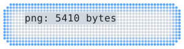
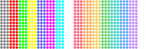

# `export`

[Index](README.md) · [canvas](canvas.md) · [draw](draw.md) · [path](path.md) · [mask](mask.md) · [transform](transform.md) · [rig](rig.md) · [layer](layer.md) · [bubble](bubble.md) · [font](font.md) · [text](text.md) · [color](color.md) · [render](render.md) · [term](term.md) · **export** · [ratatui](ratatui.md)

Export a canvas as a transparent PNG or SVG with the same cell-aligned dot
geometry the image protocols draw, so a file looks like the terminal does.

```rust
use cobra::{export, Canvas, Rgb};

let mut canvas = Canvas::new(10, 3);
canvas.disc(10.0, 6.0, 4.0, Rgb::hex(0x5ec33a));
std::fs::write("dots.png", export::png(&canvas, &export::Style::default())).unwrap();
std::fs::write("dots.svg", export::svg(&canvas, &export::Style::default())).unwrap();
```

## Contents

- [`Style`](#style)
- [`png`](#png)
- [`svg`](#svg)
- [`resolve`](#resolve)
- `Style`: [`Style::scale`](export.md#stylescale)

## `Style`

```rust
pub struct Style
```

Geometry and colours for an export.

- `pub cell: CellSize` — Pixel size of one cell. Default `10×20`.
- `pub dot_size: f32` — Dot diameter as a fraction of its slot, as in [`Options`](render.md#options). Default `0.7`.
- `pub background: Option<Rgb>` — Background fill; `None` (the default) keeps it transparent.
- `pub palette: Palette` — Resolves [`Color::Indexed`](color.md#color) and [`Color::Foreground`](color.md#color) dots. Default: xterm.
- `pub text: bool` — Draw the [text layer](text.md). A file has no terminal font, so [`svg`](export.md#svg) writes `<text>` elements and [`png`](export.md#png) draws the characters with [`Font::mono`](font.md#fontmono), a 5×9 monospace face scaled to the cell, which covers printable ASCII. Default `true`.

<picture>
  <source media="(prefers-color-scheme: dark)" srcset="img/svg.svg">
  
</picture>

```rust
// Every picture in this reference is `export::svg` of a canvas like this one,
// with a style carrying the page background.
c.fill_round_rect(1.0, 1.0, 58.0, 14.0, 4.0, Paint::edge(BLUE, t.panel, 3.0));
let style = export::Style { background: Some(t.bg), ..export::Style::default() }.scale(2);
let png = export::png(c, &style); // the same picture as a PNG, twice the size
c.text(4, 5, &format!("svg / png: {} bytes", png.len()), Font::tiny(), t.ink);
```

## `png`

```rust
pub fn png(canvas: &Canvas, style: &Style) -> Vec<u8>
```

Encodes `canvas` as an RGBA PNG. Unset dots are transparent unless
`style.background` is set.

<picture>
  <source media="(prefers-color-scheme: dark)" srcset="img/svg.svg">
  
</picture>

```rust
// Every picture in this reference is `export::svg` of a canvas like this one,
// with a style carrying the page background.
c.fill_round_rect(1.0, 1.0, 58.0, 14.0, 4.0, Paint::edge(BLUE, t.panel, 3.0));
let style = export::Style { background: Some(t.bg), ..export::Style::default() }.scale(2);
let png = export::png(c, &style); // the same picture as a PNG, twice the size
c.text(4, 5, &format!("svg / png: {} bytes", png.len()), Font::tiny(), t.ink);
```

## `svg`

```rust
pub fn svg(canvas: &Canvas, style: &Style) -> String
```

Renders `canvas` as an SVG document of one circle per set dot, positioned on the
same cell grid as [`png`](export.md#png). The `viewBox` is in pixels of `style.cell`.

<picture>
  <source media="(prefers-color-scheme: dark)" srcset="img/svg.svg">
  
</picture>

```rust
// Every picture in this reference is `export::svg` of a canvas like this one,
// with a style carrying the page background.
c.fill_round_rect(1.0, 1.0, 58.0, 14.0, 4.0, Paint::edge(BLUE, t.panel, 3.0));
let style = export::Style { background: Some(t.bg), ..export::Style::default() }.scale(2);
let png = export::png(c, &style); // the same picture as a PNG, twice the size
c.text(4, 5, &format!("svg / png: {} bytes", png.len()), Font::tiny(), t.ink);
```

## `resolve`

```rust
pub fn resolve(canvas: &Canvas, palette: &Palette) -> Canvas
```

Resolves every dot of `canvas` to RGB through `palette`; useful before exporting
a canvas that uses terminal colours to a file that has no terminal.

<picture>
  <source media="(prefers-color-scheme: dark)" srcset="img/resolve.svg">
  
</picture>

```rust
// Palette dots baked to RGB through a palette of your own, for a file that
// has no terminal to ask: the default palette on the left, ours on the right.
let mut themed = Canvas::new(12, 4);
for i in 0..8u8 {
    themed.fill_rect(i as f32 * 3.0, 0.0, 3.0, 16.0, Color::Indexed(i + 8));
}
let mut palette = Palette::default();
let ours = [RED, ORANGE, YELLOW, GREEN, CYAN, BLUE, PURPLE, Rgb::hex(0xffffff)];
palette.colors[8..16].copy_from_slice(&ours);
c.blit(&themed, 0, 0);
c.blit(&export::resolve(&themed, &palette), 24, 0);
```

## `Style` methods

## `Style::scale`

```rust
pub fn scale(mut self, k: u16) -> Self
```

Scales the cell (and thus the whole image) by an integer factor, e.g. for a
crisp README logo.

<picture>
  <source media="(prefers-color-scheme: dark)" srcset="img/svg.svg">
  
</picture>

```rust
// Every picture in this reference is `export::svg` of a canvas like this one,
// with a style carrying the page background.
c.fill_round_rect(1.0, 1.0, 58.0, 14.0, 4.0, Paint::edge(BLUE, t.panel, 3.0));
let style = export::Style { background: Some(t.bg), ..export::Style::default() }.scale(2);
let png = export::png(c, &style); // the same picture as a PNG, twice the size
c.text(4, 5, &format!("svg / png: {} bytes", png.len()), Font::tiny(), t.ink);
```

[Index](README.md) · [canvas](canvas.md) · [draw](draw.md) · [path](path.md) · [mask](mask.md) · [transform](transform.md) · [rig](rig.md) · [layer](layer.md) · [bubble](bubble.md) · [font](font.md) · [text](text.md) · [color](color.md) · [render](render.md) · [term](term.md) · **export** · [ratatui](ratatui.md)

