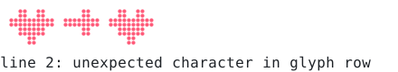
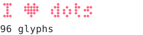
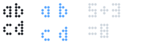
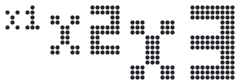

# `font`

[Index](README.md) · [canvas](canvas.md) · [draw](draw.md) · [path](path.md) · [mask](mask.md) · [transform](transform.md) · [layer](layer.md) · [bubble](bubble.md) · **font** · [text](text.md) · [color](color.md) · [render](render.md) · [term](term.md) · [export](export.md) · [ratatui](ratatui.md)

Bitmap fonts for braille canvases; see [`Font`](font.md#font).

## Contents

- [`MAX_GLYPH_WIDTH`](#max_glyph_width)
- [`Font`](#font)
- [`Glyph`](#glyph)
- [`FontError`](#fonterror)
- `Glyph`: [`Glyph::dot`](font.md#glyphdot), [`Glyph::row`](font.md#glyphrow)
- `Font`: [`Font::empty`](font.md#fontempty), [`Font::tiny`](font.md#fonttiny), [`Font::parse`](font.md#fontparse), [`Font::add`](font.md#fontadd), [`Font::glyph`](font.md#fontglyph), [`Font::height`](font.md#fontheight), [`Font::spacing`](font.md#fontspacing), [`Font::line_gap`](font.md#fontline_gap), [`Font::line_height`](font.md#fontline_height), [`Font::len`](font.md#fontlen), [`Font::is_empty`](font.md#fontis_empty), [`Font::with_spacing`](font.md#fontwith_spacing), [`Font::with_line_gap`](font.md#fontwith_line_gap), [`Font::advance`](font.md#fontadvance), [`Font::measure`](font.md#fontmeasure), [`Font::scale`](font.md#fontscale), [`Font::scale_xy`](font.md#fontscale_xy)
- `Canvas`: [`Canvas::text`](font.md#canvastext)

## `MAX_GLYPH_WIDTH`

```rust
pub const MAX_GLYPH_WIDTH: usize = 64
```

Widest a glyph can be, in dots.

<picture>
  <source media="(prefers-color-scheme: dark)" srcset="img/max_glyph_width.svg">
  
</picture>

```rust
// A glyph can be up to 64 dots wide: one character that is a whole ruler.
let (ticks, rule) = ("#...".repeat(MAX_GLYPH_WIDTH / 4), "#".repeat(MAX_GLYPH_WIDTH));
let mut font = Font::empty();
font.add('=', &[&ticks, &ticks, &rule]);
c.text(8, 4, "=", &font, YELLOW);
c.text(8, 8, &format!("{MAX_GLYPH_WIDTH} dots"), Font::tiny(), t.ink);
```

## `Font`

```rust
pub struct Font
```

A bitmap font: dot bitmaps, one per character, with a spacing and line gap.

Glyphs are proportional (each has its own width) and may differ in height; text
is drawn top-aligned from a dot position with [`Canvas::text`](font.md#canvastext).

### Format

Fonts are plain text, so they can be written by hand, generated by a script, or
loaded at run time with [`Font::parse`](font.md#fontparse); `include_str!` embeds one at compile time.

```text
// a comment
height 5      // line advance (defaults to the tallest glyph)
spacing 1     // dots between glyphs
line 1        // dots between lines

A             // one character, or U+0041; a blank line ends the glyph
.#.           // '#' (or @ * X 1) is a dot, '.' (or space - 0 _) is not
#.#
###
#.#
#.#
```

Glyphs can be added programmatically with [`Font::add`](font.md#fontadd), and [`Font::scale`](font.md#fontscale) makes
a larger copy, so one small master gives every size. [`Font::tiny`](font.md#fonttiny) is a built-in
3×5 font covering printable ASCII.

<picture>
  <source media="(prefers-color-scheme: dark)" srcset="img/font.svg">
  
</picture>

```rust
// A font is text: a keyword line or two and a bitmap per character.
let font = Font::parse("spacing 1\n\n♥\n.#.#.\n#####\n.###.\n..#..\n\n→\n..#.\n####\n..#.\n").unwrap();
c.text(2, 2, "♥→♥", &font.scale(2), RED);
// A bad line is reported by number.
let err = Font::parse("A\n#?#\n").unwrap_err();
c.print(0, 3, &format!("line {}: {}", err.line, err.message), t.ink);
```

## `Glyph`

```rust
pub struct Glyph<'a>
```

One glyph of a [`Font`](font.md#font).

- `pub width: u8` — Width in dots.
- `pub height: u8` — Height in dots.

<picture>
  <source media="(prefers-color-scheme: dark)" srcset="img/glyph.svg">
  
</picture>

```rust
// A glyph read dot by dot and drawn three times larger; then row by row, as
// bit masks, twice as large.
let g = Font::tiny().glyph('R').unwrap();
for y in 0..g.height {
    for x in 0..g.width {
        if g.dot(x, y) {
            c.fill_rect(1.0 + x as f32 * 3.0, y as f32 * 3.0, 3.0, 3.0, GREEN);
        }
    }
    let bits = g.row(y);
    for x in 0..g.width {
        if bits >> x & 1 == 1 {
            c.fill_rect(20.0 + x as f32 * 2.0, y as f32 * 2.0, 2.0, 2.0, CYAN);
        }
    }
}
```

## `FontError`

```rust
pub struct FontError
```

A parse error, with the 1-based line it was found on.

- `pub line: usize` — Line number.
- `pub message: &'static str` — What went wrong.

<picture>
  <source media="(prefers-color-scheme: dark)" srcset="img/font.svg">
  
</picture>

```rust
// A font is text: a keyword line or two and a bitmap per character.
let font = Font::parse("spacing 1\n\n♥\n.#.#.\n#####\n.###.\n..#..\n\n→\n..#.\n####\n..#.\n").unwrap();
c.text(2, 2, "♥→♥", &font.scale(2), RED);
// A bad line is reported by number.
let err = Font::parse("A\n#?#\n").unwrap_err();
c.print(0, 3, &format!("line {}: {}", err.line, err.message), t.ink);
```

## `Glyph` methods

## `Glyph::dot`

```rust
pub fn dot(&self, x: u8, y: u8) -> bool
```

Whether dot `(x, y)` of the glyph is set.

<picture>
  <source media="(prefers-color-scheme: dark)" srcset="img/glyph.svg">
  
</picture>

```rust
// A glyph read dot by dot and drawn three times larger; then row by row, as
// bit masks, twice as large.
let g = Font::tiny().glyph('R').unwrap();
for y in 0..g.height {
    for x in 0..g.width {
        if g.dot(x, y) {
            c.fill_rect(1.0 + x as f32 * 3.0, y as f32 * 3.0, 3.0, 3.0, GREEN);
        }
    }
    let bits = g.row(y);
    for x in 0..g.width {
        if bits >> x & 1 == 1 {
            c.fill_rect(20.0 + x as f32 * 2.0, y as f32 * 2.0, 2.0, 2.0, CYAN);
        }
    }
}
```

## `Glyph::row`

```rust
pub fn row(&self, y: u8) -> u64
```

Row `y` as a bit mask (bit `x` = dot `x`).

<picture>
  <source media="(prefers-color-scheme: dark)" srcset="img/glyph.svg">
  
</picture>

```rust
// A glyph read dot by dot and drawn three times larger; then row by row, as
// bit masks, twice as large.
let g = Font::tiny().glyph('R').unwrap();
for y in 0..g.height {
    for x in 0..g.width {
        if g.dot(x, y) {
            c.fill_rect(1.0 + x as f32 * 3.0, y as f32 * 3.0, 3.0, 3.0, GREEN);
        }
    }
    let bits = g.row(y);
    for x in 0..g.width {
        if bits >> x & 1 == 1 {
            c.fill_rect(20.0 + x as f32 * 2.0, y as f32 * 2.0, 2.0, 2.0, CYAN);
        }
    }
}
```

## `Font` methods

## `Font::empty`

```rust
pub fn empty() -> Self
```

A font with no glyphs, one dot of spacing and no line gap.

<picture>
  <source media="(prefers-color-scheme: dark)" srcset="img/font-add.svg">
  
</picture>

```rust
let mut font = Font::tiny().clone();          // 95 glyphs; `Font::empty()` has none
font.add('♥', &[".#.#.", "#####", "#####", ".###.", "..#.."]);
c.text(1, 1, "I ♥ dots", &font, RED);
c.text(28, 1, &format!("{} glyphs", font.len()), Font::tiny(), t.ink);
```

## `Font::tiny`

```rust
pub fn tiny() -> &'static Font
```

The built-in 3×5 font (printable ASCII).

<picture>
  <source media="(prefers-color-scheme: dark)" srcset="img/font-tiny.svg">
  
</picture>

```rust
c.text(1, 1, "Hello, 3x5!", Font::tiny(), t.ink);
c.text(1, 7, "abc XYZ 0123", Font::tiny(), BLUE);
```

## `Font::parse`

```rust
pub fn parse(src: &str) -> Result<Font, FontError>
```

Parses the text format described on [`Font`](font.md#font).

<picture>
  <source media="(prefers-color-scheme: dark)" srcset="img/font.svg">
  
</picture>

```rust
// A font is text: a keyword line or two and a bitmap per character.
let font = Font::parse("spacing 1\n\n♥\n.#.#.\n#####\n.###.\n..#..\n\n→\n..#.\n####\n..#.\n").unwrap();
c.text(2, 2, "♥→♥", &font.scale(2), RED);
// A bad line is reported by number.
let err = Font::parse("A\n#?#\n").unwrap_err();
c.print(0, 3, &format!("line {}: {}", err.line, err.message), t.ink);
```

## `Font::add`

```rust
pub fn add(&mut self, ch: char, rows: &[&str])
```

Adds (or replaces) the glyph for `ch` from rows of `#`/`.` characters, like the
text format. Rows may differ in length; the glyph is as wide as the longest.

<picture>
  <source media="(prefers-color-scheme: dark)" srcset="img/font-add.svg">
  
</picture>

```rust
let mut font = Font::tiny().clone();          // 95 glyphs; `Font::empty()` has none
font.add('♥', &[".#.#.", "#####", "#####", ".###.", "..#.."]);
c.text(1, 1, "I ♥ dots", &font, RED);
c.text(28, 1, &format!("{} glyphs", font.len()), Font::tiny(), t.ink);
```

## `Font::glyph`

```rust
pub fn glyph(&self, ch: char) -> Option<Glyph<'_>>
```

The glyph for `ch`, if the font has one.

<picture>
  <source media="(prefers-color-scheme: dark)" srcset="img/glyph.svg">
  
</picture>

```rust
// A glyph read dot by dot and drawn three times larger; then row by row, as
// bit masks, twice as large.
let g = Font::tiny().glyph('R').unwrap();
for y in 0..g.height {
    for x in 0..g.width {
        if g.dot(x, y) {
            c.fill_rect(1.0 + x as f32 * 3.0, y as f32 * 3.0, 3.0, 3.0, GREEN);
        }
    }
    let bits = g.row(y);
    for x in 0..g.width {
        if bits >> x & 1 == 1 {
            c.fill_rect(20.0 + x as f32 * 2.0, y as f32 * 2.0, 2.0, 2.0, CYAN);
        }
    }
}
```

## `Font::height`

```rust
pub fn height(&self) -> u8
```

Nominal glyph height, in dots.

<picture>
  <source media="(prefers-color-scheme: dark)" srcset="img/font-height.svg">
  
</picture>

```rust
let tight = Font::tiny(); // 5 high, 1 between glyphs, 0 between lines
let loose = Font::tiny().clone().with_spacing(3).with_line_gap(3);
c.text(1, 1, "ab\ncd", tight, t.ink);
c.text(14, 1, "ab\ncd", &loose, BLUE);
c.text(30, 1, &format!("{}+{}", loose.height(), loose.line_gap()), Font::tiny(), t.panel);
c.text(30, 8, &format!("={}", loose.line_height()), Font::tiny(), t.panel);
```

## `Font::spacing`

```rust
pub fn spacing(&self) -> u8
```

Dots between glyphs.

<picture>
  <source media="(prefers-color-scheme: dark)" srcset="img/font-height.svg">
  
</picture>

```rust
let tight = Font::tiny(); // 5 high, 1 between glyphs, 0 between lines
let loose = Font::tiny().clone().with_spacing(3).with_line_gap(3);
c.text(1, 1, "ab\ncd", tight, t.ink);
c.text(14, 1, "ab\ncd", &loose, BLUE);
c.text(30, 1, &format!("{}+{}", loose.height(), loose.line_gap()), Font::tiny(), t.panel);
c.text(30, 8, &format!("={}", loose.line_height()), Font::tiny(), t.panel);
```

## `Font::line_gap`

```rust
pub fn line_gap(&self) -> u8
```

Dots between lines.

<picture>
  <source media="(prefers-color-scheme: dark)" srcset="img/font-height.svg">
  
</picture>

```rust
let tight = Font::tiny(); // 5 high, 1 between glyphs, 0 between lines
let loose = Font::tiny().clone().with_spacing(3).with_line_gap(3);
c.text(1, 1, "ab\ncd", tight, t.ink);
c.text(14, 1, "ab\ncd", &loose, BLUE);
c.text(30, 1, &format!("{}+{}", loose.height(), loose.line_gap()), Font::tiny(), t.panel);
c.text(30, 8, &format!("={}", loose.line_height()), Font::tiny(), t.panel);
```

## `Font::line_height`

```rust
pub fn line_height(&self) -> i32
```

Distance from one baseline to the next: `height + line gap`.

<picture>
  <source media="(prefers-color-scheme: dark)" srcset="img/font-height.svg">
  
</picture>

```rust
let tight = Font::tiny(); // 5 high, 1 between glyphs, 0 between lines
let loose = Font::tiny().clone().with_spacing(3).with_line_gap(3);
c.text(1, 1, "ab\ncd", tight, t.ink);
c.text(14, 1, "ab\ncd", &loose, BLUE);
c.text(30, 1, &format!("{}+{}", loose.height(), loose.line_gap()), Font::tiny(), t.panel);
c.text(30, 8, &format!("={}", loose.line_height()), Font::tiny(), t.panel);
```

## `Font::len`

```rust
pub fn len(&self) -> usize
```

Number of glyphs.

<picture>
  <source media="(prefers-color-scheme: dark)" srcset="img/font-add.svg">
  
</picture>

```rust
let mut font = Font::tiny().clone();          // 95 glyphs; `Font::empty()` has none
font.add('♥', &[".#.#.", "#####", "#####", ".###.", "..#.."]);
c.text(1, 1, "I ♥ dots", &font, RED);
c.text(28, 1, &format!("{} glyphs", font.len()), Font::tiny(), t.ink);
```

## `Font::is_empty`

```rust
pub fn is_empty(&self) -> bool
```

`true` when the font has no glyphs.

<picture>
  <source media="(prefers-color-scheme: dark)" srcset="img/font-add.svg">
  
</picture>

```rust
let mut font = Font::tiny().clone();          // 95 glyphs; `Font::empty()` has none
font.add('♥', &[".#.#.", "#####", "#####", ".###.", "..#.."]);
c.text(1, 1, "I ♥ dots", &font, RED);
c.text(28, 1, &format!("{} glyphs", font.len()), Font::tiny(), t.ink);
```

## `Font::with_spacing`

```rust
pub fn with_spacing(mut self, spacing: u8) -> Self
```

Sets the spacing between glyphs (builder style).

<picture>
  <source media="(prefers-color-scheme: dark)" srcset="img/font-height.svg">
  
</picture>

```rust
let tight = Font::tiny(); // 5 high, 1 between glyphs, 0 between lines
let loose = Font::tiny().clone().with_spacing(3).with_line_gap(3);
c.text(1, 1, "ab\ncd", tight, t.ink);
c.text(14, 1, "ab\ncd", &loose, BLUE);
c.text(30, 1, &format!("{}+{}", loose.height(), loose.line_gap()), Font::tiny(), t.panel);
c.text(30, 8, &format!("={}", loose.line_height()), Font::tiny(), t.panel);
```

## `Font::with_line_gap`

```rust
pub fn with_line_gap(mut self, gap: u8) -> Self
```

Sets the gap between lines (builder style).

<picture>
  <source media="(prefers-color-scheme: dark)" srcset="img/font-height.svg">
  
</picture>

```rust
let tight = Font::tiny(); // 5 high, 1 between glyphs, 0 between lines
let loose = Font::tiny().clone().with_spacing(3).with_line_gap(3);
c.text(1, 1, "ab\ncd", tight, t.ink);
c.text(14, 1, "ab\ncd", &loose, BLUE);
c.text(30, 1, &format!("{}+{}", loose.height(), loose.line_gap()), Font::tiny(), t.panel);
c.text(30, 8, &format!("={}", loose.line_height()), Font::tiny(), t.panel);
```

## `Font::advance`

```rust
pub fn advance(&self, ch: char) -> i32
```

Horizontal advance for `ch`: its width plus spacing. Characters the font lacks
advance by the width of the space glyph (or half the height).

<picture>
  <source media="(prefers-color-scheme: dark)" srcset="img/font-advance.svg">
  
</picture>

```rust
let font = Font::tiny();
let (w, h) = font.measure("Hello"); // the box the text takes
c.text(2, 3, "Hello", font, t.ink);
c.rect(1.0, 2.0, w as f32 + 2.0, h as f32 + 2.0, 1.0, Paint::dithered(BLUE, 0.5));
// Each character's advance: its width plus the spacing.
let mut x = 2;
for ch in "Hello".chars() {
    c.line(x, 11, x + font.advance(ch) - 2, 11, ORANGE);
    x += font.advance(ch);
}
```

## `Font::measure`

```rust
pub fn measure(&self, text: &str) -> (i32, i32)
```

Size in dots of `text` when drawn (newlines start new lines).

<picture>
  <source media="(prefers-color-scheme: dark)" srcset="img/font-advance.svg">
  
</picture>

```rust
let font = Font::tiny();
let (w, h) = font.measure("Hello"); // the box the text takes
c.text(2, 3, "Hello", font, t.ink);
c.rect(1.0, 2.0, w as f32 + 2.0, h as f32 + 2.0, 1.0, Paint::dithered(BLUE, 0.5));
// Each character's advance: its width plus the spacing.
let mut x = 2;
for ch in "Hello".chars() {
    c.line(x, 11, x + font.advance(ch) - 2, 11, ORANGE);
    x += font.advance(ch);
}
```

## `Font::scale`

```rust
pub fn scale(&self, n: u8) -> Font
```

A copy `n` times larger: every dot becomes an `n × n` block, and spacing,
line gap and height scale with it. Glyphs are capped at 64 dots wide.

<picture>
  <source media="(prefers-color-scheme: dark)" srcset="img/font-scale.svg">
  
</picture>

```rust
c.text(1, 1, "x1", Font::tiny(), t.ink);
c.text(10, 1, "x2", &Font::tiny().scale(2), t.ink);
c.text(26, 1, "x3", &Font::tiny().scale(3), t.ink);
```

## `Font::scale_xy`

```rust
pub fn scale_xy(&self, nx: u8, ny: u8) -> Font
```

A copy scaled `nx` times horizontally and `ny` times vertically: every dot
becomes an `nx × ny` block. A cell is two dots wide and four tall, so
`scale_xy(1, 2)` is what makes a glyph as tall in cells as it is wide.

<picture>
  <source media="(prefers-color-scheme: dark)" srcset="img/font-scale_xy.svg">
  
</picture>

```rust
c.text(1, 3, "1x2", &Font::tiny().scale_xy(1, 2), GREEN);
c.text(18, 5, "2x1", &Font::tiny().scale_xy(2, 1), GREEN);
c.text(34, 1, "1x3", &Font::tiny().scale_xy(1, 3), GREEN);
```

## `Canvas` methods

## `Canvas::text`

```rust
pub fn text(&mut self, x: i32, y: i32, text: &str, font: &Font, paint: impl Into<Paint>) -> (i32, i32)
```

Draws `text` with its top-left corner at dot `(x, y)`. Newlines start a new
line; characters the font lacks leave a space. Returns the size drawn.

<picture>
  <source media="(prefers-color-scheme: dark)" srcset="img/canvas-text.svg">
  
</picture>

```rust
c.text(1, 1, "Dots, any\ncolour", Font::tiny(), Paint::linear((0.0, 0.0), (40.0, 0.0), CYAN, PURPLE));
c.text(32, 3, "BIG", &Font::tiny().scale(2), YELLOW);
```

[Index](README.md) · [canvas](canvas.md) · [draw](draw.md) · [path](path.md) · [mask](mask.md) · [transform](transform.md) · [layer](layer.md) · [bubble](bubble.md) · **font** · [text](text.md) · [color](color.md) · [render](render.md) · [term](term.md) · [export](export.md) · [ratatui](ratatui.md)

