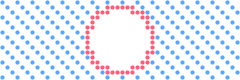
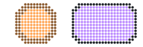

# `layer`

[Index](README.md) · [canvas](canvas.md) · [draw](draw.md) · [path](path.md) · **layer** · [bubble](bubble.md) · [font](font.md) · [text](text.md) · [color](color.md) · [render](render.md) · [term](term.md) · [export](export.md) · [ratatui](ratatui.md)

Stacked canvases with occlusion and effects between them.

A [`Layers`](layer.md#layers) is a stack of [`Layer`](layer.md#layer)s, each a full [`Canvas`](canvas.md#canvas) of its own, drawn
with the same primitives. [`Layers::flatten`](layer.md#layersflatten) composites them bottom to top into
one plain canvas: a set dot hides whatever is under it, a printed character owns
its cell, and each layer's [`Effect`](layer.md#effect)s decorate its silhouette on the way — a drop
shadow, an outline, a cleared gap that separates it from what is behind, a glow,
a shaded rim, or a shader of your own. A [matte](layer.md#layer) layer hides what is
beneath it without painting anything itself. Everything downstream (the renderer,
the ratatui widget, the exporters, [`Canvas::to_text`](canvas.md#canvasto_text)) takes the flattened canvas
as it would any other, and [`Canvas::effects`](layer.md#canvaseffects) runs the same effects around any
mask on any canvas, without a stack.

```rust
use cobra::{Effect, Layers, Paint, Rgb};

let mut layers = Layers::new(30, 6);
layers[0].fill_rect(0.0, 8.0, 60.0, 8.0, Paint::dithered(Rgb::hex(0x30363d), 0.5));
let card = layers.push();
card.fill_round_rect(6.0, 4.0, 30.0, 16.0, 4.0, Rgb::hex(0x3aa0ff));
card.effect(Effect::shadow(2, 2).paint(Paint::dithered(Rgb::hex(0), 0.6))).effect(Effect::gap(1.0));
let flat = layers.flatten(); // a `Canvas`: render, export or print it
```

### Effects

An effect is a function of a dot's signed distance to the layer's silhouette:
the set dots and printed cells of the layer, with positive distances outside it
and negative ones inside. Effects run after the layer's own dots have been laid
down, each within the band of distances it declares, in the order they were
added, so a later effect paints over an earlier one where they overlap. Distances
are rounded to the nearest dot: an outline one dot wide is the ring of dots
touching the silhouette, diagonals included. Distance fields are computed only
for the layers, and the region, that need them.

### The text fallback

A flattened canvas remembers which layer each dot came from. Where a terminal
can only give a cell one colour, the cell takes the colour of the topmost layer
that has a dot in it (the most frequent among that layer's dots), so a shape in
front keeps its edges instead of losing every shared cell to a bigger shape
behind it. Effects count as part of their layer, which makes a dithered shadow
read as solid in that fallback where it falls on another shape.

## Contents

- [`Sample`](#sample)
- [`Effect`](#effect)
- [`Layer`](#layer)
- [`Layers`](#layers)
- `Sample`: [`Sample::inside`](layer.md#sampleinside), [`Sample::layer`](layer.md#samplelayer), [`Sample::covered`](layer.md#samplecovered)
- `Effect`: [`Effect::shadow`](layer.md#effectshadow), [`Effect::outline`](layer.md#effectoutline), [`Effect::glow`](layer.md#effectglow), [`Effect::gap`](layer.md#effectgap), [`Effect::rim`](layer.md#effectrim), [`Effect::paint`](layer.md#effectpaint), [`Effect::shader`](layer.md#effectshader)
- `Layer`: [`Layer::effect`](layer.md#layereffect), [`Layer::canvas`](layer.md#layercanvas), [`Layer::canvas_mut`](layer.md#layercanvas_mut)
- `Layers`: [`Layers::new`](layer.md#layersnew), [`Layers::cols`](layer.md#layerscols), [`Layers::rows`](layer.md#layersrows), [`Layers::width`](layer.md#layerswidth), [`Layers::height`](layer.md#layersheight), [`Layers::len`](layer.md#layerslen), [`Layers::is_empty`](layer.md#layersis_empty), [`Layers::push`](layer.md#layerspush), [`Layers::insert`](layer.md#layersinsert), [`Layers::remove`](layer.md#layersremove), [`Layers::swap`](layer.md#layersswap), [`Layers::get`](layer.md#layersget), [`Layers::get_mut`](layer.md#layersget_mut), [`Layers::iter`](layer.md#layersiter), [`Layers::iter_mut`](layer.md#layersiter_mut), [`Layers::clear`](layer.md#layersclear), [`Layers::flat`](layer.md#layersflat), [`Layers::flatten`](layer.md#layersflatten)
- `Canvas`: [`Canvas::effects`](layer.md#canvaseffects)

## `Sample`

```rust
pub struct Sample<'a>
```

One dot as an effect sees it; see [`Effect::shader`](layer.md#effectshader).

- `pub x: i32` — Dot coordinates.
- `pub y: i32` — Dot coordinates.
- `pub dist: f32` — Distance in dots to the nearest dot on the other side of the layer's silhouette: positive outside, negative inside (the edge is at `±1`).
- `pub color: Option<Color>` — What the dot shows right now: the layer's own colour inside the silhouette, whatever the layers below (and earlier effects) left outside it.

## `Effect`

```rust
pub enum Effect
```

Something drawn around (or just inside) a layer's silhouette when the stack is
flattened. See the module docs for how effects are evaluated.

- `Shadow` — The silhouette again, moved by `(dx, dy)` dots and painted with `paint`, beneath the layer: a drop shadow. Dither the paint for a soft one.
  - `dx: i32` — Offset to the right.
  - `dy: i32` — Offset downwards.
  - `paint: Paint` — What the shadow is painted with.
- `Outline` — A border `width` dots thick around the silhouette.
  - `width: f32` — Thickness in dots.
  - `paint: Paint` — What the border is painted with.
- `Glow` — A halo `width` dots wide: an outer glow. It is painted in a darker shade of the paint's colour, falling from part of the paint's coverage at the edge to nothing at `width`, so a shape glowing in its own colour stays the brightest thing and reads as the source of the glow.
  - `width: f32` — Reach in dots.
  - `paint: Paint` — Colour and peak coverage.
- `Gap` — Unsets every dot of the layers beneath within `width` dots of the silhouette, so the layer reads on any background: the cleared ring of [`clear_disc`](canvas.md#canvasclear_disc), for any shape, done automatically.
  - `width: f32` — Width of the cleared ring in dots.
- `Rim` — Paints the `depth` dots just inside the silhouette: a shaded rim. `None` paints each dot in a darker shade of its own colour; a light paint highlights the edge instead, a dark one deepens it.
  - `depth: f32` — Depth in dots.
  - `paint: Option<Paint>` — What the rim is painted with; `None` for a shade of the layer's own colour.
- `Shader` — Your own: called for every dot within `reach` dots outside the silhouette and `depth` inside it, painting whatever it returns.
  - `reach: f32` — How far outside the silhouette the shader is consulted.
  - `depth: f32` — How far inside it.
  - `f: Arc<ShaderFn>` — The shader.

## `Layer`

```rust
pub struct Layer
```

One layer of a [`Layers`](layer.md#layers): a [`Canvas`](canvas.md#canvas) it dereferences to, the effects applied
around it when the stack is flattened, and whether it is shown at all.

- `pub effects: Vec<Effect>` — Effects, applied in order; see [`Effect`](layer.md#effect).
- `pub visible: bool` — Hidden layers are skipped by [`Layers::flatten`](layer.md#layersflatten). Default `true`.
- `pub matte: bool` — A matte hides instead of shows: wherever it has a dot or a character, the layers beneath are erased and nothing is painted, so the flattened canvas is transparent there. Effects still run around its silhouette. A ring around a hole in the picture, or a hollow shape whose inside must stay clear, is a shape on a matte. Default `false`.

**`matte`**

<picture>
  <source media="(prefers-color-scheme: dark)" srcset="img/layer-matte.svg">
  
</picture>

```rust
let mut layers = Layers::new(24, 4);
layers[0].fill_rect(0.0, 0.0, 48.0, 16.0, Paint::pattern(BLUE, Pattern::Diagonal(3)));
let hole = layers.push();
hole.disc(24.0, 8.0, 6.0, t.ink); // the colour does not matter
hole.matte = true;
hole.effect(Effect::outline(1.0).paint(RED));
*c = layers.flatten().clone();
```

## `Layers`

```rust
pub struct Layers
```

A stack of [`Layer`](layer.md#layer)s that flattens into one [`Canvas`](canvas.md#canvas). See the
module docs.

A new stack has one layer, index `0`, at the bottom; [`push`](layer.md#layerspush) adds
one on top. Layers are indexed like a slice and dereference to their canvas, so
`layers1.disc(..)` draws on the second one. The stack owns the scratch it
flattens with, so after the first frame flattening does not allocate.

<picture>
  <source media="(prefers-color-scheme: dark)" srcset="img/layers.svg">
  
</picture>

```rust
let mut layers = Layers::new(24, 4);
layers[0].fill_rect(0.0, 0.0, 48.0, 16.0, Paint::pattern(t.panel, Pattern::Rows(2)));
layers.push().disc(18.0, 8.0, 7.0, BLUE);
layers.push().disc(28.0, 8.0, 7.0, RED);
*c = layers.flatten().clone();
```

## `Sample` methods

## `Sample::inside`

```rust
pub fn inside(&self) -> bool
```

Whether the dot is part of the silhouette.

## `Sample::layer`

```rust
pub fn layer(&self) -> &Canvas
```

The layer being shaded.

## `Sample::covered`

```rust
pub fn covered(&self, x: i32, y: i32) -> bool
```

Whether dot `(x, y)` of the layer is in its silhouette: set, or in a cell
that holds a character. This is how a shadow finds itself.

## `Effect` methods

## `Effect::shadow`

```rust
pub fn shadow(dx: i32, dy: i32) -> Self
```

A drop shadow: the silhouette moved by `(dx, dy)` dots, in a dithered mid grey
that reads on dark and light terminals alike. [`paint`](layer.md#effectpaint) changes it.

<picture>
  <source media="(prefers-color-scheme: dark)" srcset="img/effect-shadow.svg">
  
</picture>

```rust
let mut layers = Layers::new(24, 4);
layers[0].fill_rect(0.0, 0.0, 48.0, 16.0, Paint::dithered(t.panel, 0.7));
let card = layers.push();
card.fill_round_rect(6.0, 2.0, 30.0, 10.0, 3.0, YELLOW);
card.effect(Effect::shadow(2, 2));
*c = layers.flatten().clone();
```

## `Effect::outline`

```rust
pub fn outline(width: f32) -> Self
```

A border `width` dots thick around the silhouette, in the terminal's
foreground colour. [`paint`](layer.md#effectpaint) changes it.

<picture>
  <source media="(prefers-color-scheme: dark)" srcset="img/effect-outline.svg">
  
</picture>

```rust
let mut layers = Layers::new(24, 4);
layers[0].fill_rect(0.0, 0.0, 48.0, 16.0, Paint::dithered(t.panel, 0.7));
let shape = layers.push();
shape.fill_star(12.0, 8.0, 7.0, 3.0, 5, -PI / 2.0, RED);
shape.print(11, 1, "text", RED);
shape.effect(Effect::outline(1.0).paint(t.ink));
*c = layers.flatten().clone();
```

## `Effect::glow`

```rust
pub fn glow(width: f32) -> Self
```

A glow fading out over `width` dots, in a darker shade of its paint so the shape
stays the brightest thing; by default the terminal's foreground colour, but
usually you want the shape's own colour: [`paint`](layer.md#effectpaint) sets it.

<picture>
  <source media="(prefers-color-scheme: dark)" srcset="img/effect-glow.svg">
  
</picture>

```rust
let mut layers = Layers::new(24, 4);
layers[0].fill_rect(0.0, 0.0, 48.0, 16.0, Paint::dithered(t.panel, 0.7));
let shape = layers.push();
shape.disc(12.0, 8.0, 4.0, CYAN);
shape.effect(Effect::glow(5.0).paint(CYAN));
let shape = layers.push();
shape.disc(36.0, 8.0, 4.0, YELLOW);
shape.effect(Effect::glow(5.0).paint(YELLOW));
*c = layers.flatten().clone();
```

## `Effect::gap`

```rust
pub fn gap(width: f32) -> Self
```

A cleared ring `width` dots wide in the layers beneath.

<picture>
  <source media="(prefers-color-scheme: dark)" srcset="img/effect-gap.svg">
  
</picture>

```rust
let mut layers = Layers::new(24, 4);
layers[0].fill_rect(0.0, 0.0, 48.0, 16.0, Paint::pattern(BLUE, Pattern::Cross(4)));
let shape = layers.push();
shape.fill_round_rect(10.0, 3.0, 28.0, 10.0, 4.0, GREEN);
shape.effect(Effect::gap(2.0));
*c = layers.flatten().clone();
```

## `Effect::rim`

```rust
pub fn rim(depth: f32) -> Self
```

A rim `depth` dots deep just inside the silhouette, in a darker shade of the
layer's own colour: a shaded edge on any shape. [`paint`](layer.md#effectpaint) paints
it with something else instead.

<picture>
  <source media="(prefers-color-scheme: dark)" srcset="img/effect-rim.svg">
  
</picture>

```rust
let mut layers = Layers::new(24, 4);
let shape = layers.push();
shape.disc(12.0, 8.0, 7.5, ORANGE);
shape.effect(Effect::rim(2.0));
let shape = layers.push();
shape.fill_round_rect(24.0, 1.0, 22.0, 14.0, 4.0, PURPLE);
shape.effect(Effect::rim(1.0).paint(t.ink));
*c = layers.flatten().clone();
```

## `Effect::paint`

```rust
pub fn paint(mut self, paint: impl Into<Paint>) -> Self
```

Replaces the effect's paint. Has no effect on a gap or a shader.

## `Effect::shader`

```rust
pub fn shader(reach: f32, depth: f32, f: impl Fn(&Sample) -> Option<Paint> + Send + Sync + 'static) -> Self
```

A shader of your own, consulted within `reach` dots outside the silhouette
and `depth` inside. It returns the paint for the dot, or `None` to leave it.

```rust
use cobra::{Color, Effect, Paint, Rgb};

// A shadow that darkens what it falls on instead of painting over it.
let shade = Effect::shader(4.0, 0.0, |s| match s.color {
    Some(Color::Rgb(c)) if s.covered(s.x - 3, s.y - 2) => Some(Paint::new(c.dim(0.4))),
    _ => None,
});
```

<picture>
  <source media="(prefers-color-scheme: dark)" srcset="img/effect-shader.svg">
  
</picture>

```rust
let mut layers = Layers::new(24, 4);
layers[0].fill_rect(0.0, 0.0, 48.0, 16.0, Paint::dithered(t.panel, 0.7));
let shape = layers.push();
shape.disc(24.0, 8.0, 5.0, RED);
// Concentric rings: every other dot of distance, fading out.
shape.effect(Effect::shader(8.0, 0.0, |s| {
    (s.dist.round() as i32 % 3 == 0).then(|| Paint::dithered(RED, 1.0 - s.dist / 9.0))
}));
*c = layers.flatten().clone();
```

## `Layer` methods

## `Layer::effect`

```rust
pub fn effect(&mut self, effect: Effect) -> &mut Self
```

Adds an effect after the ones already there.

## `Layer::canvas`

```rust
pub fn canvas(&self) -> &Canvas
```

The layer's canvas.

## `Layer::canvas_mut`

```rust
pub fn canvas_mut(&mut self) -> &mut Canvas
```

The layer's canvas, to draw on.

## `Layers` methods

## `Layers::new`

```rust
pub fn new(cols: u16, rows: u16) -> Self
```

Creates a stack of `cols × rows` cells with one empty layer.

## `Layers::cols`

```rust
pub fn cols(&self) -> u16
```

Width in cells.

## `Layers::rows`

```rust
pub fn rows(&self) -> u16
```

Height in cells.

## `Layers::width`

```rust
pub fn width(&self) -> i32
```

Width in dots.

## `Layers::height`

```rust
pub fn height(&self) -> i32
```

Height in dots.

## `Layers::len`

```rust
pub fn len(&self) -> usize
```

Number of layers.

## `Layers::is_empty`

```rust
pub fn is_empty(&self) -> bool
```

Whether there are no layers at all (only after [`remove`](layer.md#layersremove)).

## `Layers::push`

```rust
pub fn push(&mut self) -> &mut Layer
```

Adds an empty layer on top and returns it, to draw on and give effects.

## `Layers::insert`

```rust
pub fn insert(&mut self, index: usize) -> &mut Layer
```

Adds an empty layer at `index` (`0` is the bottom; the length puts it on top)
and returns it.

## `Layers::remove`

```rust
pub fn remove(&mut self, index: usize) -> Option<Layer>
```

Removes and returns the layer at `index`, `None` if there is none.

## `Layers::swap`

```rust
pub fn swap(&mut self, a: usize, b: usize)
```

Swaps two layers' places in the stack.

## `Layers::get`

```rust
pub fn get(&self, index: usize) -> Option<&Layer>
```

The layer at `index`, if any.

## `Layers::get_mut`

```rust
pub fn get_mut(&mut self, index: usize) -> Option<&mut Layer>
```

The layer at `index` to change, if any.

## `Layers::iter`

```rust
pub fn iter(&self) -> std::slice::Iter<'_, Layer>
```

The layers, bottom to top.

## `Layers::iter_mut`

```rust
pub fn iter_mut(&mut self) -> std::slice::IterMut<'_, Layer>
```

The layers to change, bottom to top.

## `Layers::clear`

```rust
pub fn clear(&mut self)
```

Clears every layer's dots and text. Keeps the layers, their effects and every
allocation.

## `Layers::flat`

```rust
pub fn flat(&self) -> &Canvas
```

The flattened canvas as of the last [`flatten`](layer.md#layersflatten); empty before
the first, stale after a change. For code that only has `&self`, such as a
ratatui draw closure, after flattening outside it.

## `Layers::flatten`

```rust
pub fn flatten(&mut self) -> &Canvas
```

Composites the layers, bottom to top, into one canvas and returns it. Does
nothing when nothing changed since the last call.

## `Canvas` methods

## `Canvas::effects`

```rust
pub fn effects(&mut self, mask: &Canvas, effects: &[Effect])
```

Runs `effects` around the silhouette of `mask` (its set dots and printed
cells) on this canvas, exactly as [`Layers::flatten`](layer.md#layersflatten) would around a layer:
an outline, a glow, a rim or a shadow against any mask you hand in, with no
stack involved. The mask is usually a scratch canvas of the same size that a
shape was drawn on.

```rust
use cobra::{Canvas, Effect, Rgb};

let mut canvas = Canvas::new(10, 5);
canvas.fill_rect(0.0, 0.0, 20.0, 20.0, Rgb::hex(0x203040));
let mut mask = Canvas::new(10, 5);
mask.disc(10.0, 10.0, 5.0, Rgb::hex(0xffffff));
canvas.effects(&mask, &[Effect::gap(1.0), Effect::outline(1.0).paint(Rgb::hex(0xffffff))]);
```

<picture>
  <source media="(prefers-color-scheme: dark)" srcset="img/canvas-effects.svg">
  
</picture>

```rust
c.fill_rect(0.0, 0.0, 48.0, 16.0, Paint::dithered(t.panel, 0.7));
let mut mask = Canvas::new(24, 4);
mask.text(3, 3, "MASK", &Font::tiny().scale(2), t.ink);
c.effects(&mask, &[Effect::gap(1.0), Effect::outline(1.0).paint(GREEN)]);
```

[Index](README.md) · [canvas](canvas.md) · [draw](draw.md) · [path](path.md) · **layer** · [bubble](bubble.md) · [font](font.md) · [text](text.md) · [color](color.md) · [render](render.md) · [term](term.md) · [export](export.md) · [ratatui](ratatui.md)

