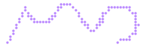
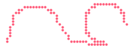
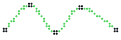

# `path`

[Index](README.md) · [canvas](canvas.md) · [draw](draw.md) · **path** · [mask](mask.md) · [transform](transform.md) · [layer](layer.md) · [bubble](bubble.md) · [font](font.md) · [text](text.md) · [color](color.md) · [render](render.md) · [term](term.md) · [export](export.md) · [ratatui](ratatui.md)

Arbitrary outlines: straight lines, Bézier curves, arcs and splines in any
combination, filled or stroked with [`Canvas::fill_path`](draw.md#canvasfill_path) and
[`Canvas::stroke_path`](draw.md#canvasstroke_path).

## Contents

- [`Path`](#path)
- `Path`: [`Path::new`](path.md#pathnew), [`Path::is_empty`](path.md#pathis_empty), [`Path::current`](path.md#pathcurrent), [`Path::move_to`](path.md#pathmove_to), [`Path::line_to`](path.md#pathline_to), [`Path::quad_to`](path.md#pathquad_to), [`Path::cubic_to`](path.md#pathcubic_to), [`Path::arc_to`](path.md#patharc_to), [`Path::curve_through`](path.md#pathcurve_through), [`Path::close`](path.md#pathclose), [`Path::rect`](path.md#pathrect), [`Path::round_rect`](path.md#pathround_rect), [`Path::apply`](path.md#pathapply), [`Path::ellipse`](path.md#pathellipse), [`Path::polygon`](path.md#pathpolygon), [`Path::transform`](path.md#pathtransform), [`Path::translate`](path.md#pathtranslate), [`Path::scale`](path.md#pathscale), [`Path::rotate`](path.md#pathrotate), [`Path::bounds`](path.md#pathbounds), [`Path::subpaths`](path.md#pathsubpaths)

## `Path`

```rust
pub struct Path
```

An outline built from segments: lines, quadratic and cubic Béziers, elliptical
arcs and smooth curves through points, in any order, in one or more subpaths.

A path is built with the `*_to` methods, each continuing from the current point;
[`move_to`](path.md#pathmove_to) starts a new subpath and [`close`](path.md#pathclose) joins
one back to its start. Filling treats every subpath as closed and uses the
even-odd rule, so a subpath inside another cuts a hole. Stroking follows each
subpath as drawn. Curves are flattened when drawn, about one segment per dot.

```rust
use cobra::{Canvas, Path, Pen, Rgb};

let mut heart = Path::new();
heart.move_to((10.0, 6.0)).cubic_to((10.0, 0.0), (0.0, 0.0), (0.0, 7.0));
heart.cubic_to((0.0, 12.0), (10.0, 16.0), (10.0, 20.0));
heart.cubic_to((10.0, 16.0), (20.0, 12.0), (20.0, 7.0));
heart.cubic_to((20.0, 0.0), (10.0, 0.0), (10.0, 6.0)).close();
heart.ellipse(10.0, 9.0, 3.0, 2.0); // a hole

let mut canvas = Canvas::new(12, 6);
canvas.fill_path(&heart, Rgb::hex(0xff3355));
canvas.stroke_path(&heart, Pen::new(1.0).dash(2.0, 2.0), Rgb::hex(0xffffff));
```

<picture>
  <source media="(prefers-color-scheme: dark)" srcset="img/path.svg">
  
</picture>

```rust
let mut p = Path::new();
p.move_to((2.0, 14.0)).line_to((8.0, 2.0)).quad_to((14.0, 14.0), (20.0, 2.0));
p.cubic_to((26.0, -4.0), (30.0, 20.0), (34.0, 6.0)).arc_to(40.0, 8.0, 6.0, 6.0, PI, 2.5 * PI);
c.stroke_path(&p, 1.0, PURPLE);
```

## `Path` methods

## `Path::new`

```rust
pub fn new() -> Self
```

An empty path.

## `Path::is_empty`

```rust
pub fn is_empty(&self) -> bool
```

Whether nothing has been drawn.

## `Path::current`

```rust
pub fn current(&self) -> Point
```

The point the next segment continues from.

## `Path::move_to`

```rust
pub fn move_to(&mut self, p: Point) -> &mut Self
```

Starts a new subpath at `p`.

## `Path::line_to`

```rust
pub fn line_to(&mut self, p: Point) -> &mut Self
```

A straight line to `p`.

## `Path::quad_to`

```rust
pub fn quad_to(&mut self, c: Point, p: Point) -> &mut Self
```

A quadratic Bézier to `p` steered by `c`.

## `Path::cubic_to`

```rust
pub fn cubic_to(&mut self, c1: Point, c2: Point, p: Point) -> &mut Self
```

A cubic Bézier to `p` steered by `c1` and `c2`.

## `Path::arc_to`

```rust
pub fn arc_to(&mut self, cx: f32, cy: f32, rx: f32, ry: f32, a0: f32, a1: f32) -> &mut Self
```

An arc of the ellipse centred on `(cx, cy)` with radii `rx`, `ry`, from angle
`a0` to `a1` (radians, clockwise on screen), joined to the current point by a
line, or starting a subpath if there is none. Arcs are cubic Béziers, one per
quarter turn.

<picture>
  <source media="(prefers-color-scheme: dark)" srcset="img/path-arc_to.svg">
  
</picture>

```rust
let mut p = Path::new();
p.move_to((2.0, 14.0)).arc_to(12.0, 8.0, 8.0, 6.0, PI, TAU).line_to((24.0, 14.0));
p.arc_to(36.0, 8.0, 7.0, 7.0, 0.5 * PI, 2.0 * PI);
c.stroke_path(&p, 1.0, RED);
```

## `Path::curve_through`

```rust
pub fn curve_through(&mut self, pts: &[Point]) -> &mut Self
```

A smooth curve (Catmull–Rom) through every point of `pts`, starting with a
line to the first, or a new subpath if there is none. Each span becomes the
equivalent cubic Bézier.

<picture>
  <source media="(prefers-color-scheme: dark)" srcset="img/path-curve_through.svg">
  
</picture>

```rust
let pts = [(2.0, 12.0), (12.0, 2.0), (22.0, 13.0), (32.0, 3.0), (46.0, 12.0)];
let mut p = Path::new();
p.curve_through(&pts);
c.stroke_path(&p, 1.0, GREEN);
for q in pts {
    c.disc(q.0, q.1, 1.2, t.ink);
}
```

## `Path::close`

```rust
pub fn close(&mut self) -> &mut Self
```

Closes the current subpath with a line back to where it started.

## `Path::rect`

```rust
pub fn rect(&mut self, x: f32, y: f32, w: f32, h: f32) -> &mut Self
```

A closed rectangle as its own subpath.

## `Path::round_rect`

```rust
pub fn round_rect(&mut self, x: f32, y: f32, w: f32, h: f32, r: f32) -> &mut Self
```

A closed box with corners rounded to radius `r`, as its own subpath.

## `Path::apply`

```rust
pub fn apply(&mut self, t: &crate::Transform) -> &mut Self
```

Applies `t` to every point (control points included).

## `Path::ellipse`

```rust
pub fn ellipse(&mut self, cx: f32, cy: f32, rx: f32, ry: f32) -> &mut Self
```

A closed ellipse as its own subpath.

## `Path::polygon`

```rust
pub fn polygon(&mut self, pts: &[Point]) -> &mut Self
```

A closed polygon as its own subpath.

## `Path::transform`

```rust
pub fn transform(&mut self, f: impl Fn(Point) -> Point) -> &mut Self
```

Maps every point (control points included) through `f`.

<picture>
  <source media="(prefers-color-scheme: dark)" srcset="img/path-transform.svg">
  
</picture>

```rust
let mut p = Path::new();
p.polygon(&[(0.0, 0.0), (6.0, 0.0), (3.0, 6.0)]);
for i in 0..6 {
    let mut copy = p.clone();
    copy.scale(1.0 + i as f32 * 0.3, 1.0 + i as f32 * 0.3).translate(2.0 + i as f32 * 8.0, 2.0);
    c.fill_path(&copy, ORANGE);
}
```

## `Path::translate`

```rust
pub fn translate(&mut self, dx: f32, dy: f32) -> &mut Self
```

Moves the path by `(dx, dy)`.

## `Path::scale`

```rust
pub fn scale(&mut self, sx: f32, sy: f32) -> &mut Self
```

Scales the path about the origin.

## `Path::rotate`

```rust
pub fn rotate(&mut self, angle: f32, center: Point) -> &mut Self
```

Rotates the path by `angle` radians (clockwise on screen) about `center`.

<picture>
  <source media="(prefers-color-scheme: dark)" srcset="img/path-rotate.svg">
  
</picture>

```rust
for i in 0..5 {
    let mut p = Path::new();
    p.rect(-6.0, -2.0, 12.0, 4.0).rotate(i as f32 * PI / 5.0, (0.0, 0.0)).translate(24.0, 8.0);
    c.stroke_path(&p, 1.0, BLUE.lerp(CYAN, i as f32 / 4.0));
}
```

## `Path::bounds`

```rust
pub fn bounds(&self) -> Option<Rect>
```

The box around every point of the path, control points included; `None`
when empty.

## `Path::subpaths`

```rust
pub fn subpaths(&self, mut f: impl FnMut(&[Point], bool))
```

Flattens the path and hands each subpath to `f` as a polyline, with whether
it was closed.

[Index](README.md) · [canvas](canvas.md) · [draw](draw.md) · **path** · [mask](mask.md) · [transform](transform.md) · [layer](layer.md) · [bubble](bubble.md) · [font](font.md) · [text](text.md) · [color](color.md) · [render](render.md) · [term](term.md) · [export](export.md) · [ratatui](ratatui.md)

