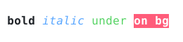
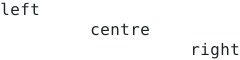
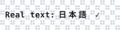
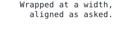

# `text`

[Index](README.md) · [canvas](canvas.md) · [draw](draw.md) · [path](path.md) · [layer](layer.md) · [bubble](bubble.md) · [font](font.md) · **text** · [color](color.md) · [render](render.md) · [term](term.md) · [export](export.md) · [ratatui](ratatui.md)

Real terminal text on a canvas: characters, not dots.

[`Canvas::text`](font.md#canvastext) draws with a bitmap [`Font`](font.md#font), so a
label is made of dots like everything else and can be any size or colour. That is
the right answer for a title inside a drawing and the wrong one for a paragraph:
at 3×5 dots a sentence is barely legible, and it is not text any more, so it
cannot be copied out of the terminal or read by a screen reader.

So a canvas also has a *text layer*: one real character per terminal cell, with
its own colours and attributes, drawn by [`Canvas::print`](text.md#canvasprint). A cell holding a
character shows that character instead of its eight dots — in the text protocol,
in the image protocols (which leave the cell transparent and print over it), in
[`Canvas::to_text`](canvas.md#canvasto_text) and in the ratatui widget. Everything the terminal's own font
can draw works: ASCII, box drawing, CJK, emoji.

```rust
use cobra::{Canvas, Rgb, TextStyle};

let mut c = Canvas::new(20, 3);
c.fill_rect(0.0, 0.0, 40.0, 12.0, Rgb::hex(0x1b2430));   // dots behind the text
c.print(1, 1, "Ready.", TextStyle::new(Rgb::hex(0xc9d1d9)).bold());
```

Cell coordinates here, dot coordinates everywhere else: one cell is
[`DOTS_X`](canvas.md#dots_x) × [`DOTS_Y`](canvas.md#dots_y) dots.

## Contents

- [`Attrs`](#attrs)
- [`TextStyle`](#textstyle)
- [`TextCell`](#textcell)
- [`Align`](#align)
- [`Wrap`](#wrap)
- [`char_width`](#char_width)
- [`width`](#width)
- [`measure`](#measure)
- [`wrap`](#wrap)
- `Attrs`: [`Attrs::NONE`](text.md#attrsnone), [`Attrs::BOLD`](text.md#attrsbold), [`Attrs::DIM`](text.md#attrsdim), [`Attrs::ITALIC`](text.md#attrsitalic), [`Attrs::UNDERLINE`](text.md#attrsunderline), [`Attrs::REVERSE`](text.md#attrsreverse), [`Attrs::has`](text.md#attrshas)
- `TextStyle`: [`TextStyle::new`](text.md#textstylenew), [`TextStyle::on`](text.md#textstyleon), [`TextStyle::with`](text.md#textstylewith), [`TextStyle::bold`](text.md#textstylebold), [`TextStyle::dim`](text.md#textstyledim), [`TextStyle::italic`](text.md#textstyleitalic), [`TextStyle::underline`](text.md#textstyleunderline)
- `TextCell`: [`TextCell::CONTINUATION`](text.md#textcellcontinuation), [`TextCell::is_empty`](text.md#textcellis_empty), [`TextCell::is_continuation`](text.md#textcellis_continuation)
- `Canvas`: [`Canvas::print`](text.md#canvasprint), [`Canvas::print_wrapped`](text.md#canvasprint_wrapped), [`Canvas::text_cell`](text.md#canvastext_cell), [`Canvas::erase_text`](text.md#canvaserase_text), [`Canvas::clear_text`](text.md#canvasclear_text), [`Canvas::has_text`](text.md#canvashas_text)

## `Attrs`

```rust
pub struct Attrs(pub u8)
```

Text attributes, as SGR bits. Combine with `|`.

```rust
let a = Attrs::BOLD | Attrs::UNDERLINE;
assert!(a.has(Attrs::BOLD) && !a.has(Attrs::ITALIC));
```

## `TextStyle`

```rust
pub struct TextStyle
```

How a character is drawn: foreground, background and attributes, each optional so
the terminal's own defaults show through.

Anything that is a [`Color`](color.md#color) converts into a `TextStyle` foreground, so
`canvas.print(0, 0, "hi", Rgb::hex(0xff0055))` works.

- `pub fg: Option<Color>` — Ink; `None` is the terminal's default foreground.
- `pub bg: Option<Color>` — Cell background; `None` leaves whatever is behind it.
- `pub attrs: Attrs` — Bold, italic and friends.

<picture>
  <source media="(prefers-color-scheme: dark)" srcset="img/textstyle.svg">
  
</picture>

```rust
c.print(1, 1, "bold", TextStyle::new(t.ink).bold());
c.print(6, 1, "italic", TextStyle::new(BLUE).italic());
c.print(13, 1, "under", TextStyle::new(GREEN).underline());
c.print(19, 1, "on bg", TextStyle::new(t.bg).on(RED).with(Attrs::BOLD));
```

## `TextCell`

```rust
pub struct TextCell
```

One cell of the text layer.

- `pub ch: char` — The character; `'\0'` for an empty cell and [`CONTINUATION`](text.md#textcellcontinuation) for the right half of a double-width one.
- `pub style: TextStyle` — How to draw it.

## `Align`

```rust
pub enum Align
```

Horizontal alignment for [`Canvas::print_wrapped`](text.md#canvasprint_wrapped) and text inside a
[`Bubble`](bubble.md#bubble).

- `Left` — Against the left edge.
- `Center` — Centred, extra space split evenly.
- `Right` — Against the right edge.

<picture>
  <source media="(prefers-color-scheme: dark)" srcset="img/align.svg">
  
</picture>

```rust
c.print_wrapped(0, 0, 24, "left", t.ink, Align::Left);
c.print_wrapped(0, 1, 24, "centre", t.ink, Align::Center);
c.print_wrapped(0, 2, 24, "right", t.ink, Align::Right);
```

## `Wrap`

```rust
pub struct Wrap<'a>
```

Iterator of wrapped lines; see [`wrap`](text.md#wrap).

## `char_width`

```rust
pub fn char_width(ch: char) -> i32
```

Cells a character occupies: `0` for a combining mark, `2` for the wide ranges of
East Asian scripts and emoji, `1` otherwise.

This is the common part of Unicode's East Asian Width, coarse enough to be a
handful of range checks and right for everything a terminal usually shows.

## `width`

```rust
pub fn width(text: &str) -> i32
```

Width of `text` in cells: the widest of its newline-separated lines.

## `measure`

```rust
pub fn measure(text: &str) -> (i32, i32)
```

Size of `text` in cells, `(width, lines)`.

## `wrap`

```rust
pub fn wrap(text: &str, width: i32) -> Wrap<'_>
```

Splits `text` into lines at most `width` cells wide, breaking at spaces where it
can and inside a word where it cannot. Existing newlines always break. A `width`
of `0` or less only splits on newlines.

The iterator borrows `text` and allocates nothing.

```rust
let lines: Vec<&str> = wrap("the quick brown fox", 9).collect();
assert_eq!(lines, ["the quick", "brown fox"]);
```

## `Attrs` methods

## `Attrs::NONE`

```rust
pub const NONE: Attrs = Attrs(0)
```

No attributes.

## `Attrs::BOLD`

```rust
pub const BOLD: Attrs = Attrs(1)
```

`SGR 1`.

## `Attrs::DIM`

```rust
pub const DIM: Attrs = Attrs(2)
```

`SGR 2`.

## `Attrs::ITALIC`

```rust
pub const ITALIC: Attrs = Attrs(4)
```

`SGR 3`.

## `Attrs::UNDERLINE`

```rust
pub const UNDERLINE: Attrs = Attrs(8)
```

`SGR 4`.

## `Attrs::REVERSE`

```rust
pub const REVERSE: Attrs = Attrs(16)
```

`SGR 7`.

## `Attrs::has`

```rust
pub const fn has(self, other: Attrs) -> bool
```

Whether every bit of `other` is set.

## `TextStyle` methods

## `TextStyle::new`

```rust
pub fn new(fg: impl Into<Color>) -> Self
```

Style with `fg` as its ink.

## `TextStyle::on`

```rust
pub fn on(mut self, bg: impl Into<Color>) -> Self
```

Sets the background.

## `TextStyle::with`

```rust
pub fn with(mut self, attrs: Attrs) -> Self
```

Adds attributes.

## `TextStyle::bold`

```rust
pub fn bold(self) -> Self
```

Adds [`Attrs::BOLD`](text.md#attrsbold).

## `TextStyle::dim`

```rust
pub fn dim(self) -> Self
```

Adds [`Attrs::DIM`](text.md#attrsdim).

## `TextStyle::italic`

```rust
pub fn italic(self) -> Self
```

Adds [`Attrs::ITALIC`](text.md#attrsitalic).

## `TextStyle::underline`

```rust
pub fn underline(self) -> Self
```

Adds [`Attrs::UNDERLINE`](text.md#attrsunderline).

## `TextCell` methods

## `TextCell::CONTINUATION`

```rust
pub const CONTINUATION: char = '\u1}'
```

Placeholder in the cell that a double-width character spills into.

## `TextCell::is_empty`

```rust
pub const fn is_empty(&self) -> bool
```

Whether no character was printed here.

## `TextCell::is_continuation`

```rust
pub const fn is_continuation(&self) -> bool
```

Whether this is the right half of a double-width character.

## `Canvas` methods

## `Canvas::print`

```rust
pub fn print(&mut self, col: i32, row: i32, text: &str, style: impl Into<TextStyle>) -> i32
```

Prints `text` with its first character in cell `(col, row)`, returning the
number of cells the widest line took.

Newlines start a new line at `col`. Double-width characters take two cells;
zero-width ones are dropped. Characters landing outside the canvas are
skipped. A printed cell hides the dots underneath it, so `style.bg` is how a
label keeps the colour of the shape it sits on.

<picture>
  <source media="(prefers-color-scheme: dark)" srcset="img/canvas-print.svg">
  
</picture>

```rust
c.fill_rect(0.0, 0.0, 48.0, 12.0, Paint::pattern(t.panel, Pattern::Checker(2)));
c.print(1, 1, "Real text: 日本語 ✓", TextStyle::new(t.ink).bold());
```

## `Canvas::print_wrapped`

```rust
pub fn print_wrapped(&mut self, col: i32, row: i32, width: i32, text: &str, style: impl Into<TextStyle>, align: Align) -> (i32, i32)
```

[`print`](text.md#canvasprint) with the text wrapped to `width` cells and each line
aligned inside it. Returns the size drawn, in cells.

<picture>
  <source media="(prefers-color-scheme: dark)" srcset="img/canvas-print_wrapped.svg">
  
</picture>

```rust
let text = "Wrapped at a width, aligned as asked.";
c.print_wrapped(1, 0, 22, text, TextStyle::new(t.ink), Align::Right);
```

## `Canvas::text_cell`

```rust
pub fn text_cell(&self, col: i32, row: i32) -> Option<TextCell>
```

The text-layer cell at `(col, row)`, `None` when nothing was printed there or
the cell is off-canvas. Continuation cells (see [`TextCell`](text.md#textcell)) come back too.

## `Canvas::erase_text`

```rust
pub fn erase_text(&mut self, col: i32, row: i32, cells: i32)
```

Removes `cells` characters of the text layer from `(col, row)` rightwards, so
the dots underneath show again.

## `Canvas::clear_text`

```rust
pub fn clear_text(&mut self)
```

Empties the text layer, keeping the dots and the allocation.

## `Canvas::has_text`

```rust
pub fn has_text(&self) -> bool
```

Whether anything has been printed on the text layer.

[Index](README.md) · [canvas](canvas.md) · [draw](draw.md) · [path](path.md) · [layer](layer.md) · [bubble](bubble.md) · [font](font.md) · **text** · [color](color.md) · [render](render.md) · [term](term.md) · [export](export.md) · [ratatui](ratatui.md)

