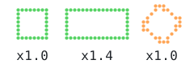
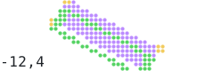

# `transform`

[Index](README.md) · [canvas](canvas.md) · [draw](draw.md) · [path](path.md) · [mask](mask.md) · **transform** · [rig](rig.md) · [layer](layer.md) · [bubble](bubble.md) · [font](font.md) · [text](text.md) · [color](color.md) · [render](render.md) · [term](term.md) · [export](export.md) · [ratatui](ratatui.md)

Affine transforms: where a shape drawn in its own coordinates lands on the canvas.

## Contents

- [`Transform`](#transform)
- `Transform`: [`Transform::IDENTITY`](transform.md#transformidentity), [`Transform::at`](transform.md#transformat), [`Transform::is_identity`](transform.md#transformis_identity), [`Transform::is_axis_aligned`](transform.md#transformis_axis_aligned), [`Transform::scale_factor`](transform.md#transformscale_factor), [`Transform::apply`](transform.md#transformapply), [`Transform::then`](transform.md#transformthen), [`Transform::inverse`](transform.md#transforminverse), [`Transform::translate`](transform.md#transformtranslate), [`Transform::scale`](transform.md#transformscale), [`Transform::flip_x`](transform.md#transformflip_x), [`Transform::flip_y`](transform.md#transformflip_y), [`Transform::rotate`](transform.md#transformrotate), [`Transform::rotate_about`](transform.md#transformrotate_about), [`Transform::skew`](transform.md#transformskew), [`Transform::snapped`](transform.md#transformsnapped), [`Transform::mix`](transform.md#transformmix)

## `Transform`

```rust
pub struct Transform
```

An affine transform of dot coordinates: a translation, scale, flip, rotation, or
any combination, applied to a [`Path`](path.md#path), a [`Mask`](mask.md#mask), or
to everything drawn inside [`Canvas::with`](canvas.md#canvaswith).

A chain of builder methods reads outer to inner, the way a shape is described:
`Transform::at(20.0, 8.0).scale(2.0, 2.0).flip_x()` is a shape flipped, then
scaled by two, then placed with its origin at `(20, 8)`. Each method adds a step
that happens *before* the ones already there. [`then`](transform.md#transformthen) is the other
way round: `a.then(&b)` applies `a` first.

```rust
use cobra::{Canvas, Rgb, Transform};

let mut canvas = Canvas::new(20, 5);
// A limb drawn about its own origin, placed at (30, 10), facing left.
canvas.with(Transform::at(30.0, 10.0).flip_x(), |c| {
    c.fill_ellipse(4.0, 0.0, 6.0, 3.0, Rgb::hex(0xffa657));
});
assert!(canvas.get(22, 10).is_some() && canvas.get(38, 10).is_none());
```

- `pub m: [f32; 6]` — The matrix `a c e; b d f`: `x' = a·x + c·y + e`, `y' = b·x + d·y + f`.

<picture>
  <source media="(prefers-color-scheme: dark)" srcset="img/transform.svg">
  
</picture>

```rust
// A chain reads outer to inner: rotated, then scaled, then placed.
for i in 0..5 {
    let at = Transform::at(5.0 + 9.5 * i as f32, 8.0).scale(1.0 + 0.2 * i as f32, 1.0).rotate(0.3 * i as f32);
    c.with(at, |c| c.fill_rect(-3.0, -3.0, 6.0, 6.0, RED.lerp(YELLOW, i as f32 / 4.0)));
}
```

## `Transform` methods

## `Transform::IDENTITY`

```rust
pub const IDENTITY: Self = Self { m: [1.0, 0.0, 0.0, 1.0, 0.0, 0.0] }
```

Leaves everything where it is.

<picture>
  <source media="(prefers-color-scheme: dark)" srcset="img/transform-identity.svg">
  
</picture>

```rust
let shape = |c: &mut Canvas| c.fill_ngon(0.0, 0.0, 6.0, 6, 0.0, PURPLE);
c.with(Transform::IDENTITY, shape); // drawn where it says: around (0, 0)
c.with(Transform::at(20.0, 8.0), shape); // the local origin moved to (20, 8)
c.with(Transform::at(20.0, 8.0).translate(18.0, 0.0), shape); // moved, then placed
```

## `Transform::at`

```rust
pub const fn at(dx: f32, dy: f32) -> Self
```

A move by `(dx, dy)` dots; the usual start of a chain, so it is named for
where the local origin ends up.

<picture>
  <source media="(prefers-color-scheme: dark)" srcset="img/transform-identity.svg">
  
</picture>

```rust
let shape = |c: &mut Canvas| c.fill_ngon(0.0, 0.0, 6.0, 6, 0.0, PURPLE);
c.with(Transform::IDENTITY, shape); // drawn where it says: around (0, 0)
c.with(Transform::at(20.0, 8.0), shape); // the local origin moved to (20, 8)
c.with(Transform::at(20.0, 8.0).translate(18.0, 0.0), shape); // moved, then placed
```

## `Transform::is_identity`

```rust
pub fn is_identity(&self) -> bool
```

Whether this is the identity.

<picture>
  <source media="(prefers-color-scheme: dark)" srcset="img/transform-identity.svg">
  
</picture>

```rust
let shape = |c: &mut Canvas| c.fill_ngon(0.0, 0.0, 6.0, 6, 0.0, PURPLE);
c.with(Transform::IDENTITY, shape); // drawn where it says: around (0, 0)
c.with(Transform::at(20.0, 8.0), shape); // the local origin moved to (20, 8)
c.with(Transform::at(20.0, 8.0).translate(18.0, 0.0), shape); // moved, then placed
```

## `Transform::is_axis_aligned`

```rust
pub fn is_axis_aligned(&self) -> bool
```

Whether axes stay axes: no rotation or shear, so a rectangle maps to a
rectangle and an ellipse to an ellipse (possibly flipped).

<picture>
  <source media="(prefers-color-scheme: dark)" srcset="img/transform-is_axis_aligned.svg">
  
</picture>

```rust
// A box stays a box under moves, scales and flips (axis-aligned, green); a
// rotation makes it a path (orange). The scale factor is what a stroke's
// width grows by.
let placed = [Transform::at(8.0, 6.0), Transform::at(24.0, 6.0).scale(2.0, 1.0), Transform::at(40.0, 6.0).rotate(0.6)];
for (i, tr) in placed.into_iter().enumerate() {
    let color = if tr.is_axis_aligned() { GREEN } else { ORANGE };
    c.with(tr, |c| c.rect(-4.0, -4.0, 8.0, 8.0, 1.0, color));
    c.text(5 + i as i32 * 16, 12, &format!("x{:.1}", tr.scale_factor()), Font::tiny(), t.ink);
}
```

## `Transform::scale_factor`

```rust
pub fn scale_factor(&self) -> f32
```

How much lengths grow on average: the square root of the area scale.

<picture>
  <source media="(prefers-color-scheme: dark)" srcset="img/transform-is_axis_aligned.svg">
  
</picture>

```rust
// A box stays a box under moves, scales and flips (axis-aligned, green); a
// rotation makes it a path (orange). The scale factor is what a stroke's
// width grows by.
let placed = [Transform::at(8.0, 6.0), Transform::at(24.0, 6.0).scale(2.0, 1.0), Transform::at(40.0, 6.0).rotate(0.6)];
for (i, tr) in placed.into_iter().enumerate() {
    let color = if tr.is_axis_aligned() { GREEN } else { ORANGE };
    c.with(tr, |c| c.rect(-4.0, -4.0, 8.0, 8.0, 1.0, color));
    c.text(5 + i as i32 * 16, 12, &format!("x{:.1}", tr.scale_factor()), Font::tiny(), t.ink);
}
```

## `Transform::apply`

```rust
pub fn apply(&self, p: Point) -> Point
```

Where `p` lands.

<picture>
  <source media="(prefers-color-scheme: dark)" srcset="img/transform-then.svg">
  
</picture>

```rust
let place = Transform::at(24.0, 8.0).rotate(0.5).scale(2.0, 1.0);
c.with(place, |c| c.fill_rect(-6.0, -3.0, 12.0, 6.0, PURPLE));
// Where the box's corners landed, from the same transform.
for corner in [(-6.0, -3.0), (6.0, -3.0), (6.0, 3.0), (-6.0, 3.0)] {
    let (x, y) = place.apply(corner);
    c.disc(x, y, 1.2, YELLOW);
}
// `a.then(&b)` applies `a` first: here a nudge in local coordinates, then the placing.
c.with(Transform::at(0.0, 2.0).then(&place), |c| c.rect(-6.0, -3.0, 12.0, 6.0, 1.0, GREEN));
// The inverse maps back: the canvas's top-left corner in the box's own coordinates.
let (u, v) = place.inverse().unwrap().apply((0.0, 0.0));
c.text(1, 11, &format!("{u:.0},{v:.0}"), Font::tiny(), t.ink);
```

## `Transform::then`

```rust
pub fn then(&self, next: &Transform) -> Self
```

The transform that applies `self`, then `next`.

<picture>
  <source media="(prefers-color-scheme: dark)" srcset="img/transform-then.svg">
  
</picture>

```rust
let place = Transform::at(24.0, 8.0).rotate(0.5).scale(2.0, 1.0);
c.with(place, |c| c.fill_rect(-6.0, -3.0, 12.0, 6.0, PURPLE));
// Where the box's corners landed, from the same transform.
for corner in [(-6.0, -3.0), (6.0, -3.0), (6.0, 3.0), (-6.0, 3.0)] {
    let (x, y) = place.apply(corner);
    c.disc(x, y, 1.2, YELLOW);
}
// `a.then(&b)` applies `a` first: here a nudge in local coordinates, then the placing.
c.with(Transform::at(0.0, 2.0).then(&place), |c| c.rect(-6.0, -3.0, 12.0, 6.0, 1.0, GREEN));
// The inverse maps back: the canvas's top-left corner in the box's own coordinates.
let (u, v) = place.inverse().unwrap().apply((0.0, 0.0));
c.text(1, 11, &format!("{u:.0},{v:.0}"), Font::tiny(), t.ink);
```

## `Transform::inverse`

```rust
pub fn inverse(&self) -> Option<Self>
```

The inverse, `None` when the transform flattens the plane.

<picture>
  <source media="(prefers-color-scheme: dark)" srcset="img/transform-then.svg">
  
</picture>

```rust
let place = Transform::at(24.0, 8.0).rotate(0.5).scale(2.0, 1.0);
c.with(place, |c| c.fill_rect(-6.0, -3.0, 12.0, 6.0, PURPLE));
// Where the box's corners landed, from the same transform.
for corner in [(-6.0, -3.0), (6.0, -3.0), (6.0, 3.0), (-6.0, 3.0)] {
    let (x, y) = place.apply(corner);
    c.disc(x, y, 1.2, YELLOW);
}
// `a.then(&b)` applies `a` first: here a nudge in local coordinates, then the placing.
c.with(Transform::at(0.0, 2.0).then(&place), |c| c.rect(-6.0, -3.0, 12.0, 6.0, 1.0, GREEN));
// The inverse maps back: the canvas's top-left corner in the box's own coordinates.
let (u, v) = place.inverse().unwrap().apply((0.0, 0.0));
c.text(1, 11, &format!("{u:.0},{v:.0}"), Font::tiny(), t.ink);
```

## `Transform::translate`

```rust
pub fn translate(self, dx: f32, dy: f32) -> Self
```

A move by `(dx, dy)`, before everything so far.

<picture>
  <source media="(prefers-color-scheme: dark)" srcset="img/transform-identity.svg">
  
</picture>

```rust
let shape = |c: &mut Canvas| c.fill_ngon(0.0, 0.0, 6.0, 6, 0.0, PURPLE);
c.with(Transform::IDENTITY, shape); // drawn where it says: around (0, 0)
c.with(Transform::at(20.0, 8.0), shape); // the local origin moved to (20, 8)
c.with(Transform::at(20.0, 8.0).translate(18.0, 0.0), shape); // moved, then placed
```

## `Transform::scale`

```rust
pub fn scale(self, sx: f32, sy: f32) -> Self
```

A scale about the origin, before everything so far.

<picture>
  <source media="(prefers-color-scheme: dark)" srcset="img/transform-scale.svg">
  
</picture>

```rust
// A flag about the top of its pole: as drawn, stretched, mirrored, upside down.
let flag = |c: &mut Canvas| {
    c.polyline(&[(0.0, 0.0), (0.0, 8.0)], 1.0, ORANGE);
    c.fill_rect(1.0, 0.0, 6.0, 4.0, YELLOW);
    c.fill_polygon(&[(7.0, 0.0), (10.0, 2.0), (7.0, 4.0)], RED);
};
c.with(Transform::at(2.0, 4.0), flag);
c.with(Transform::at(14.0, 2.0).scale(1.0, 1.5), flag);
c.with(Transform::at(36.0, 4.0).flip_x(), flag);
c.with(Transform::at(38.0, 12.0).flip_y(), flag);
```

## `Transform::flip_x`

```rust
pub fn flip_x(self) -> Self
```

A left-to-right mirror about the origin (`x` becomes `-x`), before
everything so far.

<picture>
  <source media="(prefers-color-scheme: dark)" srcset="img/transform-scale.svg">
  
</picture>

```rust
// A flag about the top of its pole: as drawn, stretched, mirrored, upside down.
let flag = |c: &mut Canvas| {
    c.polyline(&[(0.0, 0.0), (0.0, 8.0)], 1.0, ORANGE);
    c.fill_rect(1.0, 0.0, 6.0, 4.0, YELLOW);
    c.fill_polygon(&[(7.0, 0.0), (10.0, 2.0), (7.0, 4.0)], RED);
};
c.with(Transform::at(2.0, 4.0), flag);
c.with(Transform::at(14.0, 2.0).scale(1.0, 1.5), flag);
c.with(Transform::at(36.0, 4.0).flip_x(), flag);
c.with(Transform::at(38.0, 12.0).flip_y(), flag);
```

## `Transform::flip_y`

```rust
pub fn flip_y(self) -> Self
```

A top-to-bottom mirror about the origin, before everything so far.

<picture>
  <source media="(prefers-color-scheme: dark)" srcset="img/transform-scale.svg">
  
</picture>

```rust
// A flag about the top of its pole: as drawn, stretched, mirrored, upside down.
let flag = |c: &mut Canvas| {
    c.polyline(&[(0.0, 0.0), (0.0, 8.0)], 1.0, ORANGE);
    c.fill_rect(1.0, 0.0, 6.0, 4.0, YELLOW);
    c.fill_polygon(&[(7.0, 0.0), (10.0, 2.0), (7.0, 4.0)], RED);
};
c.with(Transform::at(2.0, 4.0), flag);
c.with(Transform::at(14.0, 2.0).scale(1.0, 1.5), flag);
c.with(Transform::at(36.0, 4.0).flip_x(), flag);
c.with(Transform::at(38.0, 12.0).flip_y(), flag);
```

## `Transform::rotate`

```rust
pub fn rotate(self, angle: f32) -> Self
```

A rotation by `angle` radians about the origin (clockwise on screen, since
`y` grows downwards), before everything so far.

<picture>
  <source media="(prefers-color-scheme: dark)" srcset="img/transform-rotate.svg">
  
</picture>

```rust
// A hand pointing up from its pivot, turned about its own origin; then the
// same hand turned about a point that is not its origin, so it swings.
let hand = |c: &mut Canvas| c.fill_round_rect(-1.0, -7.0, 2.0, 8.0, 1.0, CYAN);
for i in 0..5 {
    c.with(Transform::at(12.0, 9.0).rotate(i as f32 * 0.4), hand);
    c.with(Transform::at(36.0, 9.0).rotate_about(i as f32 * 0.4, (0.0, -7.0)), hand);
}
c.disc(12.0, 9.0, 1.2, t.ink);
c.disc(36.0, 2.0, 1.2, t.ink);
```

## `Transform::rotate_about`

```rust
pub fn rotate_about(self, angle: f32, center: Point) -> Self
```

A rotation by `angle` radians about `center`, before everything so far.

<picture>
  <source media="(prefers-color-scheme: dark)" srcset="img/transform-rotate.svg">
  
</picture>

```rust
// A hand pointing up from its pivot, turned about its own origin; then the
// same hand turned about a point that is not its origin, so it swings.
let hand = |c: &mut Canvas| c.fill_round_rect(-1.0, -7.0, 2.0, 8.0, 1.0, CYAN);
for i in 0..5 {
    c.with(Transform::at(12.0, 9.0).rotate(i as f32 * 0.4), hand);
    c.with(Transform::at(36.0, 9.0).rotate_about(i as f32 * 0.4, (0.0, -7.0)), hand);
}
c.disc(12.0, 9.0, 1.2, t.ink);
c.disc(36.0, 2.0, 1.2, t.ink);
```

## `Transform::skew`

```rust
pub fn skew(self, kx: f32, ky: f32) -> Self
```

A shear, before everything so far: `x` gains `kx · y` and `y` gains `ky · x`,
so `skew(0.3, 0.0)` leans a figure to the right as it goes up the screen.

On a dot grid a shear is the deformation that keeps a shape's dots: it slides
whole rows sideways, so only the outline leans, where a rotation resamples a
small silhouette into a different one. A lean into a walk, a squash on
landing, a tree in wind, a tail raking towards its speaker: all shears.

<picture>
  <source media="(prefers-color-scheme: dark)" srcset="img/transform-skew.svg">
  
</picture>

```rust
// A lean: rows slide sideways and keep their dots; only the outline tilts.
for (i, k) in [-0.4, 0.0, 0.4].into_iter().enumerate() {
    c.with(Transform::at(8.0 + 16.0 * i as f32, 15.0).skew(k, 0.0), |c| {
        c.fill_round_rect(-4.0, -14.0, 8.0, 14.0, 2.0, GREEN.lerp(CYAN, i as f32 / 2.0));
    });
}
```

## `Transform::snapped`

```rust
pub fn snapped(self, steps: u32) -> Self
```

The same transform with its rotation rounded to the nearest of `steps`
equal angles around the turn (eight gives every 45°); scale, shear and
translation are kept. A limb drawn at a few chosen angles reads better on a
dot grid than one rotated smoothly through them, since each chosen angle
is a shape and the in-betweens are resampling.

<picture>
  <source media="(prefers-color-scheme: dark)" srcset="img/transform-snapped.svg">
  
</picture>

```rust
// The same limb at angles that increase smoothly, snapped to eighths of a turn:
// three chosen shapes instead of five resampled ones.
for i in 0..5 {
    let angle = 0.25 * i as f32;
    c.with(Transform::at(5.0 + 9.5 * i as f32, 3.0).rotate(angle).snapped(8), |c| {
        c.fill_round_rect(-1.5, 0.0, 3.0, 11.0, 1.5, ORANGE);
    });
}
```

## `Transform::mix`

```rust
pub fn mix(a: &Transform, b: &Transform, t: f32) -> Self
```

The transform between `a` (at `t = 0`) and `b` (at `t = 1`): rotation,
scale, shear and translation interpolated separately, the rotation the short
way round, so a limb tweened between two poses turns instead of shrinking
through the middle. Not clamped: `t` outside `0..=1` extrapolates.

<picture>
  <source media="(prefers-color-scheme: dark)" srcset="img/transform-mix.svg">
  
</picture>

```rust
// Tweening: five frames between two poses, the rotation taking the short way.
let (from, to) = (Transform::at(6.0, 4.0), Transform::at(40.0, 4.0).rotate(2.5).scale(1.6, 1.6));
for i in 0..5 {
    let at = Transform::mix(&from, &to, i as f32 / 4.0);
    c.with(at, |c| c.fill_polygon(&[(-3.0, 0.0), (3.0, 0.0), (0.0, 6.0)], BLUE.lerp(PURPLE, i as f32 / 4.0)));
}
```

[Index](README.md) · [canvas](canvas.md) · [draw](draw.md) · [path](path.md) · [mask](mask.md) · **transform** · [rig](rig.md) · [layer](layer.md) · [bubble](bubble.md) · [font](font.md) · [text](text.md) · [color](color.md) · [render](render.md) · [term](term.md) · [export](export.md) · [ratatui](ratatui.md)

